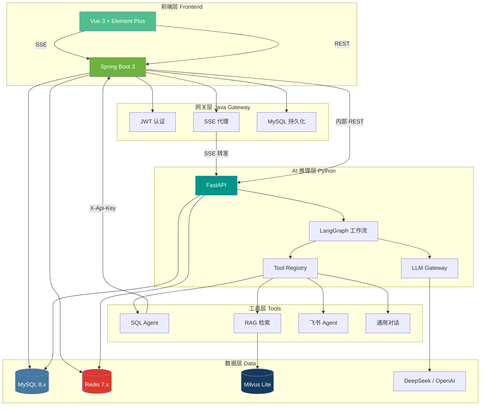
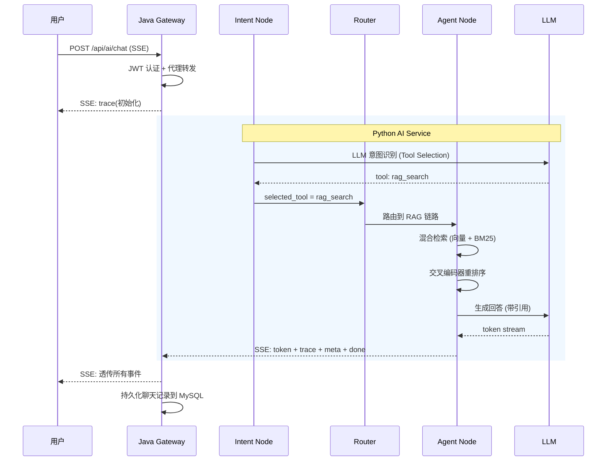
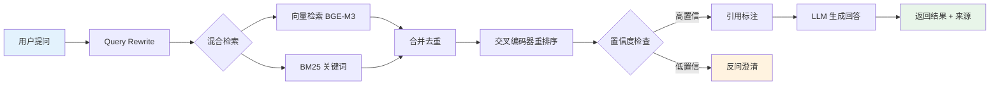

<div align="center">

# InternSU

### 企业级 AI Agent 智能协作平台

**基于 LangGraph 工作流编排 · RAG 知识检索 · Tool Registry 插件体系 · SSE 流式对话**

***


</div>

***

## 项目简介

InternSU 是一个**企业级 AI Agent 协作平台**，以"AI 实习生小SU"为角色定位，为企业内部员工提供智能问答、知识库检索、数据库查询和飞书消息总结等能力。

### 解决什么问题

- 企业知识分散在多个文档系统中，员工查找制度、流程效率低
- 业务数据查询依赖技术人员编写 SQL，非技术人员无法自主分析
- 飞书群聊信息量大，重要消息容易被淹没
- 传统客服机器人只能处理固定问答，无法理解复杂意图并自动选择工具

### 为什么开发这个项目

构建一个能够**自主理解用户意图、自动选择合适工具、透明展示执行过程**的 AI Agent 平台，让每个员工都能拥有一个"懂公司、会查数据、能读文档"的 AI 助手。

### 适用场景

| 场景     | 示例                              |
| ------ | ------------------------------- |
| 企业知识问答 | "公司报销流程是什么？" → RAG 检索制度文档       |
| 业务数据分析 | "本月入职了多少新员工？" → SQL Agent 查询数据库 |
| 飞书消息总结 | "总结技术群最近的重要消息" → 飞书 Agent 拉取并总结 |
| 通用对话   | "你好" → 直接与 LLM 对话               |

***

## 核心能力

<table>
<tr>
<td align="center" width="25%">

**🤖 Agent 任务执行**
LLM 自主选择工具
意图识别 → 路由 → 执行

</td>
<td align="center" width="25%">

**📚 RAG 知识库问答**
混合检索 + 重排序
向量语义 + BM25 关键词

</td>
<td align="center" width="25%">

**🔧 Tool Registry**
统一工具注册机制
运行时动态启用/禁用

</td>
<td align="center" width="25%">

**📊 SQL Agent**
自然语言 → SQL
三层安全防护

</td>
</tr>
<tr>
<td align="center" width="25%">

**⚡ SSE 流式输出**
逐 Token 实时推送
全链路异步架构

</td>
<td align="center" width="25%">

**🔍 Trace 执行追踪**
每步可视化记录
耗时、Token、状态

</td>
<td align="center" width="25%">

**💬 多轮对话**
上下文记忆
自动澄清模糊问题

</td>
<td align="center" width="25%">

**🔐 JWT 双 Token**
Access + Refresh
Redis 黑名单管理

</td>
</tr>
<tr>
<td align="center" width="25%">

**🏢 飞书集成**
消息拉取 + 重要性评分
LLM 结构化摘要

</td>
<td align="center" width="25%">

**🗄️ 向量检索**
BGE-M3 嵌入模型
Milvus 向量数据库

</td>
<td align="center" width="25%">

**🔄 LangGraph 工作流**
14 节点有向图
条件路由 + 状态机

</td>
<td align="center" width="25%">

**🛡️ 安全体系**
RBAC 权限控制
SQL 注入防护 + 审计日志

</td>
</tr>
</table>

***

## 系统架构



***

## 技术栈

| 层级         | 技术                         | 说明                    |
| ---------- | -------------------------- | --------------------- |
| **前端框架**   | Vue 3 + Vite               | 响应式 UI，Vite HMR 秒级热更新 |
| **UI 组件**  | Element Plus               | 企业级 Vue 3 组件库         |
| **状态管理**   | Pinia                      | 轻量级状态管理               |
| **后端框架**   | Spring Boot 3.3            | Java 21，响应式 + 传统混合    |
| **ORM**    | MyBatis-Plus 3.5           | 数据库访问，禁止 JPA          |
| **API 文档** | Knife4j (OpenAPI 3)        | 交互式 API 文档            |
| **认证**     | JWT (JJWT 0.12)            | 双 Token 机制            |
| **AI 框架**  | FastAPI + LangGraph        | Python 异步 AI 服务       |
| **LLM 编排** | LangChain 0.3              | LLM 调用统一网关            |
| **工作流**    | LangGraph 0.2              | 有向图状态机                |
| **向量嵌入**   | BGE-M3 (FlagEmbedding)     | 1024 维多语言嵌入           |
| **向量数据库**  | Milvus Lite 3.0            | 内嵌式向量存储               |
| **关系数据库**  | MySQL 8.4                  | 业务数据 + 元数据            |
| **缓存**     | Redis 7.4                  | 会话、Token 黑名单、限流       |
| **消息队列**   | Kafka (可选)                 | 异步事件流                 |
| **密码加密**   | BCrypt                     | Spring Security 默认    |
| **监控**     | Prometheus + OpenTelemetry | 指标采集 + 链路追踪           |
| **容器化**    | Docker Compose / K8s       | 开发 + 生产部署             |

***

## 系统功能

### 🏠 首页

平台入口，展示核心功能入口和快速导航。

### 💬 聊天中心

| 能力         | 说明                     |
| ---------- | ---------------------- |
| SSE 流式对话   | LLM 逐 Token 实时推送，打字机效果 |
| 意图自动识别     | LLM 自主选择工具，无需规则配置      |
| 多轮对话       | Redis 会话记忆，支持上下文理解     |
| 知识库选择      | 可指定知识空间进行精准检索          |
| Trace 执行追踪 | 右侧面板实时展示 AI 执行步骤       |

### 📚 知识库中心

| 能力   | 说明                 |
| ---- | ------------------ |
| 文档上传 | 支持 PDF、DOCX、TXT、MD |
| 自动索引 | 上传后自动分块 → 向量化 → 存储 |
| 知识空间 | 三级可见性：公司/部门/个人     |
| 文档状态 | 实时追踪处理进度           |

### 📊 数据查询

| 能力       | 说明                       |
| -------- | ------------------------ |
| 自然语言查询   | "本月入职了多少新员工？"            |
| SQL 自动生成 | LLM 生成 SQL，三层安全校验        |
| 结果自然语言总结 | SQL 结果由 LLM 转化为可读文本      |
| 只读执行     | 仅允许 SELECT/SHOW/DESCRIBE |

### 🔧 工具管理

| 能力    | 说明                 |
| ----- | ------------------ |
| 工具注册  | 统一 ToolRegistry 机制 |
| 运行时管理 | 启用/禁用/配置更新         |
| 审计日志  | 工具调用全链路记录          |

### 🔐 用户管理

| 能力      | 说明                            |
| ------- | ----------------------------- |
| RBAC 权限 | 四级角色：admin/developer/employee |
| JWT 认证  | 双 Token + Redis 黑名单           |
| 部门体系    | 组织架构隔离                        |

***

## 核心业务流程

### 智能问答流程



### RAG 检索流程



***

## 项目亮点

### 1. LLM 驱动的意图识别（替代规则引擎）

**技术设计**: 采用 LLM Tool Selection 模式，将每个能力（聊天/RAG/SQL/Agent）定义为一个"工具"，让 LLM 根据工具描述自主选择。

**解决的问题**: 传统关键词匹配无法处理复杂语义（如"帮我查一下去年的考勤数据"混合了意图），且每新增能力都需要改规则。

**实现方式**: `intent_node.py` 构建 TOOLS\_PROMPT，将工具描述注入 LLM 上下文，LLM 仅输出工具名（max\_tokens=20），延迟 < 2s。

**工程价值**: 新增能力只需在 TOOLS\_PROMPT 加一行描述，零代码改动，完全解耦。

***

### 2. 统一 Tool Registry 插件体系

**技术设计**: 采用 BaseTool 抽象类 + ToolRegistry 单例 + ToolManager 编排的三层架构，实现工具的动态注册、发现和执行。

**解决的问题**: 新增工具需要改动多处代码（路由、参数构建、执行逻辑），耦合度高。

**实现方式**:

- `BaseTool`: 定义 `get_metadata()` + `_execute()` 接口
- `ToolRegistry`: 运行时注册/注销，OpenAI function-calling schema 自动生成
- `ToolManager`: 统一执行入口，自动处理超时、参数校验、Trace 记录

**工程价值**: 新增工具只需实现 BaseTool 并在 bootstrap.py 注册，无需修改路由或 Agent 逻辑。

***

### 3. 14 节点 LangGraph 工作流

**技术设计**: 将 AI 推理过程建模为有向图，每个节点是独立的处理步骤，通过条件边实现动态路由。

**解决的问题**: 线性链路无法处理多轮澄清、任务恢复、条件分支等复杂场景。

**实现方式**:

```
intent → clarify → slot_collect → task_resume → router
    → chat_node | rag_chain | sql_chain | agent_node → response
```

- 30+ 类型化状态字段
- 多轮反问 + 槽位填充
- 中断任务恢复

**工程价值**: 每个节点独立可测试、可替换，工作流可视化便于调试。

***

### 4. 三层 SQL 安全防护

**技术设计**: 语法校验 → 危险操作拦截 → 只读执行，逐层递进。

**解决的问题**: LLM 生成的 SQL 可能包含危险操作（DROP、DELETE）或注入攻击。

**实现方式**:

1. `sqlparse` 语法解析 + AST 分析
2. 正则匹配危险关键词（DROP/ALTER/TRUNCATE/DELETE without WHERE）
3. 仅允许 SELECT/SHOW/DESCRIBE/EXPLAIN/WITH 前缀

**工程价值**: 通过 sql\_execute\_log 审计所有 SQL 执行，支持事后追溯。

***

### 5. 混合检索 + 交叉编码器重排序

**技术设计**: 向量语义检索 (BGE-M3, 1024 维) + BM25 关键词检索，合并后用交叉编码器精排。

**解决的问题**: 单一向量检索对精确关键词匹配弱（如"OA-2024-001"），单 BM25 对语义理解弱。

**实现方式**:

- Dense: BGE-M3 向量 + Milvus IVF\_FLAT 索引 (COSINE)
- Sparse: rank\_bm25 + jieba 中文分词
- Rerank: BGE-M3 cross-encoder 对 top-20 精排
- 引用标注: 追踪到文档名 + 页码

**工程价值**: 检索准确率显著优于单路检索，引用溯源增强可信度。

***

### 6. 全链路 Trace 执行追踪

**技术设计**: 每条消息的 AI 执行过程记录到 t\_message\_trace，包含步骤类型、耗时、Token 消耗、输入输出摘要。

**解决的问题**: AI 黑盒问题——用户不知道 AI 做了什么、为什么返回这个结果。

**实现方式**:

- Python 端: 每个节点执行时写入 trace\_steps
- SSE 事件: trace 事件实时推送到前端右侧面板
- Java 端: SSE 完成后持久化到 MySQL
- 全链路: trace\_id 贯穿 Java → Python → LLM

**工程价值**: 可视化展示 AI 执行过程，便于调试和用户信任建设。

***

### 7. "小SU" 人格化 Prompt 体系

**技术设计**: 精心设计的 System Prompt + Jinja2 模板，定义 AI 实习生角色、说话风格、能力边界。

**解决的问题**: 通用 LLM 回答缺乏企业特色，用户体验冷冰冰。

**实现方式**:

- 角色: "公司里最年轻的成员，刚刚开始实习"
- 称呼: 称用户为"老师"，禁用"作为 AI 助手"
- 口头禅: "收到老师～" "好的老师～" "小SU 帮您查一下～"
- 规则: 不知道就说不知道，信息不足主动反问
- 模板存储: t\_prompt\_template 表，支持运行时更新

**工程价值**: 人格化设计提升用户粘性，模板化支持多场景定制。

***

### 8. SSE 流式架构（真流式 vs 伪流式）

**技术设计**: Python 后台 Task 执行 LangGraph，token 实时入 asyncio.Queue，主协程从 Queue 读取并 yield SSE 事件。

**解决的问题**: 旧架构等待 Graph 完全执行完（10-60s）再一次性返回（伪流式），用户体验差。

**实现方式**:

```python
# 后台 Task: Graph 执行 → token 实时入队
bg_task = asyncio.create_task(_run_graph_in_background())
# 主协程: 从 Queue 读取 → yield SSE
while True:
    item = await token_queue.get()
    yield sse_event(item)
```

**工程价值**: 首 Token 延迟 < 2s，用户感知实时打字效果。

***

### 9. 双层持久化（Redis + MySQL）

**技术设计**: Redis 存储热数据（会话上下文、图状态快照），MySQL 存储冷数据（聊天记录、Trace、审计日志）。

**解决的问题**: 单一存储无法同时满足高性能会话读取和持久化需求。

**实现方式**:

- Redis: session:{user}:{conv} → 对话上下文 + LangGraph 状态快照 (30min TTL)
- MySQL: t\_conversation + t\_message + t\_message\_trace → 永久存储
- 桥接: conversation\_uuid 统一两端标识

**工程价值**: 会话切换 < 100ms（Redis），历史查询走 MySQL，冷热分离。

***

### 10. Docker Compose + K8s 双部署

**技术设计**: 开发环境 Docker Compose 一键启动，生产环境 Kubernetes 编排。

**解决的问题**: 开发环境搭建复杂（需装 Node/Java/Python/MySQL/Redis），生产部署需要高可用。

**实现方式**:

- 开发: `scripts/start-all.bat` 自动检测环境、创建 Conda、启动三服务
- 生产: `deploy/docker/docker-compose.prod.yml` + `deploy/kubernetes/`
- 安全: 非 root 用户、多阶段构建、健康检查、.env 注入

**工程价值**: 5 分钟搭建开发环境，生产级部署方案。

***

## 项目结构

```
InternSU/
├── frontend/                          # 前端 — Vue 3 Vben Admin Monorepo
│   ├── apps/web-ele/                  #   Element Plus 版应用
│   │   └── src/
│   │       ├── views/                 #     页面: home/chat/history/knowledge
│   │       ├── components/            #     组件: NavBar/Notify/Dock
│   │       ├── store/                 #     状态: auth/chat/knowledge
│   │       ├── router/                #     路由: 动态菜单 + 权限守卫
│   │       └── api/                   #     API: 请求封装 + Token 刷新
│   └── packages/                      #   共享包 (14 个 workspace 包)
│
├── java-service/                      # 后端 — Spring Boot 3.3
│   └── src/main/java/.../aiplatform/
│       ├── auth/                      #   认证: JWT + RBAC + 审计
│       ├── chat/                      #   聊天: SSE 代理 + MySQL 持久化
│       ├── rag/                       #   知识库: 文档管理 + 空间权限
│       ├── sql/                       #   SQL: Schema 查询 + 安全执行
│       ├── tool/                      #   工具: CRUD + 运行时管理
│       ├── user/                      #   用户: CRUD + 角色分配
│       └── common/                    #   公共: 异常/配置/安全/过滤器
│
├── python-ai-service/                 # AI 服务 — FastAPI + LangGraph
│   └── app/
│       ├── graph/                     #   工作流: 14 节点 LangGraph
│       │   ├── intern_graph.py        #     图定义
│       │   └── nodes/                 #     节点: intent/chat/rag/sql/agent
│       ├── tools/                     #   工具: Registry + Manager + Adapters
│       ├── llm/                       #   LLM: Gateway + DeepSeek/OpenAI
│       ├── rag/                       #   RAG: 检索 + 重排序 + 引用
│       ├── sql_agent/                 #   SQL Agent: NL2SQL + 安全校验
│       ├── prompts/                   #   Prompt: 人格 + 模板管理
│       └── api/                       #   API: 聊天/会话/健康检查
│
├── docs/                              # 文档
│   ├── api/                           #   API 接口文档 (11 篇)
│   ├── database/                      #   数据库脚本 (8 个版本)
│   ├── global/                        #   全局规则 + 安全规范
│   └── questions/                     #   技术问题记录
│
├── deploy/                            # 部署
│   ├── docker/                        #   Docker Compose (开发 + 生产)
│   ├── kubernetes/                    #   K8s 配置
│   └── scripts/                       #   构建脚本
│
├── data/                              # 示例数据
└── scripts/                           # Windows 开发脚本
```

***

## 快速启动

### 环境要求

| 依赖      | 版本    | 说明    |
| ------- | ----- | ----- |
| Node.js | 22+   | 前端构建  |
| Java    | 21+   | 后端运行  |
| Python  | 3.10+ | AI 服务 |
| MySQL   | 8.x   | 数据存储  |
| Redis   | 7.x   | 缓存    |

### 一键启动（Windows）

```bat
:: 1. 检查环境
scripts\check-env.bat

:: 2. 启动所有服务
scripts\start-all.bat

:: 3. 停止所有服务
scripts\stop-all.bat
```

### 手动启动

```bash
# 1. 基础设施：确保 MySQL 和 Redis 已启动

# 2. 前端
cd frontend && pnpm install && pnpm run dev:ele

# 3. Python AI 服务
cd python-ai-service && pip install -r requirements.txt
uvicorn app.main:app --reload --port 8000

# 4. Java 后端
cd java-service && ./mvnw spring-boot:run
```

### 服务地址

| 服务          | 地址                                      |
| ----------- | --------------------------------------- |
| 前端          | <http://localhost:5777>                 |
| AI API 文档   | <http://localhost:8000/docs>            |
| Java API 文档 | <http://localhost:8080/swagger-ui.html> |
| 健康检查        | <http://localhost:8000/ai/health>       |

> 详细配置请参考各模块 README。

***

## 项目文档

| 文档                                     | 说明                   |
| -------------------------------------- | -------------------- |
| [API 接口文档](docs/api/API-Overview.md)   | 全部 24 个接口的完整定义       |
| [认证文档](docs/api/Authentication.md)     | JWT 双 Token 机制 + 时序图 |
| [错误码文档](docs/api/ErrorCode.md)         | HTTP + 业务错误码         |
| [架构分析](docs/api/API-Architecture.md)   | 设计规范 + 异常处理 + 权限     |
| [数据库设计](docs/database/)                | Flyway 迁移脚本 (V1-V8)  |
| [安全规范](docs/global/SECURITY.md)        | 安全检查清单               |
| [全局规则](docs/global/00-global-rules.md) | 开发规范                 |
| [审计报告](docs/AUDIT_REPORT.md)           | 代码审计记录               |

***

## 开发路线图

### 已完成

- [x] LangGraph 14 节点工作流
- [x] RAG 混合检索 + 重排序
- [x] SQL Agent + 三层安全
- [x] Tool Registry 插件体系
- [x] SSE 流式对话
- [x] JWT 双 Token 认证
- [x] 飞书消息总结
- [x] Trace 全链路追踪
- [x] Docker Compose 部署

### 规划中

- [ ] 多 Agent 协同（Agent 间消息传递）
- [ ] MCP 协议扩展（标准工具接入）
- [ ] Workflow 可视化编排（拖拽式）
- [ ] Tool 市场（第三方工具市场）
- [ ] 多模态支持（图片/文件理解）
- [ ] 实时协作（多人同时与 Agent 对话）

***

## 为什么这个项目值得写进简历

### 🏗️ 工程能力体现

> 独立完成三语言（Vue/Java/Python）全栈开发，实现 24 个 REST API、14 个 LangGraph 工作流节点、Tool Registry 插件体系。代码遵循 DDD 四层架构，MyBatis-Plus ORM，Flyway 数据库版本管理，Docker + K8s 双部署方案。

### 🧠 架构能力体现

> 设计 Java Gateway + Python AI Service 双服务架构，Java 负责认证/路由/持久化，Python 负责 AI 推理/工作流编排。SSE 流式代理实现真流式输出，双层持久化（Redis 热数据 + MySQL 冷数据）兼顾性能与可靠性。

### 🤖 AI 应用能力体现

> 实现完整的 Agentic RAG 流程：Query Rewrite → 混合检索（向量 + BM25）→ 交叉编码器重排序 → 引用标注 → LLM 生成。LLM 驱动的意图识别替代规则引擎，Tool Registry 实现工具动态注册，三层 SQL 安全防护确保 NL2SQL 可控。

### 📊 系统设计能力体现

> JWT 双 Token 认证 + Redis 黑名单，RBAC 四级权限控制，SQL 执行审计日志，全链路 Trace 追踪（Java → Python → LLM），Prometheus + OpenTelemetry 监控体系。从认证到审计的完整企业级安全方案。

***

<div align="center">

**InternSU** — 让每个员工都拥有一个懂公司、会查数据、能读文档的 AI 助手

Built with ❤️ by InternSU Team

</div>
