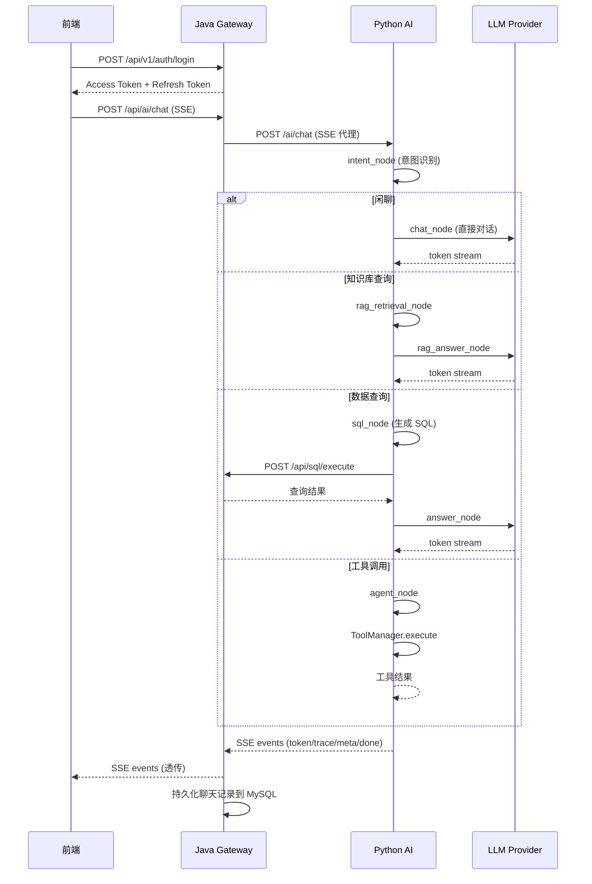

# InternSU API 总览

> 版本: v1.0.0 | 更新日期: 2026-06-13

## 系统架构

```
┌──────────────┐     ┌──────────────────┐     ┌──────────────────┐
│   前端 (Vue)  │────→│  Java Gateway    │────→│ Python AI Service │
│  web-ele      │     │  Spring Boot     │     │  FastAPI          │
└──────────────┘     └──────────────────┘     └──────────────────┘
       │                     │                          │
       │              ┌──────┴──────┐            ┌──────┴──────┐
       │              │   MySQL     │            │   Redis     │
       │              │  (业务数据)  │            │  (会话记忆)  │
       │              └─────────────┘            └─────────────┘
       │                     │                          │
       │                     │                   ┌──────┴──────┐
       │                     │                   │   Milvus    │
       │                     │                   │  (向量存储)  │
       │                     │                   └─────────────┘
       │                     │
       │              ┌──────┴──────┐
       └─────────────→│   MySQL     │
                      │  (聊天记录)  │
                      └─────────────┘
```

## 接口统计

| 指标 | 数量 |
|------|------|
| 接口总数 | 24 |
| GET 接口 | 11 |
| POST 接口 | 10 |
| PUT 接口 | 3 |
| DELETE 接口 | 3 |

## 模块分布

| 模块 | 基础路径 | 接口数 | 服务 |
|------|---------|--------|------|
| 认证模块 | `/api/v1/auth` | 4 | Java |
| 用户模块 | `/api/v1/admin/users` | 5 | Java |
| 聊天模块 | `/api/ai` | 4 | Java (代理) + Python |
| 知识库模块 | `/api/v1/documents` | 5 | Java |
| SQL 模块 | `/api/sql` | 3 | Java |
| 工具模块 | `/api/v1/tools` | 5 | Java |
| Python 聊天 | `/ai` | 7 | Python |
| Python RAG | `/ai/rag` | 4 | Python |
| 健康检查 | `/ai` | 2 | Python |

## 接口总览表

### 认证模块 (`/api/v1/auth`)

| 方法 | 路径 | 描述 | 认证 |
|------|------|------|------|
| POST | `/api/v1/auth/register` | 用户注册 | 无 |
| POST | `/api/v1/auth/login` | 用户登录 | 无 |
| POST | `/api/v1/auth/refresh` | 刷新 Token | 无 |
| POST | `/api/v1/auth/logout` | 退出登录 | Bearer Token |

### 用户模块 (`/api/v1/admin/users`)

| 方法 | 路径 | 描述 | 认证 |
|------|------|------|------|
| GET | `/api/v1/admin/users` | 用户列表(分页) | ADMIN |
| GET | `/api/v1/admin/users/{id}` | 用户详情 | ADMIN |
| POST | `/api/v1/admin/users/roles` | 分配角色 | ADMIN |
| PUT | `/api/v1/admin/users/{id}/status` | 启用/禁用用户 | ADMIN |
| GET | `/api/v1/admin/users/me` | 获取当前用户信息 | USER/ADMIN |

### 聊天模块 (`/api/ai`)

| 方法 | 路径 | 描述 | 认证 |
|------|------|------|------|
| POST | `/api/ai/chat` | SSE 流式聊天 | Bearer Token |
| GET | `/api/ai/conversations` | 会话列表 | Bearer Token |
| POST | `/api/ai/conversations` | 创建会话 | Bearer Token |
| GET | `/api/ai/conversations/{id}/messages` | 消息历史 | Bearer Token |

### 知识库模块 (`/api/v1/documents`)

| 方法 | 路径 | 描述 | 认证 |
|------|------|------|------|
| GET | `/api/v1/documents/spaces` | 知识空间列表 | Bearer Token |
| GET | `/api/v1/documents/my` | 我的文档(分页) | Bearer Token |
| GET | `/api/v1/documents/public` | 公开文档(分页) | Bearer Token |
| POST | `/api/v1/documents/upload` | 上传文档 | Bearer Token |
| DELETE | `/api/v1/documents/{id}` | 删除文档 | Bearer Token |

### SQL 模块 (`/api/sql`)

| 方法 | 路径 | 描述 | 认证 |
|------|------|------|------|
| GET | `/api/sql/schema` | 数据库 Schema | Bearer Token |
| GET | `/api/sql/tables` | 表列表 | Bearer Token |
| POST | `/api/sql/execute` | 执行 SQL | X-Api-Key |

### 工具模块 (`/api/v1/tools`)

| 方法 | 路径 | 描述 | 认证 |
|------|------|------|------|
| GET | `/api/v1/tools/list` | 启用的工具列表 | Bearer Token |
| GET | `/api/v1/tools/admin/list` | 所有工具列表 | ADMIN |
| GET | `/api/v1/tools/{name}` | 获取工具详情 | Bearer Token |
| PUT | `/api/v1/tools/{name}/enabled` | 启用/禁用工具 | ADMIN |
| PUT | `/api/v1/tools/{name}/config` | 更新工具配置 | ADMIN |

### Python AI 服务 (`/ai`)

| 方法 | 路径 | 描述 | 认证 |
|------|------|------|------|
| POST | `/ai/chat` | 聊天(SSE/JSON) | 无(内部) |
| POST | `/ai/chat/stream` | 流式聊天 | 无(内部) |
| GET | `/ai/conversations` | 会话列表 | 无(内部) |
| POST | `/ai/conversations` | 创建会话 | 无(内部) |
| GET | `/ai/conversations/{id}/messages` | 消息列表 | 无(内部) |
| DELETE | `/ai/conversations/{id}` | 删除会话 | 无(内部) |
| GET | `/ai/health` | 健康检查 | 无 |
| GET | `/ai/health/llm` | LLM 健康检查 | 无 |

### Python RAG 管理 (`/ai/rag`)

| 方法 | 路径 | 描述 | 认证 |
|------|------|------|------|
| POST | `/ai/rag/search` | 知识库搜索 | 无(内部) |
| POST | `/ai/rag/index` | 文档索引 | 无(内部) |
| DELETE | `/ai/rag/document/{doc_id}` | 删除文档 | 无(内部) |
| GET | `/ai/rag/stats` | 知识库统计 | 无(内部) |

## 核心业务流程



## 认证机制

- **认证方式**: JWT (Bearer Token)
- **Token 类型**: 双 Token 机制 (Access Token + Refresh Token)
- **Access Token 有效期**: 可配置 (默认 30 分钟)
- **Refresh Token 有效期**: 可配置 (默认 7 天)
- **密码加密**: BCrypt
- **公开接口**: `/api/v1/auth/login`, `/api/v1/auth/register`, `/api/v1/auth/refresh`, `/api/sql/execute`
- **详见**: [Authentication.md](./Authentication.md)

## 统一返回体

```json
{
  "code": 200,
  "message": "操作成功",
  "data": {},
  "timestamp": 1718265600000,
  "traceId": "6a2c1f97ecdc79ac910e251ef7d38d13"
}
```

## 错误码

详见 [ErrorCode.md](./ErrorCode.md)
