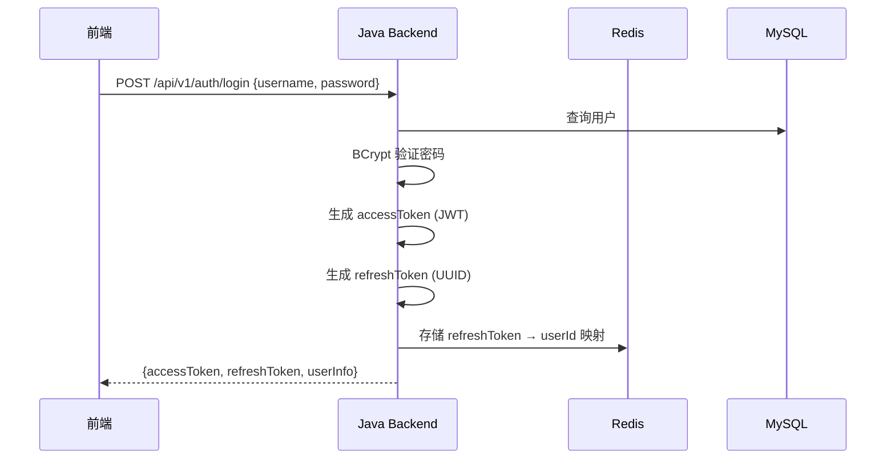
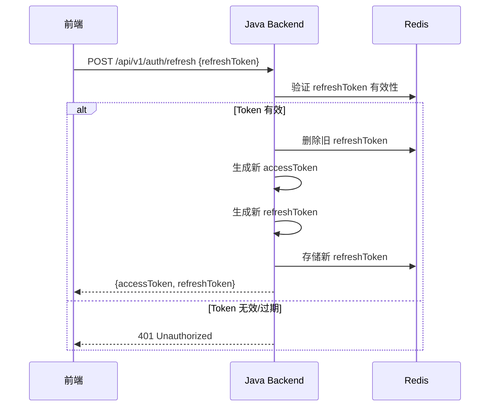
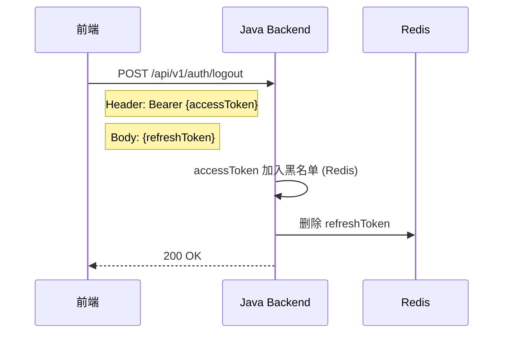

# InternSU 认证文档

> 版本: v1.0.0 | 更新日期: 2026-06-13

## 认证架构

InternSU 采用 **JWT 双 Token 机制**，实现无状态认证和 Token 自动刷新。

```
┌──────────────┐                    ┌──────────────┐
│    前端       │                    │   Java 后端   │
└──────┬───────┘                    └──────┬───────┘
       │                                   │
       │  1. POST /api/v1/auth/login       │
       │  ──────────────────────────────→  │
       │                                   │
       │  2. 返回 accessToken              │
       │     + refreshToken                │
       │  ←──────────────────────────────  │
       │                                   │
       │  3. GET /api/v1/admin/users/me    │
       │     Authorization: Bearer {at}    │
       │  ──────────────────────────────→  │
       │                                   │
       │  4. 200 OK + 用户信息             │
       │  ←──────────────────────────────  │
       │                                   │
       │  5. (Token 过期) POST /refresh    │
       │     { refreshToken }              │
       │  ──────────────────────────────→  │
       │                                   │
       │  6. 返回新 accessToken            │
       │     + 新 refreshToken             │
       │  ←──────────────────────────────  │
       │                                   │
       │  7. POST /api/v1/auth/logout      │
       │     Authorization: Bearer {at}    │
       │     { refreshToken }              │
       │  ──────────────────────────────→  │
       │                                   │
       │  8. 200 OK (Token 已失效)         │
       │  ←──────────────────────────────  │
```

## JWT 结构

### Access Token
- **用途**: API 请求认证
- **载荷**: userId, username, roles, exp
- **存储**: 前端 localStorage
- **传输**: `Authorization: Bearer <access_token>`

### Refresh Token
- **用途**: 刷新 Access Token (无需重新登录)
- **存储**: Redis (服务端) + 前端 localStorage
- **有效期**: 7 天

## 登录流程

### 用户名/密码登录



### 邮箱登录

与用户名登录相同，区别在于使用 `email` 字段查询用户。

## Token 刷新流程



## 退出登录流程



## 安全机制

### 密码存储
- **算法**: BCrypt (Spring Security 默认)
- **盐值**: 自动生成
- **强度**: 10 rounds

### Token 黑名单
- Access Token 退出时加入 Redis 黑名单
- 黑名单 TTL = Token 剩余有效期
- JwtAuthenticationFilter 每次请求检查黑名单

### CORS 配置
- 允许的来源: 可配置 (默认 `*`)
- 允许的方法: GET, POST, PUT, DELETE, OPTIONS
- 允许的头: Authorization, Content-Type

### 会话管理
- **策略**: STATELESS (无 HttpSession)
- **CSRF**: 已禁用 (前后端分离不需要)

## 错误响应

### 401 未认证
```json
{
  "code": 401,
  "message": "未认证，请先登录"
}
```

### 403 无权限
```json
{
  "code": 403,
  "message": "无权限访问"
}
```

### 登录失败
```json
{
  "code": 1001,
  "message": "用户名或密码错误"
}
```

## 前端集成指南

### 存储 Token
```javascript
// 登录成功后
localStorage.setItem('accessToken', data.accessToken);
localStorage.setItem('refreshToken', data.refreshToken);
```

### 请求拦截器
```javascript
// axios 请求拦截器
axios.interceptors.request.use(config => {
  const token = localStorage.getItem('accessToken');
  if (token) {
    config.headers.Authorization = `Bearer ${token}`;
  }
  return config;
});
```

### Token 刷新
```javascript
// axios 响应拦截器
axios.interceptors.response.use(
  response => response,
  async error => {
    if (error.response?.status === 401) {
      const refreshToken = localStorage.getItem('refreshToken');
      if (refreshToken) {
        const { data } = await axios.post('/api/v1/auth/refresh', { refreshToken });
        localStorage.setItem('accessToken', data.data.accessToken);
        localStorage.setItem('refreshToken', data.data.refreshToken);
        // 重试原请求
        error.config.headers.Authorization = `Bearer ${data.data.accessToken}`;
        return axios(error.config);
      }
    }
    return Promise.reject(error);
  }
);
```
