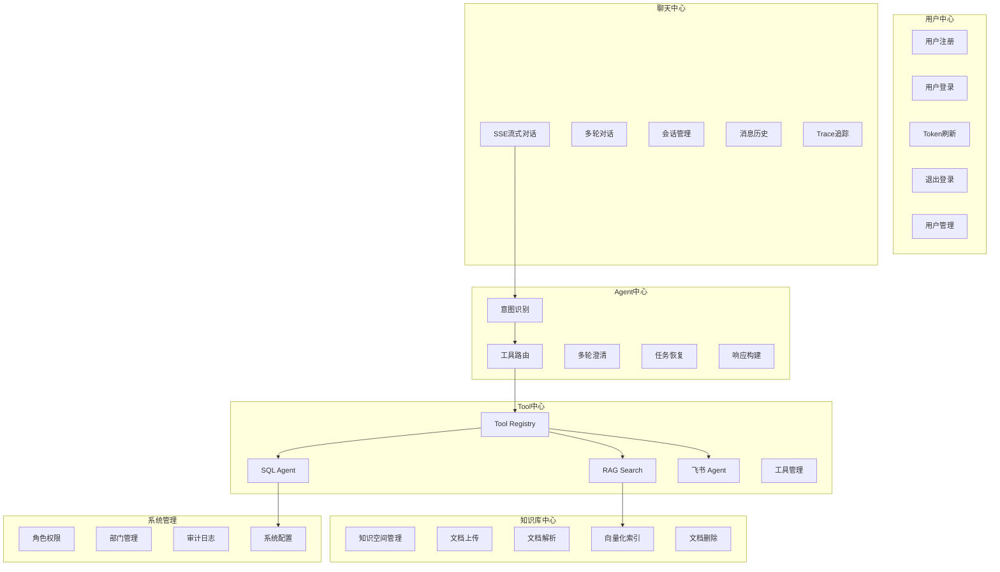
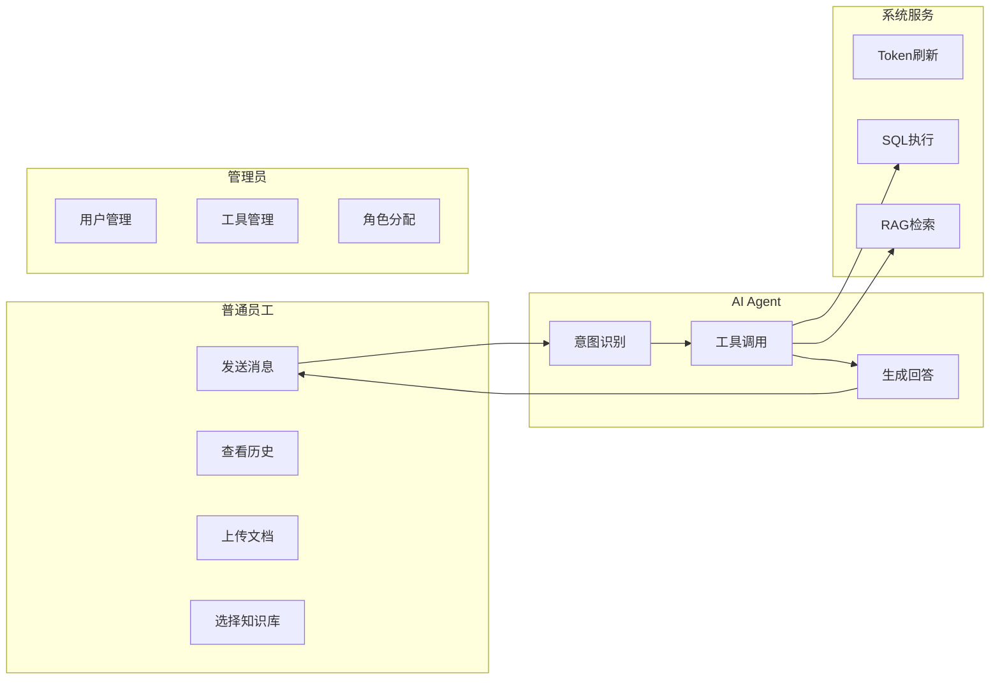
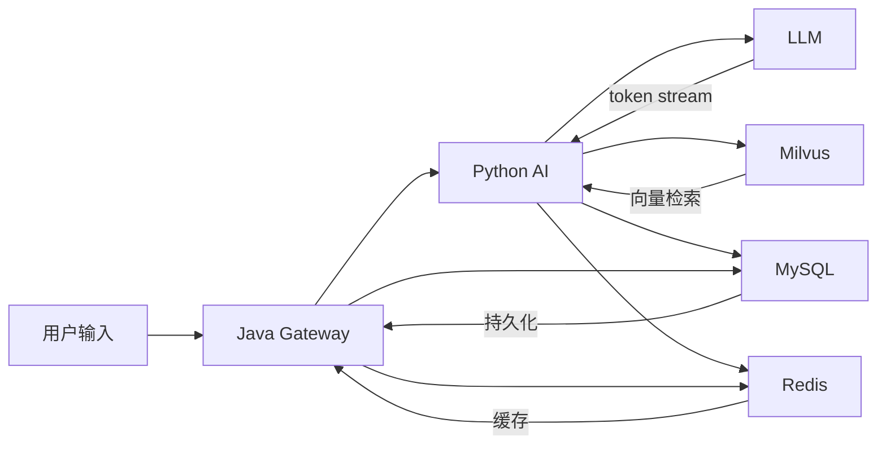

# InternSU 软件需求规格说明书（SRS）

> 文档编号: INT-SRS-001
> 版本: v1.0.0
> 编写日期: 2026-06-13
> 状态: 已完成

---

## 1 引言

### 1.1 编写目的

本文档基于 InternSU 项目已实现的源码进行反向分析，完整描述系统的功能需求和非功能需求。作为项目交付的核心文档之一，本文档可用于：

- **产品经理**: 理解系统全部功能边界和业务规则
- **开发人员**: 作为需求基线，指导后续迭代开发
- **测试人员**: 作为测试用例设计的依据
- **面试官**: 快速理解项目的业务全貌和技术深度
- **项目评审人员**: 评估系统完整性和工程规范性

### 1.2 项目背景

企业内部知识分散在多个文档系统中，员工查找制度和流程效率低；业务数据查询依赖技术人员编写 SQL，非技术人员无法自主分析；飞书群聊信息量大，重要消息容易被淹没；传统客服机器人只能处理固定问答，无法理解复杂意图并自动选择工具。

InternSU 旨在构建一个能够**自主理解用户意图、自动选择合适工具、透明展示执行过程**的 AI Agent 平台，让每个员工都能拥有一个"懂公司、会查数据、能读文档"的 AI 助手。

### 1.3 项目目标

| 目标 | 说明 | 代码依据 |
|------|------|---------|
| 智能问答 | 员工可通过自然语言与 AI 对话，获取企业知识 | `chat_node.py`, `ChatProxyController.java` |
| 知识库检索 | 支持文档上传、向量化、RAG 检索 | `rag_pipeline.py`, `RagController.java` |
| 数据查询 | 非技术人员可通过自然语言查询数据库 | `sql_node.py`, `SqlAgentController.java` |
| 飞书集成 | 自动拉取飞书群消息并生成结构化摘要 | `feishu_tool.py`, `FeishuClient` |
| 执行追踪 | AI 每步执行过程可视化展示 | `t_message_trace`, Trace SSE 事件 |
| 工具扩展 | 支持动态注册和管理 AI 工具 | `ToolRegistry`, `ToolManager` |

### 1.4 名词解释

| 术语 | 说明 |
|------|------|
| LLM | 大语言模型 (Large Language Model)，如 DeepSeek、GPT-4o |
| Agent | 能自主决策和执行任务的 AI 智能体 |
| RAG | 检索增强生成 (Retrieval-Augmented Generation)，结合检索和生成的 AI 技术 |
| Embedding | 向量嵌入，将文本转换为高维浮点数组的技术 |
| Tool | AI 工具，Agent 可调用的功能单元 (如 SQL 查询、RAG 检索) |
| Workflow | 工作流，定义 Agent 执行步骤的有向图 |
| Trace | 执行追踪，记录 AI 每步操作的元数据 |
| SSE | Server-Sent Events，服务端向客户端推送事件的协议 |
| JWT | JSON Web Token，用于无状态认证的令牌 |
| NL2SQL | 自然语言转 SQL，将用户问题转换为数据库查询 |

---

## 2 项目概述

### 2.1 系统定位

InternSU 是一个面向企业内部员工的 **AI Agent 智能协作平台**，以"AI 实习生小 SU"为角色定位，提供知识库问答、数据库查询、飞书消息总结等智能服务。

### 2.2 用户群体

| 角色 | 说明 | 代码依据 |
|------|------|---------|
| 普通员工 | 使用 AI 对话、知识库查询 | `t_role.role_code = 'employee'` |
| 知识管理员 | 管理知识库文档和分类 | `t_role.role_code = 'knowledge_admin'` |
| 系统管理员 | 管理用户、角色、系统配置 | `t_role.role_code = 'admin'` |
| 开发者 | 注册自定义工具、编排工作流 | `t_role.role_code = 'developer'` |
| AI Agent | 自主执行任务的智能体 | `agent_node.py`, `ToolManager` |

### 2.3 系统价值

**用户价值**:
- 信息获取效率提升: 自然语言提问即可获取答案，无需翻阅文档
- 数据分析自主化: 非技术人员可直接查询业务数据
- 消息处理自动化: 飞书群消息自动总结，不遗漏重要信息

**企业价值**:
- 知识沉淀: 企业文档结构化存储，降低知识流失风险
- 效率提升: 减少重复性咨询工作，释放人力资源
- 决策支持: 数据驱动的智能分析辅助决策

### 2.4 产品边界

| 系统负责 | 系统不负责 |
|---------|-----------|
| 企业知识库问答 | 外部互联网搜索 (仅飞书 Agent) |
| 业务数据库查询 | 数据库写入操作 (仅只读) |
| 飞书消息总结 | 飞书消息发送 |
| AI 对话交互 | 语音交互 |
| 文档上传和解析 | 文档在线编辑 |
| 用户权限管理 | 组织架构同步 |

---

## 3 用户角色分析

### 3.1 普通员工 (Employee)

**职责**: 使用 AI 助手查询信息、获取知识、分析数据。

**权限**:
- 发送 AI 聊天消息
- 查看自己的会话历史
- 上传文档到个人知识空间
- 查看公司公开知识空间
- 选择知识空间进行精准检索

**使用场景**:
- "公司报销流程是什么？" → RAG 知识库检索
- "本月入职了多少新员工？" → SQL Agent 查询
- "总结技术群最近的重要消息" → 飞书 Agent
- "你好，小 SU" → 通用对话

### 3.2 知识管理员 (Knowledge Admin)

**职责**: 管理企业知识库，维护文档质量。

**权限**:
- 上传文档到任意知识空间
- 管理知识空间的可见性
- 删除不合适的文档
- 查看文档处理状态

**使用场景**:
- 上传公司制度文档到"公司制度与规范"知识空间
- 审核文档解析状态，处理失败的文档
- 调整知识空间的可见范围

### 3.3 系统管理员 (Admin)

**职责**: 管理系统用户、角色、权限和配置。

**权限**:
- 用户 CRUD 操作
- 角色分配和权限管理
- 工具启用/禁用
- 工具配置更新
- 系统配置管理

**使用场景**:
- 创建新用户并分配角色
- 启用/禁用 AI 工具
- 查看系统审计日志

### 3.4 开发者 (Developer)

**职责**: 开发和注册自定义 AI 工具。

**权限**:
- 查看工具列表
- 查看工具详情
- (未在代码中发现注册自定义工具的完整实现)

### 3.5 AI Agent

**职责**: 自主执行用户任务，选择合适的工具完成工作。

**权限**:
- 调用已注册的工具 (sql_query, rag_search, feishu_agent)
- 访问 LLM 生成回答
- 读取知识库文档
- 执行只读 SQL 查询

**工作流程**:
```
用户提问 → intent_node (意图识别) → router_node (路由)
  → chat_node | rag 链路 | sql 链路 | agent_node → response_node
```

### 3.6 系统服务

**职责**: 内部服务间通信，执行后台任务。

**权限**:
- Python AI 服务通过 X-Api-Key 调用 Java SQL 执行接口
- Java 网关代理 SSE 流到前端

---

## 4 总体功能需求



---

## 5 功能需求说明

### 5.1 用户注册

**功能描述**: 新用户通过用户名、密码、邮箱注册系统账号。

**使用场景**: 员工首次使用系统时注册账号。

**前置条件**: 系统允许自主注册 (`t_system_config.allow_registration = 'true'`)。

**后置条件**: 用户账号创建成功，状态为正常。

**输入**:
| 参数 | 类型 | 必填 | 约束 |
|------|------|------|------|
| username | string | 是 | 2-64 位，不允许重复 |
| password | string | 是 | 6-128 位 |
| email | string | 否 | 邮箱格式校验 |
| nickname | string | 否 | 最长 64 位 |

**输出**: 注册成功提示。

**业务规则**:
- 用户名不允许重复 (UK 约束)
- 密码使用 BCrypt 加密存储
- 注册成功后可直接登录

**异常处理**:
- 用户名已存在: 返回错误提示
- 参数校验失败: 返回具体字段错误信息

**数据变化**: 写入 `t_user` 表。

**涉及接口**: `POST /api/v1/auth/register`

---

### 5.2 用户登录

**功能描述**: 用户通过用户名/邮箱 + 密码登录，获取 Access Token 和 Refresh Token。

**使用场景**: 员工每次使用系统前需登录认证。

**前置条件**: 用户已注册且状态为正常。

**后置条件**: 返回双 Token，用户可访问受保护接口。

**输入**:
| 参数 | 类型 | 必填 | 约束 |
|------|------|------|------|
| username | string | 否 | 用户名登录时使用 |
| email | string | 否 | 邮箱登录时使用 |
| password | string | 是 | 6-128 位 |

> username 和 email 至少传一个。

**输出**:
```json
{
  "accessToken": "eyJhbGci...",
  "refreshToken": "a1b2c3d4-...",
  "tokenType": "Bearer",
  "expiresIn": 1800,
  "userInfo": { "id": 1, "username": "admin", ... }
}
```

**业务规则**:
- 支持用户名和邮箱两种登录方式
- Access Token 有效期 30 分钟
- Refresh Token 有效期 7 天
- 记录登录 IP 和 User-Agent

**异常处理**:
- 用户名或密码错误: 返回登录失败
- 账号被禁用: 返回账号已禁用

**数据变化**: 写入 `t_login_log`，Redis 存储 Refresh Token。

**涉及接口**: `POST /api/v1/auth/login`

---

### 5.3 Token 刷新

**功能描述**: 使用 Refresh Token 获取新的 Access Token，无需重新登录。

**使用场景**: Access Token 过期时，前端自动调用刷新接口。

**前置条件**: Refresh Token 有效且未被使用。

**后置条件**: 返回新的双 Token，旧 Refresh Token 失效。

**输入**:
| 参数 | 类型 | 必填 |
|------|------|------|
| refreshToken | string | 是 |

**输出**: 新的 accessToken + refreshToken。

**业务规则**:
- Refresh Token 一次性使用
- 刷新后旧 Token 立即失效

**异常处理**:
- Refresh Token 无效/过期: 返回 401

**数据变化**: Redis 更新 Refresh Token 映射。

**涉及接口**: `POST /api/v1/auth/refresh`

---

### 5.4 退出登录

**功能描述**: 用户主动退出，Token 加入黑名单。

**使用场景**: 用户离开时安全退出。

**前置条件**: 用户已登录。

**后置条件**: Access Token 加入黑名单，Refresh Token 从 Redis 删除。

**输入**:
| 参数 | 类型 | 必填 |
|------|------|------|
| refreshToken | string | 否 |

**输出**: 退出成功提示。

**数据变化**: Redis 写入 Token 黑名单，删除 Refresh Token。

**涉及接口**: `POST /api/v1/auth/logout`

---

### 5.5 创建会话

**功能描述**: 用户创建新的 AI 对话会话。

**使用场景**: 用户开始新的对话主题时创建会话。

**前置条件**: 用户已登录。

**后置条件**: 创建会话记录，返回会话 ID。

**输入**:
| 参数 | 类型 | 必填 | 说明 |
|------|------|------|------|
| user_id | string | 是 | 用户 ID |
| title | string | 否 | 会话标题 (为空时 AI 自动生成) |
| message | string | 否 | 首条消息 (用于 AI 生成标题) |

**输出**:
```json
{
  "conversation_id": "conv-uuid",
  "title": "Python 学习计划"
}
```

**业务规则**:
- 不传 title 时，LLM 根据首条消息自动生成标题 (不超过 15 字)
- 标题生成失败时使用默认标题"新对话"

**数据变化**: Redis 创建会话上下文，MySQL 创建 `t_conversation` 记录。

**涉及接口**: `POST /ai/conversations`, `POST /api/ai/conversations`

---

### 5.6 发送消息 (SSE 流式)

**功能描述**: 用户发送消息，AI 实时流式返回回答。

**使用场景**: 核心交互场景，用户与 AI 对话。

**前置条件**: 用户已登录，已有会话。

**后置条件**: 消息持久化，Trace 记录写入数据库。

**输入**:
| 参数 | 类型 | 必填 | 说明 |
|------|------|------|------|
| conversation_id | string | 是 | 会话 ID |
| user_id | string | 是 | 用户 ID |
| message | string | 是 | 用户消息 (最大 32000 字符) |
| model | string | 否 | 模型名称 (默认 deepseek-chat) |
| space_ids | list | 否 | 知识空间 ID 列表 |
| doc_ids | list | 否 | 文档 ID 列表 |

**输出 (SSE 事件流)**:
```
event: trace    → 工作过程步骤
event: token    → LLM 逐字输出
event: meta     → 元数据 (sources, tokens)
event: done     → 完成标记
event: error    → 错误信息
```

**业务规则**:
- 意图自动识别: LLM 自主选择工具 (chat/rag/sql/feishu_agent)
- 流式输出: LLM 每生成一个 token 立即推送到前端
- 知识库范围: 可通过 space_ids 限定检索范围
- 会话记忆: Redis 保存最近 20 轮对话上下文

**异常处理**:
- LLM 调用失败: 返回错误提示
- 超时 (120s): 取消后台任务，返回超时提示
- 客户端断开: 自动取消后台 Task

**数据变化**: Redis 更新会话上下文，MySQL 写入 `t_message` + `t_message_trace`。

**涉及接口**: `POST /api/ai/chat`, `POST /ai/chat`

---

### 5.7 查询会话历史

**功能描述**: 用户查看历史会话列表和消息记录。

**使用场景**: 用户查看之前的对话内容。

**前置条件**: 用户已登录。

**输入**:
| 参数 | 类型 | 必填 | 说明 |
|------|------|------|------|
| user_id | string | 是 | 用户 ID |
| limit | int | 否 | 消息数量限制 (默认 50) |

**输出**:
```json
{
  "conversations": [...],
  "messages": [...]
}
```

**数据变化**: 无 (只读操作)。

**涉及接口**: `GET /ai/conversations`, `GET /ai/conversations/{id}/messages`

---

### 5.8 删除会话

**功能描述**: 用户删除指定会话及其消息记录。

**使用场景**: 用户清理不需要的历史会话。

**前置条件**: 会话属于当前用户。

**后置条件**: 会话和消息记录被逻辑删除。

**涉及接口**: `DELETE /ai/conversations/{conversation_id}`

---

### 5.9 上传知识库文档

**功能描述**: 用户上传文档到知识空间，系统自动解析、分块、向量化。

**使用场景**: 知识管理员上传公司制度、规范等文档。

**前置条件**: 用户已登录，有目标知识空间的上传权限。

**后置条件**: 文档状态变为"已就绪"，向量数据存入 Milvus。

**输入**:
| 参数 | 类型 | 必填 | 说明 |
|------|------|------|------|
| spaceId | long | 是 | 知识空间 ID (0=本部门) |
| file | file | 是 | 上传的文件 (PDF/DOCX/TXT/MD) |

**处理流程**:
```
上传文件 → t_document (status=0) → 解析 (status=1)
  → 分块 (status=2, 512字符, 64重叠) → 向量化 (status=3, BGE-M3)
  → 写入 t_document_chunk → 写入 Milvus
  → 完成 (status=4)
```

**异常处理**:
- 文件类型不支持: 返回错误
- 解析失败: status 设为 -1，记录 error_msg
- 空间不存在: 返回错误

**数据变化**: 写入 `t_document`, `t_document_chunk`，写入 Milvus `knowledge_chunks`。

**涉及接口**: `POST /api/v1/documents/upload`

---

### 5.10 知识库检索 (RAG)

**功能描述**: 根据用户问题，从知识库中检索相关文档片段并生成回答。

**使用场景**: 员工询问公司制度、流程等问题。

**前置条件**: 知识库中有已就绪的文档。

**处理流程**:
```
用户提问 → Query Rewrite → 混合检索 (向量 + BM25)
  → 合并去重 → 交叉编码器重排序 → 置信度检查
  → 引用标注 → LLM 生成回答
```

**业务规则**:
- 混合检索: BGE-M3 向量 (COSINE) + BM25 关键词
- 重排序: 交叉编码器对 top-20 精排
- 引用标注: 追踪到文档名 + 页码
- 三级可见性: public/department/private

**异常处理**:
- 检索无结果: 进入澄清节点，反问用户
- 重排序失败: 降级使用原始检索结果

---

### 5.11 数据库查询 (SQL Agent)

**功能描述**: 将自然语言转换为 SQL 查询，执行并返回结果。

**使用场景**: 员工查询业务数据 (如"本月入职了多少新员工")。

**前置目标**: 数据库 `internsu_business` 中有对应的业务表。

**处理流程**:
```
用户提问 → Schema 查询 → LLM 生成 SQL
  → 三层安全校验 → 执行 SQL → LLM 总结结果
```

**三层安全防护**:
1. 语法校验: sqlparse 解析 + AST 分析
2. 危险操作拦截: DROP/ALTER/TRUNCATE/DELETE
3. 只读执行: 仅允许 SELECT/SHOW/DESCRIBE/EXPLAIN

**业务规则**:
- 非聚合查询自动添加 LIMIT 1000
- 聚合查询 (COUNT/SUM/AVG/MAX/MIN) 不添加 LIMIT
- 所有 SQL 执行记录写入 `t_sql_execute_log`

**涉及接口**: `POST /api/sql/execute` (Python → Java 内部调用)

---

### 5.12 飞书消息总结 (飞书 Agent)

**功能描述**: 拉取飞书群聊消息，筛选重要内容，生成结构化摘要。

**使用场景**: 员工希望快速了解飞书群的重要消息。

**处理流程**:
```
用户请求 → FeishuClient 拉取消息 → 消息重要性评分
  → LLM 生成结构化摘要 (通知/任务/会议/风险/其他)
```

**前置条件**: 系统配置了 `FEISHU_APP_ID` 和 `FEISHU_APP_SECRET`。

**异常处理**:
- 飞书未配置: 返回配置错误提示
- 无消息: 返回"未找到消息"

---

### 5.13 多轮澄清

**功能描述**: 当用户问题模糊时，AI 主动反问以获取更多信息。

**使用场景**: 问题信息不足，无法确定使用哪个工具。

**处理流程**:
```
intent_node 识别为 clarify → clarify_node 生成反问
  → 前端展示反问 → 用户回答 → slot_collect_node 收集
  → task_resume_node 恢复上下文 → 重新路由
```

**业务规则**:
- 最多 3 轮澄清 (clarify_round 计数)
- 每个问题给出默认选项
- 用户回复"确认"时使用默认值

---

### 5.14 Trace 执行追踪

**功能描述**: 可视化展示 AI 每步执行过程。

**使用场景**: 用户查看 AI 执行了哪些步骤、耗时多少。

**记录内容**:
- 步骤类型 (意图识别/知识检索/SQL 生成/回答生成)
- 执行状态 (running/completed/failed)
- 耗时 (毫秒)
- Token 消耗 (prompt/completion/total)
- 输入/输出摘要

**数据变化**: 写入 `t_message_trace`。

---

### 5.15 用户管理 (管理员)

**功能描述**: 管理员对系统用户进行 CRUD 操作和角色分配。

**使用场景**: 管理员创建用户、分配角色、启用/禁用账号。

**权限要求**: ADMIN 角色 (`@PreAuthorize("hasRole('ADMIN')")`)。

**涉及接口**:
- `GET /api/v1/admin/users` — 用户列表 (分页)
- `GET /api/v1/admin/users/{id}` — 用户详情
- `POST /api/v1/admin/users/roles` — 分配角色
- `PUT /api/v1/admin/users/{id}/status` — 启用/禁用
- `GET /api/v1/admin/users/me` — 获取当前用户信息

---

### 5.16 工具管理 (管理员)

**功能描述**: 管理 AI 工具的启用/禁用和配置更新。

**使用场景**: 管理员运行时调整工具状态。

**涉及接口**:
- `GET /api/v1/tools/list` — 启用的工具列表
- `GET /api/v1/tools/admin/list` — 所有工具列表
- `PUT /api/v1/tools/{name}/enabled` — 启用/禁用
- `PUT /api/v1/tools/{name}/config` — 更新配置

---

## 6 用例分析

### 6.1 用例图



### 6.2 用例: 用户登录

**参与者**: 普通员工

**前置条件**: 用户已注册，系统运行正常。

**基本事件流**:
1. 用户打开登录页面
2. 输入用户名和密码
3. 点击"登录"按钮
4. 系统验证凭证
5. 系统返回 Access Token + Refresh Token
6. 前端存储 Token，跳转到首页

**异常事件流**:
- 4a. 用户名不存在: 提示"用户名或密码错误"
- 4b. 密码错误: 提示"用户名或密码错误"
- 4c. 账号被禁用: 提示"账号已禁用"

**后置条件**: 用户获得认证令牌，可访问系统功能。

### 6.3 用例: AI 聊天

**参与者**: 普通员工

**前置条件**: 用户已登录，有可用会话。

**基本事件流**:
1. 用户在聊天页面输入消息
2. 前端发送 POST /api/ai/chat (SSE)
3. Java 网关认证后代理到 Python
4. Python intent_node 识别意图
5. router_node 路由到对应处理节点
6. 处理节点生成回答 (流式)
7. SSE 事件实时推送到前端
8. 消息和 Trace 持久化到 MySQL

**异常事件流**:
- 4a. 意图不明确: 进入澄清流程
- 6a. LLM 调用失败: 返回错误提示
- 6b. 处理超时 (120s): 取消任务，返回超时提示

**后置条件**: 消息记录写入数据库，Trace 可查看。

### 6.4 用例: 知识库问答

**参与者**: 普通员工

**前置条件**: 知识库中有已就绪的文档。

**基本事件流**:
1. 用户选择知识空间 (可选)
2. 输入问题 "公司报销流程是什么？"
3. 系统识别为 RAG 意图
4. 混合检索 (向量 + BM25)
5. 交叉编码器重排序
6. 引用标注 (文档名 + 页码)
7. LLM 生成带引用的回答
8. 前端展示回答和来源

**异常事件流**:
- 4a. 检索无结果: 反问用户是否换个关键词
- 6a. 置信度低: 反问用户确认

### 6.5 用例: 文档上传

**参与者**: 知识管理员

**前置条件**: 用户已登录，有目标知识空间的上传权限。

**基本事件流**:
1. 用户选择知识空间
2. 选择本地文件 (PDF/DOCX/TXT/MD)
3. 点击上传
4. 系统保存文件，创建文档记录
5. 异步触发解析流程
6. 文档分块 (512 字符，64 重叠)
7. BGE-M3 向量化
8. 存入 Milvus
9. 文档状态变为"已就绪"

**异常事件流**:
- 5a. 解析失败: 状态变为 -1，记录错误信息
- 5b. 文件类型不支持: 返回错误

### 6.6 用例: SQL 数据查询

**参与者**: 普通员工

**前置条件**: 数据库 `internsu_business` 中有对应业务表。

**基本事件流**:
1. 用户输入 "本月入职了多少新员工？"
2. 系统识别为 SQL 意图
3. 查询数据库 Schema
4. LLM 生成 SQL: `SELECT COUNT(*) FROM oa_employee WHERE hire_date >= '2026-06-01'`
5. 三层安全校验通过
6. 执行 SQL，返回结果
7. LLM 将结果转化为自然语言
8. 前端展示 "本月入职了 5 名新员工"

**异常事件流**:
- 4a. SQL 语法错误: 返回错误提示
- 5a. 危险操作被拦截: 返回安全提示
- 6a. 执行超时: 返回超时提示

---

## 7 非功能需求

### 7.1 性能需求

| 指标 | 要求 | 实现方式 |
|------|------|---------|
| 首 Token 延迟 | < 2s | SSE 真流式架构，asyncio.Queue 实时推送 |
| 会话切换 | < 100ms | Redis 热数据缓存 |
| 向量检索 | < 500ms | Milvus IVF_FLAT 索引 |
| SQL 执行 | < 5s | 30s 超时限制，LIMIT 1000 |
| 文档索引 | 异步 | 后台异步处理，不阻塞用户 |

### 7.2 可用性需求

| 需求 | 说明 |
|------|------|
| 热更新 | 前端 Vite HMR，Python uvicorn --reload，Java DevTools |
| 错误恢复 | LLM 调用失败时返回友好提示，不暴露内部错误 |
| 客户端断开 | 自动取消后台 asyncio.Task，释放资源 |

### 7.3 安全需求

| 需求 | 实现 |
|------|------|
| 认证 | JWT 双 Token (Access + Refresh) |
| 密码安全 | BCrypt 加密 (cost >= 10) |
| Token 黑名单 | Redis 存储，退出时加入 |
| 权限控制 | RBAC 四级角色 + @PreAuthorize |
| 数据隔离 | 部门级知识空间隔离 |
| SQL 安全 | 三层防护: 语法校验 → 危险拦截 → 只读执行 |
| 审计日志 | 登录日志、工具调用日志、SQL 执行日志 |
| 敏感数据 | 密码不在 API 响应中返回 |

### 7.4 可扩展性需求

| 需求 | 实现 |
|------|------|
| 新增工具 | 实现 BaseTool 接口 + bootstrap.py 注册，零路由改动 |
| 新增意图 | TOOLS_PROMPT 添加一行描述，LLM 自动识别 |
| 新增模型 | LLM Gateway 支持多 Provider 切换 |
| Prompt 迭代 | t_prompt_template 版本化管理 |
| 工作流扩展 | t_workflow + t_workflow_node 支持自定义图 |

### 7.5 可维护性需求

| 需求 | 实现 |
|------|------|
| 模块解耦 | Java (网关) + Python (AI) 双服务分离 |
| 配置化 | t_system_config 运行时配置，.env 环境变量 |
| 统一异常 | GlobalExceptionHandler + Result 统一返回体 |
| 日志规范 | trace_id 贯穿全链路，结构化日志 |
| 数据库版本 | Flyway 迁移脚本 (V1-V8) |

### 7.6 可观测性需求

| 需求 | 实现 |
|------|------|
| 分布式追踪 | trace_id 贯穿 Java → Python → LLM |
| 执行追踪 | t_message_trace 记录每步操作 |
| 前端可视化 | SSE trace 事件实时展示执行步骤 |
| Prometheus | Java actuator/prometheus + Python /metrics |
| OpenTelemetry | Python FastAPI 链路追踪 |

---

## 8 数据需求

### 8.1 核心实体

| 实体 | 说明 | 存储 |
|------|------|------|
| User | 系统用户 | MySQL t_user |
| Role | 角色定义 | MySQL t_role |
| Permission | 权限定义 | MySQL t_permission |
| Conversation | 对话会话 | MySQL t_conversation + Redis |
| Message | 对话消息 | MySQL t_message + Redis |
| MessageTrace | 执行追踪 | MySQL t_message_trace |
| KnowledgeSpace | 知识空间 | MySQL t_knowledge_space |
| Document | 文档元数据 | MySQL t_document |
| DocumentChunk | 文档分块 | MySQL t_document_chunk + Milvus |
| ToolDefinition | 工具定义 | MySQL t_tool_definition |
| ToolCallLog | 工具调用日志 | MySQL t_tool_call_log |
| PromptTemplate | Prompt 模板 | MySQL t_prompt_template |
| Department | 部门组织 | MySQL t_department |
| SystemConfig | 系统配置 | MySQL t_system_config |
| SqlExecuteLog | SQL 审计 | MySQL t_sql_execute_log |

### 8.2 数据流转



### 8.3 数据生命周期

| 数据 | 创建 | 存储 | 过期/删除 |
|------|------|------|----------|
| 用户 | 注册 | MySQL (永久) | 逻辑删除 |
| 会话 | 创建 | Redis (30min) + MySQL (永久) | Redis TTL |
| 消息 | 发送 | MySQL (永久) | 逻辑删除 |
| 文档 | 上传 | MySQL + Milvus | 逻辑删除 + 向量删除 |
| Token | 登录 | Redis | TTL 过期 |
| 黑名单 | 退出 | Redis | Token 剩余有效期 |

---

## 9 接口需求

### 9.1 认证模块

| 接口 | 方法 | 路径 | 说明 |
|------|------|------|------|
| 用户注册 | POST | /api/v1/auth/register | 公开 |
| 用户登录 | POST | /api/v1/auth/login | 公开 |
| Token 刷新 | POST | /api/v1/auth/refresh | 公开 |
| 退出登录 | POST | /api/v1/auth/logout | Bearer Token |

### 9.2 聊天模块

| 接口 | 方法 | 路径 | 说明 |
|------|------|------|------|
| SSE 聊天 | POST | /api/ai/chat | Bearer Token, SSE |
| 会话列表 | GET | /api/ai/conversations | Bearer Token |
| 创建会话 | POST | /api/ai/conversations | Bearer Token |
| 消息历史 | GET | /api/ai/conversations/{id}/messages | Bearer Token |

### 9.3 知识库模块

| 接口 | 方法 | 路径 | 说明 |
|------|------|------|------|
| 知识空间 | GET | /api/v1/documents/spaces | Bearer Token |
| 我的文档 | GET | /api/v1/documents/my | Bearer Token, 分页 |
| 公开文档 | GET | /api/v1/documents/public | Bearer Token, 分页 |
| 上传文档 | POST | /api/v1/documents/upload | Bearer Token, multipart |
| 删除文档 | DELETE | /api/v1/documents/{id} | Bearer Token |

### 9.4 SQL 模块

| 接口 | 方法 | 路径 | 说明 |
|------|------|------|------|
| Schema | GET | /api/sql/schema | Bearer Token |
| 表列表 | GET | /api/sql/tables | Bearer Token |
| 执行 SQL | POST | /api/sql/execute | X-Api-Key (内部) |

### 9.5 工具模块

| 接口 | 方法 | 路径 | 说明 |
|------|------|------|------|
| 工具列表 | GET | /api/v1/tools/list | Bearer Token |
| 管理列表 | GET | /api/v1/tools/admin/list | ADMIN |
| 工具详情 | GET | /api/v1/tools/{name} | Bearer Token |
| 启用/禁用 | PUT | /api/v1/tools/{name}/enabled | ADMIN |
| 更新配置 | PUT | /api/v1/tools/{name}/config | ADMIN |

### 9.6 用户模块

| 接口 | 方法 | 路径 | 说明 |
|------|------|------|------|
| 用户列表 | GET | /api/v1/admin/users | ADMIN, 分页 |
| 用户详情 | GET | /api/v1/admin/users/{id} | ADMIN |
| 分配角色 | POST | /api/v1/admin/users/roles | ADMIN |
| 启用/禁用 | PUT | /api/v1/admin/users/{id}/status | ADMIN |
| 当前用户 | GET | /api/v1/admin/users/me | USER/ADMIN |

---

## 10 系统约束

### 10.1 技术约束

| 约束 | 说明 |
|------|------|
| Java 版本 | 21+ (Spring Boot 3.3) |
| Python 版本 | 3.10+ (FastAPI) |
| Node.js 版本 | 22+ (Vue 3 + Vite) |
| MySQL 版本 | 8.x |
| Redis 版本 | 7.x |

### 10.2 架构约束

| 约束 | 说明 |
|------|------|
| 前端仅与 Java 通信 | Python AI 服务不直接暴露给前端 |
| SSE 由 Java 代理 | Java 网关透传 SSE 流 |
| SQL 仅允许只读 | 禁止 INSERT/UPDATE/DELETE/DROP |
| Python 内部调用 | SQL 执行通过 X-Api-Key 认证 |

### 10.3 模型约束

| 约束 | 说明 |
|------|------|
| 默认 LLM | DeepSeek (deepseek-chat) |
| 嵌入模型 | BGE-M3 (1024 维) |
| 向量数据库 | Milvus Lite (内嵌式) |
| 分块大小 | 512 字符，64 重叠 |

### 10.4 第三方依赖约束

| 依赖 | 用途 | 风险 |
|------|------|------|
| DeepSeek API | LLM 推理 | API 可用性 |
| 飞书开放平台 | 消息拉取 | 需要企业应用审批 |
| BGE-M3 | 向量嵌入 | 本地部署，无外部依赖 |

---

## 11 未来扩展需求

基于现有架构推导的合理扩展方向:

| 扩展方向 | 说明 | 架构基础 |
|---------|------|---------|
| 多 Agent 协同 | Agent 间消息传递，分工合作 | LangGraph 状态图 |
| MCP 协议扩展 | 标准化工具接入协议 | Tool Registry |
| Workflow 可视化编排 | 拖拽式工作流设计 | t_workflow + t_workflow_node |
| Tool 市场 | 第三方工具注册和发现 | ToolRegistry + bootstrap |
| 多模态支持 | 图片/文件理解 | LLM 多模态能力 |
| 实时协作 | 多人同时与 Agent 对话 | Redis 会话 + SSE |
| 语音交互 | 语音输入/输出 | ASR/TTS 集成 |

---

## 12 项目亮点需求分析

### 12.1 Tool Registry 插件体系

**为什么需要**: 企业 AI 平台需要支持多种工具 (SQL、RAG、飞书等)，且工具需要动态管理。

**业务价值**: 新增工具只需实现 BaseTool 接口并注册，无需修改路由或 Agent 逻辑，降低扩展成本。

**代码依据**: `BaseTool` 抽象类 + `ToolRegistry` 单例 + `ToolManager` 编排 + `bootstrap.py` 注册。

### 12.2 全链路 Trace 追踪

**为什么需要**: AI 黑盒问题——用户不知道 AI 做了什么，难以建立信任。

**业务价值**: 可视化展示 AI 执行过程，增强用户信任，便于问题排查。

**代码依据**: `t_message_trace` 表 + SSE trace 事件 + trace_id 全链路贯穿。

### 12.3 LLM 驱动的意图识别

**为什么需要**: 传统关键词匹配无法处理复杂语义，且每新增能力都需要改规则。

**业务价值**: 新增能力只需在 TOOLS_PROMPT 加一行描述，零代码改动。

**代码依据**: `intent_node.py` 构建 TOOLS_PROMPT，LLM 自主选择工具。

### 12.4 混合检索 + 重排序

**为什么需要**: 单一向量检索对精确关键词弱，单 BM25 对语义理解弱。

**业务价值**: 检索准确率显著优于单路检索，引用溯源增强可信度。

**代码依据**: `rag_pipeline.py` 向量 + BM25 混合检索 + 交叉编码器重排序。

### 12.5 三层 SQL 安全防护

**为什么需要**: LLM 生成的 SQL 可能包含危险操作或注入攻击。

**业务价值**: 确保 NL2SQL 安全可控，支持审计追溯。

**代码依据**: `sql_agent/security.py` 语法校验 → 危险拦截 → 只读执行。

### 12.6 SSE 流式架构

**为什么需要**: 旧架构等待完全执行完再返回 (伪流式)，用户体验差。

**业务价值**: 首 Token 延迟 < 2s，用户感知实时打字效果。

**代码依据**: `chat_api.py` asyncio.Queue + 后台 Task + SSE yield。

### 12.7 双层持久化

**为什么需要**: 单一存储无法同时满足高性能会话读取和持久化需求。

**业务价值**: 会话切换 < 100ms (Redis)，历史查询走 MySQL，冷热分离。

**代码依据**: Redis session + MySQL t_conversation/t_message + conversation_uuid 桥接。

### 12.8 "小 SU" 人格化 Prompt

**为什么需要**: 通用 LLM 回答缺乏企业特色，用户体验冷冰冰。

**业务价值**: 人格化设计提升用户粘性，模板化支持多场景定制。

**代码依据**: `internsu_prompts.py` + `t_prompt_template` 版本化管理。

---

## 附录: 面试官可能追问的问题

| 问题 | 准备方向 |
|------|---------|
| 为什么选 LangGraph 而非 LangChain Agent? | 状态机可视化、节点独立可测试、条件路由灵活 |
| RAG 准确率如何保证? | 混合检索 + 重排序 + 引用溯源 |
| SQL 注入怎么防? | 三层校验 + 只读执行 + 审计日志 |
| SSE 断线重连? | 取消传播链 + asyncio.Task 生命周期管理 |
| 工具怎么扩展? | BaseTool 接口 + bootstrap 注册 + 零路由改动 |
| Redis 和 MySQL 怎么分工? | Redis 热数据 (30min) + MySQL 冷数据 (永久) |
| 为什么用 Milvus Lite 而非完整版? | 内嵌式部署简化开发，生产可切换完整版 |
| 多轮澄清怎么实现? | clarify_node → slot_collect_node → task_resume_node |
