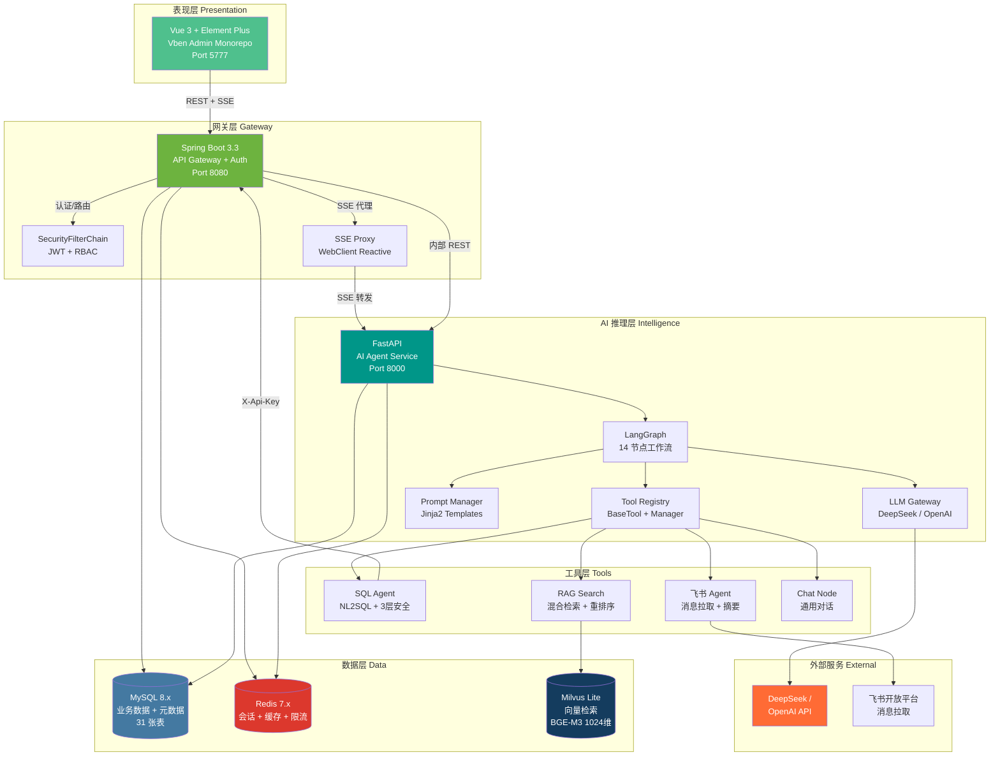
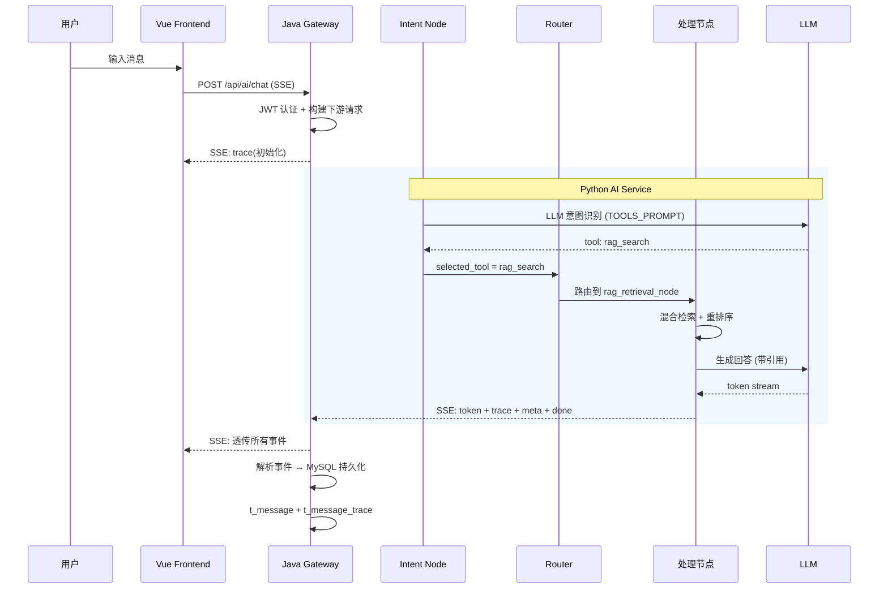
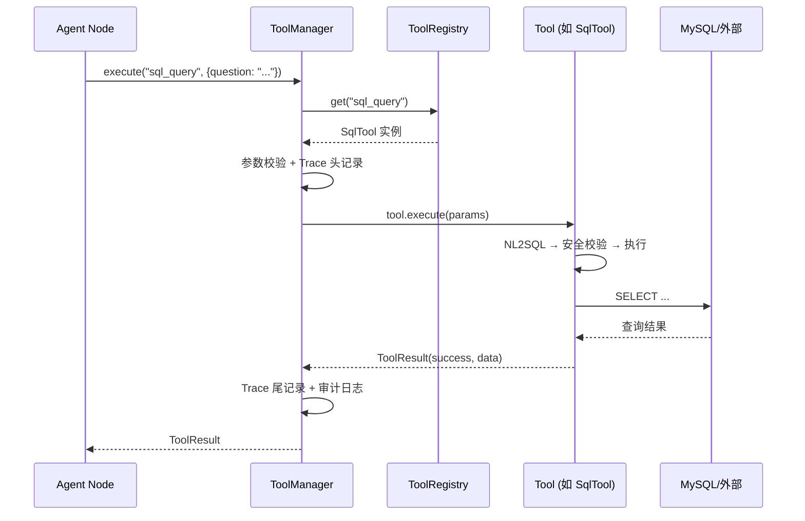
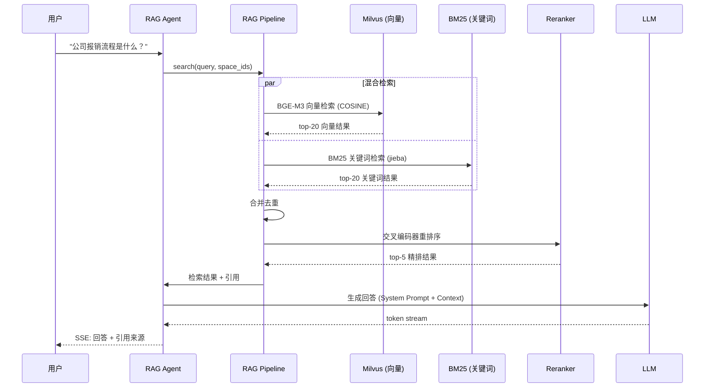
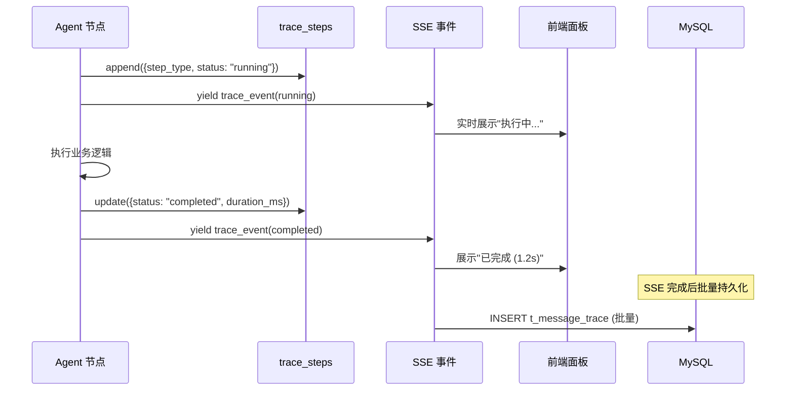
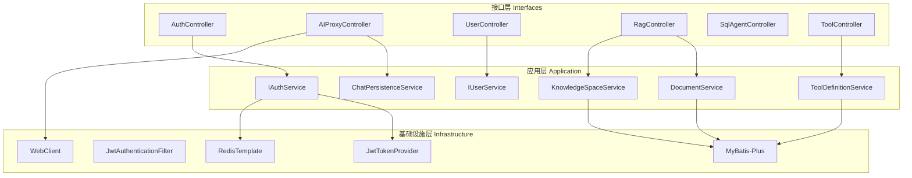
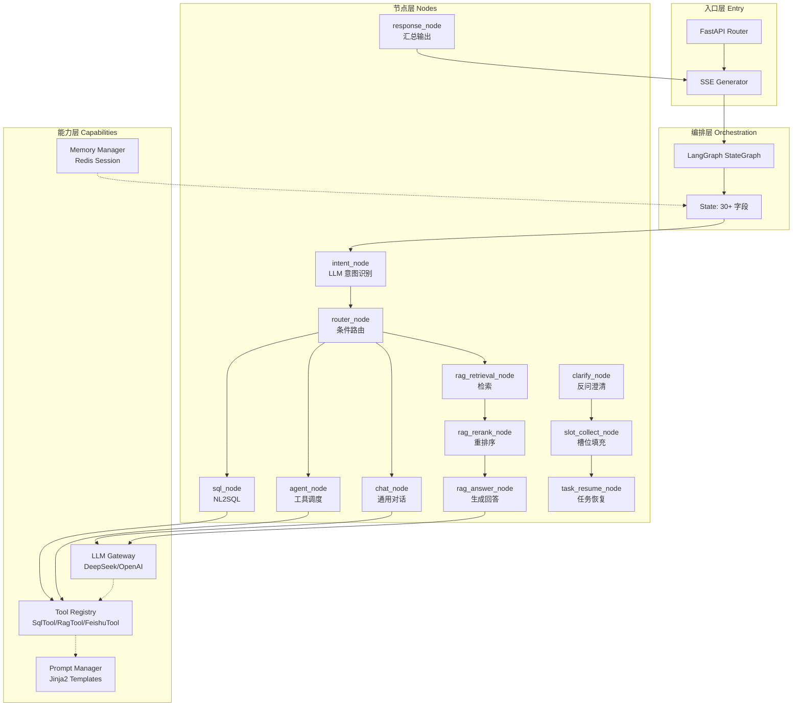
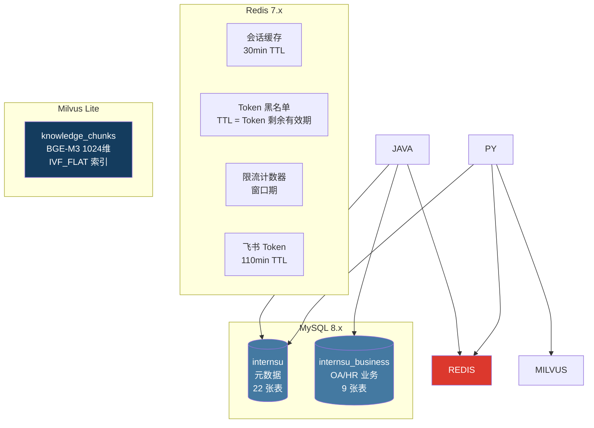
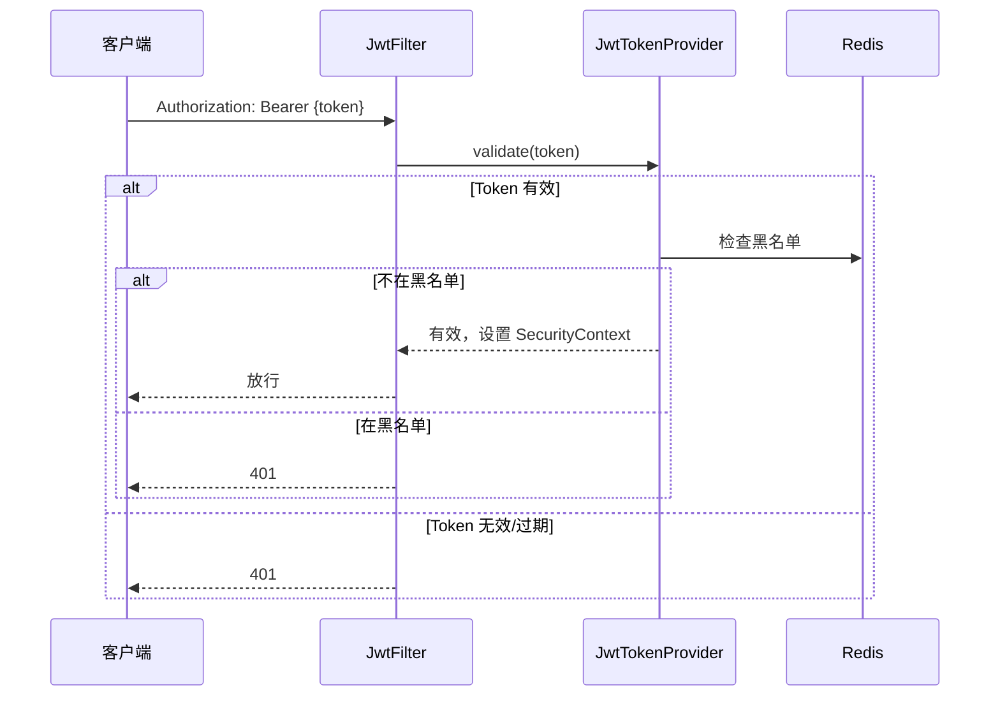

# InternSU 系统设计说明书

> 文档编号: INT-SDD-001
> 版本: v1.0.0
> 编写日期: 2026-06-13
> 状态: 已完成

---

## 1 引言

### 1.1 文档目的

本文档基于 InternSU 项目已实现的源码，从系统架构、模块设计、核心流程、数据存储、安全机制等维度进行全面分析，完整描述系统的实现方式和设计决策。作为项目技术文档的核心之一，本文档可用于：

- **开发人员**: 理解系统全貌，快速定位代码位置，指导后续开发
- **架构师**: 评估架构合理性，识别技术债务，规划演进方向
- **面试官**: 快速理解系统设计深度和技术选型依据
- **项目评审人员**: 评估系统完整性和工程规范性

### 1.2 系统背景

**系统定位**: InternSU 是一个面向企业内部员工的 AI Agent 智能协作平台，以"AI 实习生小 SU"为角色定位，提供知识库问答、数据库查询、飞书消息总结等智能服务。

**业务背景**: 企业知识分散在多个系统中，员工查找效率低；业务数据查询依赖技术人员；飞书群消息容易遗漏。需要一个能自主理解意图、自动选择工具、透明展示过程的 AI Agent 平台。

**建设目标**:
- 构建 LangGraph 14 节点工作流编排引擎
- 实现 RAG 混合检索 + 交叉编码器重排序
- 实现 Tool Registry 统一工具注册与调度
- 实现 SSE 真流式输出架构
- 实现全链路 Trace 执行追踪

---

## 2 系统总体设计

### 2.1 总体架构



### 2.2 分层设计

| 层级 | 职责 | 技术实现 | 代码位置 |
|------|------|---------|---------|
| **表现层** | 用户交互、页面渲染、状态管理 | Vue 3 + Element Plus + Pinia | `frontend/apps/web-ele/src/` |
| **网关层** | 认证鉴权、路由代理、数据持久化 | Spring Boot 3.3 + Spring Security | `java-service/src/` |
| **AI 推理层** | 意图识别、工作流编排、工具调度、LLM 调用 | FastAPI + LangGraph + LangChain | `python-ai-service/app/` |
| **工具层** | 具体任务执行 (SQL/RAG/飞书/对话) | BaseTool + ToolRegistry | `python-ai-service/app/tools/` |
| **数据层** | 结构化存储、缓存、向量检索 | MySQL + Redis + Milvus | 配置文件 + 迁移脚本 |

**分层理由**:
- 表现层与网关层分离: 前端不直接访问 Python，Java 统一管理认证和持久化
- 网关层与 AI 层分离: Java 负责业务逻辑 (CRUD/认证)，Python 专注 AI 推理
- 工具层独立: 工具通过注册机制接入，与 Agent 逻辑解耦

### 2.3 系统边界

| 系统负责 | 系统不负责 |
|---------|-----------|
| 企业知识库问答 (RAG) | 外部互联网搜索 |
| 业务数据库查询 (SQL Agent，只读) | 数据库写入操作 |
| 飞书群消息总结 | 飞书消息发送 |
| AI 多轮对话 | 语音交互 |
| 文档上传、解析、向量化 | 文档在线编辑 |
| 用户权限管理 (RBAC) | 组织架构同步 |
| 全链路执行追踪 | 性能监控 (仅基础 Prometheus) |

---

## 3 模块设计

### 3.1 用户模块

**职责**: 管理用户认证、授权和组织归属。

**核心组件**:
- `AuthController` — 注册/登录/刷新/退出
- `JwtTokenProvider` — JWT 生成与验证
- `JwtAuthenticationFilter` — 请求认证过滤器
- `SecurityConfig` — 安全过滤器链配置

**输入**: 用户凭证 (用户名/密码/Token)
**输出**: 认证令牌 + 用户信息
**依赖**: Redis (Token 黑名单), MySQL (用户数据), BCrypt (密码加密)

### 3.2 聊天模块

**职责**: 统一 AI 聊天入口，SSE 流式代理，消息持久化。

**核心组件**:
- `AIProxyController` — Java SSE 代理入口
- `chat_api.py` — Python SSE 事件生成器
- `chat_node.py` — 通用对话节点
- `ChatPersistenceService` — MySQL 持久化服务

**输入**: 用户消息 + 会话 ID + 知识空间 ID
**输出**: SSE 事件流 (trace/token/meta/done)
**依赖**: LangGraph (AI 推理), Redis (会话缓存), MySQL (消息存储)

**SSE 事件架构**:
```
Java Gateway (WebClient)
  └── 转发 SSE 流到前端
  └── 解析事件进行持久化
      ├── trace → t_message_trace
      └── done  → t_message

Python AI Service
  └── asyncio.Queue 作为 token 传输通道
  └── 后台 Task 执行 LangGraph
  └── 主协程从 Queue 读取并 yield SSE
```

### 3.3 Agent 模块

**职责**: 自主理解用户意图，选择工具，执行任务，生成回答。

**核心组件**:
- `intern_graph.py` — LangGraph 14 节点有向图定义
- `intent_node.py` — LLM 意图识别 (Tool Selection)
- `router_node.py` — 条件路由分发
- `clarify_node.py` — 多轮澄清
- `slot_collect_node.py` — 槽位填充
- `task_resume_node.py` — 任务恢复

**生命周期**:
```
用户消息 → intent_node (LLM 选择工具)
  → clarify_node (如需澄清) → slot_collect_node → task_resume_node
  → router_node (路由到处理节点)
  → chat_node | rag 链路 | sql_node | agent_node
  → response_node → 完成
```

**状态管理**: 30+ 类型化状态字段，通过 LangGraph StateGraph 传递。

### 3.4 Tool 模块

**职责**: 统一工具注册、发现、调用和管理。

**核心组件**:
- `BaseTool` — 工具抽象基类 (get_metadata + _execute)
- `ToolRegistry` — 单例注册表 (运行时注册/注销)
- `ToolManager` — 执行编排器 (超时/校验/Trace/审计)
- `bootstrap.py` — 启动时注册所有工具

**注册机制**:
```python
# bootstrap.py
registry = ToolRegistry.get_instance()
registry.register(SqlTool())
registry.register(RagTool())
registry.register(FeishuTool())
```

**调用机制**:
```
Agent 选择工具 → ToolManager.execute(tool_name, params)
  → ToolRegistry.get(tool_name)
  → BaseTool.execute(params)
  → ToolResult (success/error + trace_steps)
```

**扩展机制**: 新增工具只需:
1. 实现 `BaseTool` 接口 (`get_metadata()` + `_execute()`)
2. 在 `bootstrap.py` 注册
3. 在 `TOOLS_PROMPT` 添加描述

### 3.5 Workflow 模块

**职责**: 定义和执行 AI 工作流，支持 LangGraph 状态图。

**核心组件**:
- `intern_graph.py` — 14 节点有向图定义
- `state.py` — 30+ 类型化状态字段定义
- `router_node.py` — 条件边路由逻辑

**状态流转**:
```
init → intent → [clarify?]
              ↓
         router
        /  |  |  \
      chat rag sql agent
        \  |  |  /
         response
           ↓
          done
```

**编排逻辑**: 通过 LangGraph 的 `add_conditional_edges` 实现条件路由，每个节点是独立的异步函数。

### 3.6 Trace 模块

**职责**: 记录 AI 每步执行过程，支持全链路追踪。

**核心组件**:
- `trace_steps` — 状态中的追踪步骤列表
- `t_message_trace` — MySQL 持久化表
- SSE `trace` 事件 — 实时推送到前端

**数据来源**: 每个节点执行时追加 trace_step:
```python
trace_steps.append({
    "node": "intent_node",
    "step_type": "intent_recognition",
    "step_name": "意图识别",
    "status": "completed",
    "duration_ms": 1200,
    "prompt_tokens": 50,
    "completion_tokens": 5,
})
```

**展示逻辑**: 前端右侧面板实时展示 trace 事件，包含步骤名、状态、耗时、Token 消耗。

### 3.7 知识库模块

**职责**: 管理企业知识空间、文档处理、向量检索。

**核心组件**:
- `RagController` — 文档 CRUD + 空间查询
- `rag_pipeline.py` — RAG 完整流程 (检索/重排/回答)
- `FeishuClient` — 文档解析管道
- `rag_tool.py` — Tool 适配器

**向量化流程**:
```
文档上传 → 解析 (pypdf/python-docx) → 分块 (512字符, 64重叠)
  → BGE-M3 嵌入 (1024维) → Milvus 存储 (IVF_FLAT 索引)
  → t_document_chunk 记录 (MySQL + Milvus 双写)
```

**检索流程**:
```
用户提问 → Query Rewrite → 混合检索
  ├── 向量检索 (BGE-M3 + Milvus COSINE)
  └── BM25 关键词检索 (jieba 分词)
  → 合并去重 → 交叉编码器重排序 (top-20)
  → 置信度检查 → 引用标注 (文档名 + 页码)
```

---

## 4 核心流程设计

### 4.1 用户聊天流程



### 4.2 Tool 调用流程



### 4.3 RAG 知识检索流程



### 4.4 Trace 执行流程



---

## 5 Frontend 设计

### 5.1 页面模块

| 页面 | 路由 | 功能 |
|------|------|------|
| 首页 | `/home` | 平台入口，展示核心功能 |
| 聊天 | `/chat` | AI 对话，SSE 流式输出 |
| 历史记录 | `/history` | 查看历史会话和消息 |
| 知识库 | `/knowledge` | 文档上传和管理 |
| 登录 | `/auth/login` | 用户登录 |
| 注册 | `/auth/register` | 用户注册 |
| 404 | `/:path(.*)*` | 未找到页面 |

### 5.2 组件设计

| 组件 | 位置 | 说明 |
|------|------|------|
| NavBar | `components/NavBar.vue` | 顶部导航栏 |
| NotifyProvider | `components/NotifyProvider.vue` | 通知中心 |
| Dock | `components/ui/Dock.vue` | 底部停靠栏 (知识库) |
| UserMenu | `components/UserMenu.vue` | 用户菜单 |

### 5.3 状态管理

| Store | 职责 | 核心状态 |
|-------|------|---------|
| `auth.ts` | 认证状态 | login, logout, fetchUserInfo |
| `chat.ts` | 聊天状态 | messages, conversations, streaming, traces |
| `knowledge.ts` | 知识库状态 | spaces, selectedSpaceIds, loading |

### 5.4 请求封装

- **请求拦截器**: 自动注入 `Authorization: Bearer <token>`
- **响应拦截器**: 401 时自动刷新 Token，失败时跳转登录
- **Token 管理**: localStorage 存储，三级回退 (Pinia → API → localStorage)

### 5.5 权限控制

- 前端路由守卫: 未登录跳转 `/auth/login`
- `@vben/access` 指令: `v-access` 控制元素可见性
- 后端 RBAC: `@PreAuthorize` 注解控制接口访问

### 5.6 路由设计

```typescript
// 路由结构
/                    → redirect /home
/home                → 首页
/chat                → AI 聊天
/history             → 历史记录
/knowledge           → 知识库
/auth/login          → 登录
/auth/register       → 注册
/:path(.*)*          → 404
```

---

## 6 Java 服务设计

### 6.1 分层架构



### 6.2 关键设计

**统一返回体**:
```java
public class Result<T> {
    int code;        // 业务状态码
    String message;  // 描述信息
    T data;          // 数据体
    long timestamp;  // 服务器时间戳
    String traceId;  // 请求追踪 ID
}
```

**异常处理**: `GlobalExceptionHandler` 统一捕获 `BusinessException`、`MethodArgumentNotValidException`、`AccessDeniedException`。

**SSE 代理**: `AIProxyController` 使用 Spring WebClient 响应式代理 Python SSE 流，同时解析事件进行 MySQL 持久化。

**认证机制**: `JwtAuthenticationFilter` 从请求头提取 Token → `JwtTokenProvider` 验证 → 设置 `SecurityContext`。

---

## 7 Python Agent 服务设计

### 7.1 Agent 执行架构



### 7.2 核心设计

**LangGraph 状态图**:
- 14 个节点，每个是独立的异步函数
- 30+ 类型化状态字段 (TypedDict)
- 条件边实现动态路由

**LLM Gateway**:
- 多 Provider 支持: DeepSeek (默认) + OpenAI
- 启动探活: 验证 API Key 有效性
- 选择性重试: 仅对 transient 错误重试
- 401 快速熔断: 认证失败立即剔除 Provider

**Prompt 管理**:
- 硬编码 Prompt: `internsu_prompts.py` (fallback)
- 数据库 Prompt: `t_prompt_template` (运行时可更新)
- Jinja2 模板: 支持变量注入

**Memory 机制**:
- Redis 会话记忆: `session:{user_id}:{conv_id}` (30min TTL)
- 滑动窗口: 最近 20 轮对话
- 图状态快照: LangGraph state 完整序列化到 Redis

---

## 8 数据存储设计

### 8.1 三库分离架构



### 8.2 MySQL 设计

**元数据库 (internsu)**: 22 张表，覆盖认证、AI 对话、知识库、工具、工作流、审计。

**业务数据库 (internsu_business)**: 9 张表，OA 模块 (部门/员工/项目/任务/考勤) + HR 模块 (部门/岗位/候选人/面试)。

**设计规范**: `t_` 前缀 + 蛇形命名 + 5 个企业级必须字段 (id/create_time/update_time/is_deleted/creator_id)。

### 8.3 Redis 设计

| Key 模式 | 用途 | TTL | 数据类型 |
|---------|------|-----|---------|
| `jwt:blacklist:{token_id}` | Token 黑名单 | Token 有效期 | STRING |
| `session:{user_id}:{conv_id}` | 会话上下文 | 30min 滑动 | HASH |
| `memory:state:{user_id}:{conv_id}` | 图状态快照 | 30min | STRING (JSON) |
| `ratelimit:{user_id}:{api}` | 用户限流 | 窗口期 | STRING |
| `feishu:token:*` | 飞书 Token | 110min | STRING |

### 8.4 Milvus 设计

**Collection**: `knowledge_chunks`
- `chunk_id`: VARCHAR(128) PK
- `file_id`: VARCHAR(64)
- `content`: VARCHAR(8192)
- `embedding`: FLOAT_VECTOR(1024)
- `metadata`: JSON

**索引**: IVF_FLAT, nlist=128, COSINE 相似度

**与 MySQL 关联**: `t_document_chunk.milvus_id` ↔ `knowledge_chunks.chunk_id`

---

## 9 安全设计

### 9.1 认证机制



### 9.2 双 Token 机制

| Token | 用途 | 有效期 | 存储 |
|-------|------|--------|------|
| Access Token | API 请求认证 | 30 分钟 | 前端 localStorage |
| Refresh Token | 刷新 Access Token | 7 天 | Redis + 前端 localStorage |

### 9.3 权限控制

**RBAC 模型**:
- 4 个角色: admin, knowledge_admin, developer, employee
- `@PreAuthorize("hasRole('ADMIN')")` 注解式权限
- Python 内部 API: `X-Api-Key` 头认证

### 9.4 数据隔离

- 部门级知识空间隔离: `visibility` + `department_id`
- 用户级会话隔离: `user_id` 权限检查
- SQL 只读执行: 三层安全防护

### 9.5 密码安全

- BCrypt 加密 (cost >= 10)
- 密码不在 API 响应中返回
- 登录失败审计日志

---

## 10 缓存设计

### 10.1 缓存策略

| 策略 | 应用场景 | 说明 |
|------|---------|------|
| Write-Through | 会话消息 | 写入时同时更新 Redis 和 MySQL |
| Cache-Aside | 工具定义 | 启动时加载，变更时刷新 |
| TTL 过期 | 会话上下文 | 30 分钟滑动过期 |
| 黑名单 | JWT Token | 退出时加入，过期自动删除 |

### 10.2 缓存与 MySQL 关系

- **Redis (热数据)**: 会话上下文、图状态快照、Token 黑名单、限流计数
- **MySQL (冷数据)**: 消息记录、Trace 追踪、审计日志、用户数据
- **桥接**: `conversation_uuid` 统一 Python UUID 和 MySQL BIGINT 标识

---

## 11 异常处理设计

### 11.1 全局异常

**Java 侧**:
- `GlobalExceptionHandler` 统一捕获
- `BusinessException` → 业务错误码
- `MethodArgumentNotValidException` → 参数校验错误
- `AccessDeniedException` → 权限不足

**Python 侧**:
- FastAPI 内置异常处理
- SSE `error` 事件推送到前端
- `trace_id` 贯穿全链路便于排查

### 11.2 AI 服务异常

| 异常 | 处理 |
|------|------|
| LLM 调用失败 | 返回友好提示，不暴露内部错误 |
| LLM 超时 | 取消后台 Task，返回超时提示 |
| 工具执行失败 | 返回 ToolResult(success=False) |
| 检索无结果 | 进入澄清节点，反问用户 |

### 11.3 降级方案

| 场景 | 降级 |
|------|------|
| LLM 不可用 | 返回"服务暂时不可用" |
| Redis 不可用 | 跳过缓存，直接查 MySQL |
| Milvus 不可用 | 降级为 BM25 关键词检索 |
| 飞书 API 不可用 | 返回"飞书服务不可用" |

---

## 12 可扩展性设计

### 12.1 新增 Tool

```
1. 实现 BaseTool 接口
   class MyTool(BaseTool):
       def get_metadata(self) -> ToolMetadata: ...
       async def _execute(self, params) -> ToolResult: ...

2. 在 bootstrap.py 注册
   registry.register(MyTool())

3. 在 TOOLS_PROMPT 添加描述
   "5. my_tool —— 功能描述..."
```

**零路由改动**: ToolManager 通过名称动态查找，无需修改 Agent 逻辑。

### 12.2 新增 Workflow

```
1. 在 intern_graph.py 添加新节点
   async def my_node(state): ...

2. 添加条件边
   graph.add_conditional_edges("router", route_fn, {...})

3. 更新 t_workflow 表记录
```

### 12.3 新增知识库

```
1. 创建 t_knowledge_space 记录
2. 设置 visibility (public/department/private)
3. 上传文档到该空间
4. 自动触发 RAG 索引
```

### 12.4 新增 LLM 模型

```
1. 在 LLM Gateway 添加 Provider
   class NewProvider(BaseLLMProvider): ...

2. 在 _init_providers 注册
3. 在 settings 配置 API Key
```

---

## 13 性能设计

### 13.1 分页

- MySQL: MyBatis-Plus 分页插件 (`IPage<T>`)
- 前端: 无限滚动 + 按需加载

### 13.2 缓存

- Redis 会话缓存: 30min TTL，避免频繁查 MySQL
- 工具定义缓存: 启动时加载，避免每次请求查库

### 13.3 异步

- Python: asyncio + 后台 Task 执行 LangGraph
- 文档索引: 异步处理，不阻塞用户
- SSE: asyncio.Queue 实时推送，非阻塞

### 13.4 流式响应

- SSE 真流式: LLM 每生成一个 token 立即推送
- 首 Token 延迟 < 2s

### 13.5 数据库优化

- 冗余计数字段: `message_count`, `document_count`
- 复合索引: `(user_id, create_time)` 支持分页排序
- 逻辑删除: 避免物理删除导致索引碎片

### 13.6 向量检索优化

- IVF_FLAT 索引: 适合百万级数据
- 混合检索: 向量语义 + BM25 关键词互补
- 交叉编码器重排序: 精排 top-20 → top-5

---

## 14 系统亮点

### 14.1 LLM 驱动的意图识别

**问题背景**: 传统关键词匹配无法处理复杂语义，每新增能力需改规则。

**设计方案**: 将每个能力定义为"工具"，让 LLM 根据工具描述自主选择。

**实现方式**: `intent_node.py` 构建 TOOLS_PROMPT，LLM 仅输出工具名 (max_tokens=20)。

**工程价值**: 新增能力只需在 TOOLS_PROMPT 加一行描述，零代码改动。

### 14.2 统一 Tool Registry

**问题背景**: 新增工具需改动多处代码 (路由/参数/执行)，耦合度高。

**设计方案**: BaseTool 抽象类 + ToolRegistry 单例 + ToolManager 编排。

**实现方式**: 启动时 bootstrap.py 注册所有工具，ToolManager 通过名称动态查找。

**工程价值**: 新增工具只需实现 BaseTool + 注册，无需修改路由或 Agent 逻辑。

### 14.3 14 节点 LangGraph 工作流

**问题背景**: 线性链路无法处理多轮澄清、任务恢复、条件分支。

**设计方案**: 将 AI 推理过程建模为有向图，每个节点独立可测试。

**实现方式**: `intern_graph.py` 定义 StateGraph，30+ 类型化状态字段，条件边路由。

**工程价值**: 节点独立可替换，工作流可视化便于调试。

### 14.4 混合检索 + 交叉编码器重排序

**问题背景**: 单一向量检索对精确关键词弱，单 BM25 对语义弱。

**设计方案**: 向量语义 + BM25 关键词混合检索，交叉编码器精排。

**实现方式**: BGE-M3 向量 (COSINE) + rank_bm25 + jieba 分词 + BGE-M3 cross-encoder。

**工程价值**: 检索准确率显著优于单路检索。

### 14.5 SSE 真流式架构

**问题背景**: 旧架构等完全执行完再返回 (伪流式)，用户体验差。

**设计方案**: Python 后台 Task 执行 LangGraph，token 实时入 Queue，主协程 yield SSE。

**实现方式**: `asyncio.Queue` + `asyncio.create_task` + `StreamingResponse`。

**工程价值**: 首 Token 延迟 < 2s，用户感知实时打字效果。

### 14.6 全链路 Trace 追踪

**问题背景**: AI 黑盒问题，用户不知 AI 做了什么。

**设计方案**: 每步记录 trace_step，SSE 实时推送，MySQL 持久化。

**实现方式**: `trace_steps` 列表 + SSE trace 事件 + `t_message_trace` 表 + trace_id 贯穿。

**工程价值**: 可视化 AI 执行过程，增强信任，便于调试。

### 14.7 三层 SQL 安全防护

**问题背景**: LLM 生成的 SQL 可能包含危险操作或注入。

**设计方案**: 语法校验 → 危险操作拦截 → 只读执行，逐层递进。

**实现方式**: `sqlparse` AST 分析 + 正则危险关键词 + SELECT/SHOW/DESCRIBE/EXPLAIN 白名单。

**工程价值**: NL2SQL 安全可控，支持审计追溯。

### 14.8 双层持久化 (Redis + MySQL)

**问题背景**: 单一存储无法同时满足高性能会话读取和持久化。

**设计方案**: Redis 热数据 (30min) + MySQL 冷数据 (永久)，conversation_uuid 桥接。

**实现方式**: Redis session + MySQL t_conversation/t_message + 冗余 conversation_uuid 字段。

**工程价值**: 会话切换 < 100ms，历史查询走 MySQL，冷热分离。

---

## 15 技术债务与改进方向

### 15.1 当前不足

| 问题 | 说明 | 影响 |
|------|------|------|
| 无读写分离 | 单 MySQL 实例 | 高并发读场景性能瓶颈 |
| 无分库分表 | 单库 31 张表 | 数据量增长后性能下降 |
| 无归档策略 | 消息/日志永久保留 | 存储空间持续增长 |
| Milvus Lite 限制 | 内嵌式部署 | 不支持分布式，数据量受限 |
| 前端无国际化 | 仅中文 | 不支持多语言用户 |
| 无 WebSocket | 仅 SSE | 不支持双向实时通信 |

### 15.2 未来演进方向

| 方向 | 说明 | 优先级 |
|------|------|--------|
| 多 Agent 协同 | Agent 间消息传递，分工合作 | 高 |
| MCP 协议扩展 | 标准化工具接入协议 | 高 |
| Workflow 可视化编排 | 拖拽式工作流设计 | 中 |
| 多模态支持 | 图片/文件理解 | 中 |
| 读写分离 | MySQL 主从复制 | 中 |
| 消息表分区 | 按时间分区 | 低 |

---

## 16 面试官关注点

### 16.1 为什么 Java 和 Python 分离？

**基于代码的分析**:
- Java 擅长: 业务 CRUD、认证鉴权、事务管理、SSE 代理
- Python 擅长: LLM 调用、LangGraph 工作流、RAG 检索、向量处理
- 分离好处: 各自技术栈最优解，独立部署和扩展

### 16.2 为什么用 Milvus？

**基于代码的分析**:
- 内嵌式部署 (milvus-lite): 简化开发环境，无需独立容器
- IVF_FLAT 索引: 适合百万级数据，查询性能 < 500ms
- 生产可切换: 代码中 pymilvus 客户端兼容完整版 Milvus

### 16.3 为什么用 Redis？

**基于代码的分析**:
- 会话缓存: 30min TTL，避免频繁查 MySQL
- Token 黑名单: 退出时加入，O(1) 查询
- 图状态快照: LangGraph state 完整序列化，支持会话恢复
- 限流: 滑动窗口计数器

### 16.4 为什么用 LangGraph 而非 LangChain Agent？

**基于代码的分析**:
- 状态机可视化: 14 节点有向图，调试直观
- 节点独立可测试: 每个节点是独立异步函数
- 条件路由灵活: add_conditional_edges 支持复杂分支
- 多轮澄清支持: clarify → slot_collect → task_resume 循环

### 16.5 为什么需要 Trace？

**基于代码的分析**:
- AI 黑盒问题: 用户不知 AI 做了什么
- 调试需求: 开发时定位慢步骤、Token 消耗
- 用户信任: 可视化执行过程增强信任
- 审计合规: 全链路记录支持事后追溯

### 16.6 为什么用 SSE 而非 WebSocket？

**基于代码的分析**:
- 单向推送: AI 回答是单向流，无需双向通信
- 实现简单: FastAPI 原生支持 StreamingResponse
- Java 代理: Spring WebClient 响应式透传
- 取消传播: 客户端断开自动取消后台 Task

### 16.7 Tool Registry 的设计价值？

**基于代码的分析**:
- 解耦: 工具与 Agent 逻辑完全分离
- 动态: 运行时启用/禁用，无需重启
- 扩展: 新增工具只需实现 BaseTool + 注册
- 审计: ToolManager 自动记录调用日志和 Trace

### 16.8 混合检索的优势？

**基于代码的分析**:
- 向量语义: BGE-M3 理解语义相似性 (如"报销"≈"费用申请")
- BM25 关键词: jieba 分词精确匹配 (如"OA-2024-001")
- 交叉编码器: BGE-M3 cross-encoder 精排，显著提升准确率
- 引用溯源: 追踪到文档名 + 页码，增强可信度
