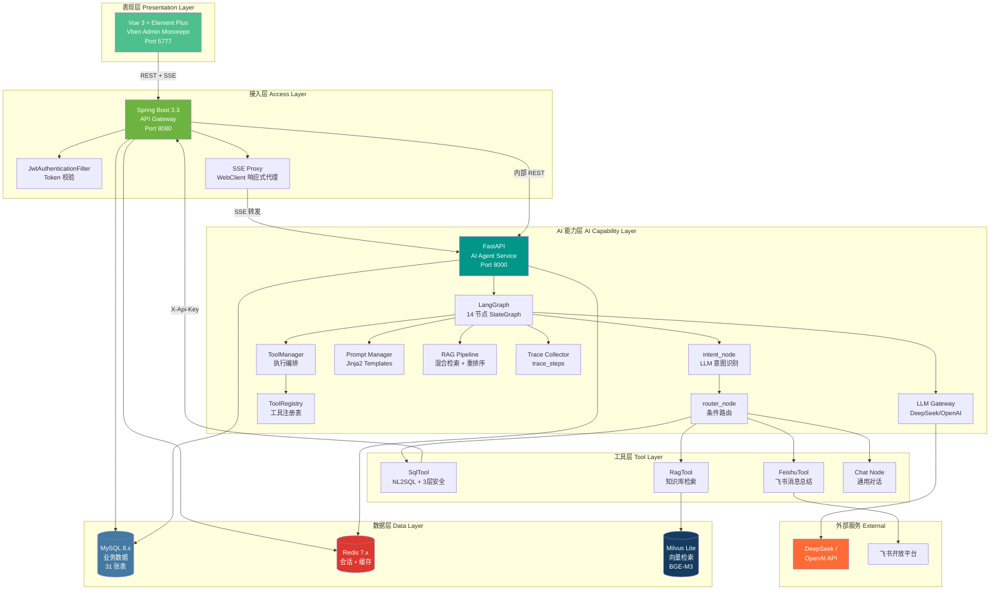
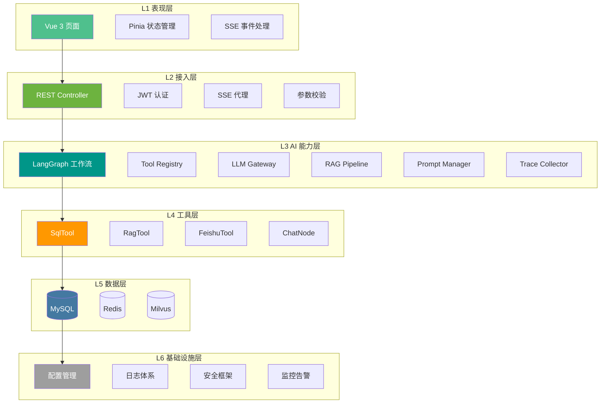
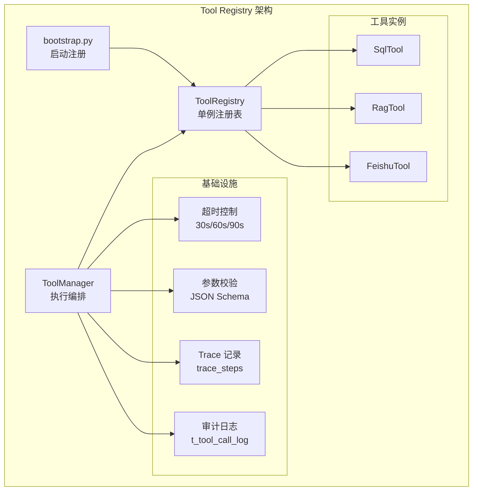
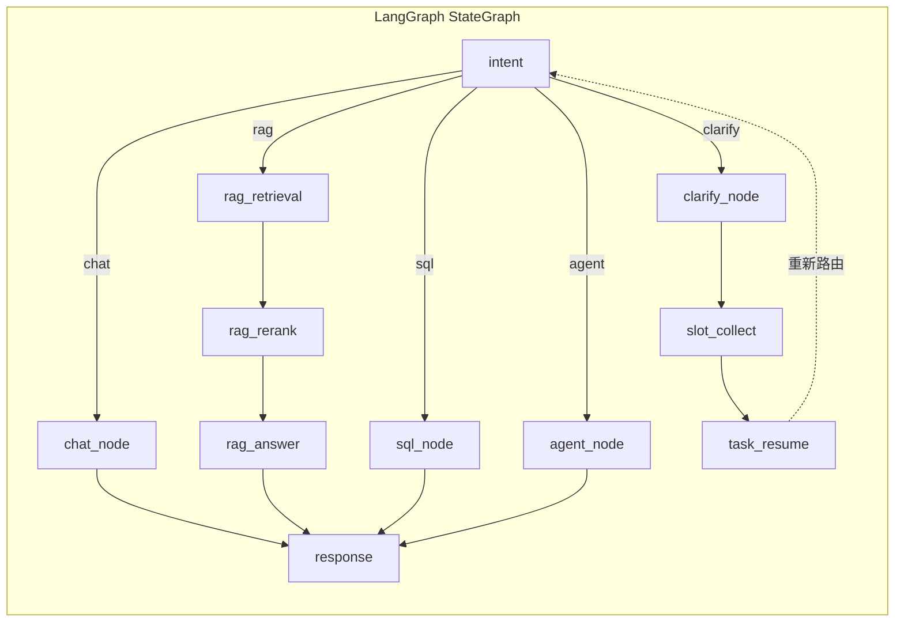
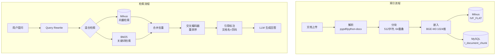
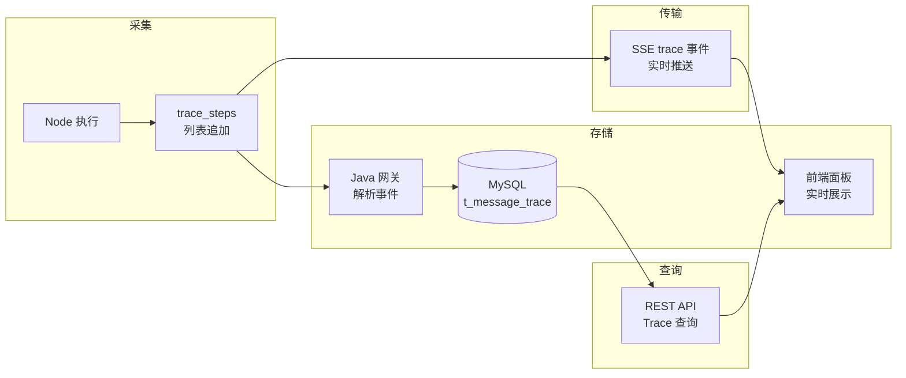
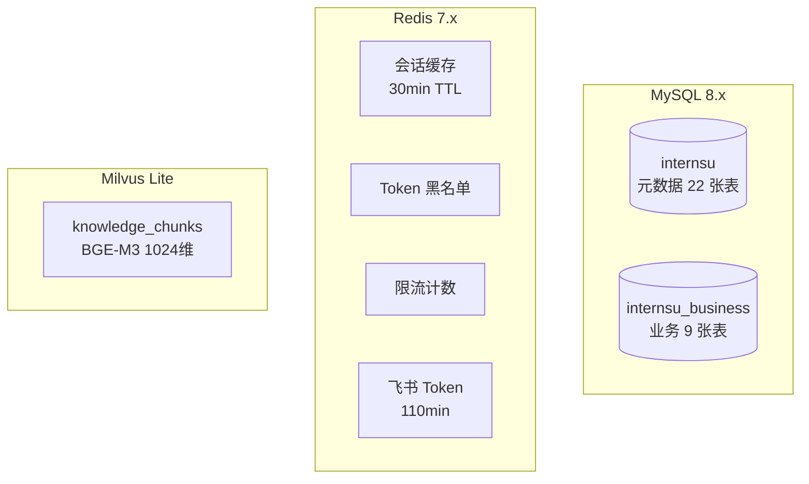
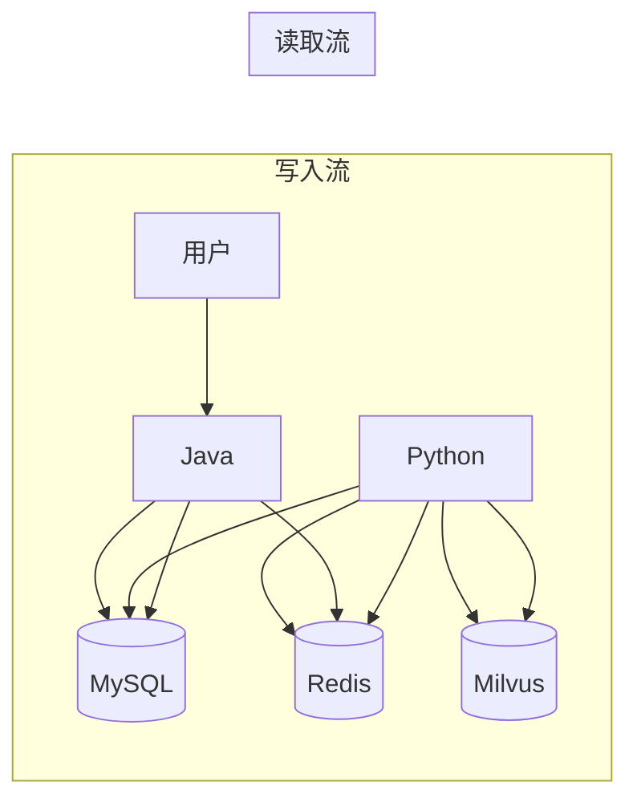
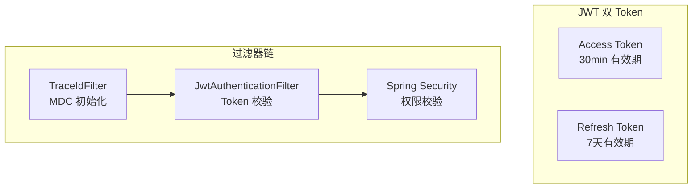

# InternSU 架构设计说明书

> 文档编号: INT-ADD-001
> 版本: v1.0.0
> 编写日期: 2026-06-13
> 状态: 已完成

---

## 1 文档概述

### 1.1 编写目的

本文档基于 InternSU 项目已实现的源码，从架构设计角度全面分析系统的分层结构、服务拆分、模块边界、技术选型和核心架构决策。作为项目技术文档的核心之一，本文档可用于：

- **架构师**: 评估架构合理性，识别技术债务，规划演进方向
- **开发人员**: 理解系统全貌和设计思想，快速定位代码位置
- **面试官**: 快速理解架构设计深度和技术选型依据
- **技术负责人**: 评估系统完整性和工程规范性

### 1.2 系统背景

**项目定位**: InternSU 是一个面向企业内部员工的 AI Agent 智能协作平台，以"AI 实习生小 SU"为角色定位，提供知识库问答、数据库查询、飞书消息总结等智能服务。

**建设目标**:
- 构建 LangGraph 14 节点工作流编排引擎
- 实现 RAG 混合检索 + 交叉编码器重排序
- 实现 Tool Registry 统一工具注册与调度
- 实现 SSE 真流式输出架构
- 实现全链路 Trace 执行追踪

**业务背景**: 企业知识分散在多个系统中，员工查找效率低；业务数据查询依赖技术人员；飞书群消息容易遗漏。需要一个能自主理解意图、自动选择工具、透明展示过程的 AI Agent 平台。

---

## 2 架构设计目标

| 目标 | 说明 | 代码依据 |
|------|------|---------|
| 高扩展性 | 新增工具/意图/模型零路由改动 | `BaseTool` + `bootstrap.py` + `TOOLS_PROMPT` |
| 模块解耦 | Java (网关) + Python (AI) 独立部署 | `AIProxyController` (Java) + `chat_api.py` (Python) |
| Agent 可扩展 | 新增能力只需添加工具描述 | `intent_node.py` TOOLS_PROMPT |
| Tool 可扩展 | 实现 BaseTool + 注册即可 | `ToolRegistry` + `ToolManager` |
| Workflow 可视化 | 14 节点有向图，节点独立可测试 | `intern_graph.py` LangGraph StateGraph |
| 知识库可扩展 | 支持多空间、多文档类型 | `t_knowledge_space` + `t_document` |
| 全链路可观测 | 每步执行过程透明可追踪 | `t_message_trace` + SSE trace 事件 |

---

## 3 总体架构设计

### 3.1 系统架构图



### 3.2 架构组件清单

| 组件 | 技术栈 | 端口 | 职责 |
|------|--------|------|------|
| Frontend | Vue 3 + Element Plus | 5777 | 用户交互 |
| Java Gateway | Spring Boot 3.3 | 8080 | 认证/路由/持久化 |
| Python AI | FastAPI | 8000 | AI 推理/工作流 |
| MySQL | MySQL 8.x | 3306 | 关系数据 |
| Redis | Redis 7.x | 6379 | 缓存/会话 |
| Milvus | Milvus Lite | 内嵌 | 向量检索 |
| DeepSeek API | REST | 外部 | LLM 推理 |

---

## 4 架构分层设计



| 层级 | 职责 | 边界 | 依赖 |
|------|------|------|------|
| L1 表现层 | 用户交互、页面渲染 | 不涉及业务逻辑 | 仅调用 L2 API |
| L2 接入层 | 认证鉴权、路由代理、参数校验 | 不涉及 AI 推理 | 调用 L3 |
| L3 AI 能力层 | 意图识别、工作流、LLM 调用 | 不涉及 CRUD | 调用 L4/L5 |
| L4 工具层 | 具体任务执行 | 与 Agent 逻辑解耦 | 调用 L5 |
| L5 数据层 | 数据存储和检索 | 不涉及业务逻辑 | 被上层调用 |
| L6 基础设施层 | 配置/日志/安全/监控 | 横切关注点 | 被所有层使用 |

---

## 5 服务拆分设计

### 5.1 为什么采用 Java + Python 双服务

**职责划分**:

| 服务 | 职责 | 技术优势 |
|------|------|---------|
| Java Gateway | 认证鉴权、API 网关、数据持久化、SSE 代理 | Spring Security 生态、MyBatis-Plus ORM、WebClient 响应式 |
| Python AI | 意图识别、工作流编排、LLM 调用、RAG 检索、Tool 执行 | LangGraph 状态图、LangChain 生态、pymilvus、asyncio |

**边界划分**:
- 前端仅与 Java 通信
- Java 代理 SSE 流到 Python
- Python 通过 X-Api-Key 调用 Java SQL 执行接口
- 数据持久化统一由 Java 处理

**优点**:
- 各自技术栈最优解
- 独立部署和扩展
- Python AI 服务可独立重启不影响 Java

**缺点**:
- 跨服务通信增加延迟
- 双语言维护成本
- 分布式事务不支持

**未来扩展**:
- Python 服务可水平扩展 (多实例)
- Java 可按模块进一步拆分

---

## 6 模块架构设计

### 6.1 用户模块

**职责**: 用户认证、授权、组织归属管理。

**依赖**: MySQL (t_user/t_role/t_permission), Redis (Token 黑名单), BCrypt

**边界**: 不涉及 AI 推理，不涉及知识库操作。

### 6.2 聊天模块

**职责**: 统一 AI 聊天入口，SSE 流式代理，消息持久化。

**依赖**: Python AI Service, MySQL (t_conversation/t_message/t_message_trace), Redis (会话缓存)

**边界**: 不直接调用 LLM，不直接操作知识库。

### 6.3 Agent 模块

**职责**: 自主理解意图，选择工具，执行任务，生成回答。

**生命周期**:
```
用户消息 → intent_node → router_node → 处理节点 → response_node → 完成
              ↓ (如需澄清)
         clarify_node → slot_collect → task_resume → 重新路由
```

**扩展能力**: 新增意图只需在 TOOLS_PROMPT 添加描述。

### 6.4 Tool 模块

**职责**: 统一工具注册、发现、调用和管理。

**注册机制**: `bootstrap.py` 启动时注册所有工具到 `ToolRegistry` 单例。

**调用机制**: `ToolManager.execute(tool_name, params)` → `ToolRegistry.get(name)` → `BaseTool.execute(params)`

**扩展机制**: 实现 `BaseTool` 接口 + 在 `bootstrap.py` 注册 + 在 `TOOLS_PROMPT` 添加描述。

### 6.5 Workflow 模块

**职责**: 定义和执行 AI 工作流，支持 LangGraph 状态图。

**状态流转**:
```
init → intent → clarify? → router → [chat|rag|sql|agent] → response → done
```

**扩展机制**: 在 `intern_graph.py` 添加新节点 + 条件边。

### 6.6 Trace 模块

**职责**: 记录 AI 每步执行过程，支持全链路追踪。

**数据流**:
```
节点执行 → trace_steps.append() → SSE trace 事件 → 前端展示
                                        ↓
                              MySQL t_message_trace
```

**展示逻辑**: 前端右侧面板实时展示 trace 事件。

### 6.7 知识库模块

**职责**: 管理知识空间、文档处理、向量检索。

**数据流**:
```
文档上传 → 解析 → 分块 → BGE-M3 嵌入 → Milvus 存储
用户提问 → 混合检索 → 重排序 → 引用标注 → LLM 生成
```

**扩展能力**: 支持多知识空间、多文档类型、多嵌入模型。

---

## 7 技术选型分析

### 7.1 Spring Boot (Java 网关)

| 维度 | 分析 |
|------|------|
| 为什么选 | 成熟的 Java Web 框架，生态丰富 |
| 解决什么 | API 网关、认证鉴权、数据持久化 |
| 替代方案 | Vert.x, Quarkus, Micronaut |
| 为什么更适合 | Spring Security 生态完整，MyBatis-Plus ORM 成熟 |

### 7.2 Vue 3 (前端)

| 维度 | 分析 |
|------|------|
| 为什么选 | 渐进式框架，组合式 API，TypeScript 支持好 |
| 解决什么 | 用户交互、页面渲染、状态管理 |
| 替代方案 | React, Angular |
| 为什么更适合 | Vben Admin 模板成熟，Element Plus 组件丰富 |

### 7.3 FastAPI (Python AI)

| 维度 | 分析 |
|------|------|
| 为什么选 | 异步高性能，自动 API 文档，类型安全 |
| 解决什么 | AI 服务入口，SSE 流式输出 |
| 替代方案 | Flask, Django, Starlette |
| 为什么更适合 | 原生 async/await，SSE 支持好 |

### 7.4 LangGraph (工作流)

| 维度 | 分析 |
|------|------|
| 为什么选 | 有向图状态机，节点独立可测试 |
| 解决什么 | AI 工作流编排，条件路由，多轮澄清 |
| 替代方案 | LangChain Agent, CrewAI, AutoGen |
| 为什么更适合 | 状态机可视化，条件路由灵活，多轮对话支持好 |

### 7.5 Redis (缓存)

| 维度 | 分析 |
|------|------|
| 为什么选 | 高性能 KV 存储，数据结构丰富 |
| 解决什么 | 会话缓存、Token 黑名单、限流、图状态快照 |
| 替代方案 | Memcached, Hazelcast |
| 为什么更适合 | 数据结构丰富 (HASH/STRING)，TTL 支持好 |

### 7.6 MySQL (关系数据)

| 维度 | 分析 |
|------|------|
| 为什么选 | 成熟稳定，生态丰富，支持 JSON 字段 |
| 解决什么 | 业务数据、用户数据、审计日志 |
| 替代方案 | PostgreSQL, MongoDB |
| 为什么更适合 | MyBatis-Plus 生态成熟，JSON 字段支持灵活配置 |

### 7.7 Milvus (向量数据库)

| 维度 | 分析 |
|------|------|
| 为什么选 | 专业向量数据库，支持多种索引 |
| 解决什么 | 文档向量存储和检索 |
| 替代方案 | Pinecone, Weaviate, Qdrant, pgvector |
| 为什么更适合 | Lite 版内嵌部署简化开发，生产可切换完整版 |

### 7.8 DeepSeek (LLM)

| 维度 | 分析 |
|------|------|
| 为什么选 | 性价比高，中文能力强 |
| 解决什么 | 意图识别、回答生成、SQL 生成、摘要生成 |
| 替代方案 | OpenAI GPT-4o, Claude, 通义千问 |
| 为什么更适合 | 成本低，API 兼容 OpenAI 格式，切换成本低 |

### 7.9 BGE-M3 (嵌入模型)

| 维度 | 分析 |
|------|------|
| 为什么选 | 多语言支持，1024 维高精度 |
| 解决什么 | 文档向量化，查询向量化 |
| 替代方案 | text-embedding-3-small, E5, GTE |
| 为什么更适合 | 中英文双语支持好，本地部署无外部依赖 |

---

## 8 核心架构设计

### 8.1 Agent 架构设计

```mermaid
graph TB
    subgraph "Agent 执行引擎"
        INPUT[用户消息]
        STATE[StateGraph<br/>30+ 类型化字段]

        subgraph "意图识别"
            INTENT[intent_node<br/>LLM Tool Selection]
        end

        subgraph "条件路由"
            ROUTER[router_node<br/>chat|rag|sql|agent]
        end

        subgraph "处理节点"
            CHAT[chat_node<br/>通用对话]
            RAG1[rag_retrieval<br/>检索]
            RAG2[rag_rerank<br/>重排序]
            RAG3[rag_answer<br/>生成回答]
            SQL[sql_node<br/>NL2SQL]
            AGENT[agent_node<br/>工具调度]
        end

        subgraph "澄清循环"
            CLARIFY[clarify_node<br/>反问澄清]
            SLOT[slot_collect<br/>槽位填充]
            RESUME[task_resume<br/>任务恢复]
        end

        RESPONSE[response_node<br/>汇总输出]
    end

    INPUT --> STATE
    STATE --> INTENT
    INTENT --> ROUTER
    ROUTER --> CHAT
    ROUTER --> RAG1
    ROUTER --> SQL
    ROUTER --> AGENT
    RAG1 --> RAG2 --> RAG3
    INTENT -.->|需澄清| CLARIFY
    CLARIFY --> SLOT --> RESUME
    RESUME -.-> INTENT
    CHAT --> RESPONSE
    RAG3 --> RESPONSE
    SQL --> RESPONSE
    AGENT --> RESPONSE
```

**Agent 生命周期**:
1. **接收**: 从 Redis 恢复会话上下文
2. **识别**: intent_node 通过 LLM 选择工具
3. **路由**: router_node 根据意图分发
4. **执行**: 处理节点执行具体任务
5. **输出**: response_node 汇总，SSE 推送
6. **持久化**: 消息和 Trace 写入 MySQL

**扩展能力**: 新增意图只需在 TOOLS_PROMPT 添加一行描述。

### 8.2 Tool Registry 架构设计



**注册**: `bootstrap.py` 启动时 `registry.register(Tool())`

**发现**: `ToolRegistry.get(name)` 按名称查找

**调用**: `ToolManager.execute(name, params)` → 校验 → 执行 → Trace → 审计

**扩展**: 实现 `BaseTool` + 注册 + TOOLS_PROMPT 描述

### 8.3 Workflow 架构设计



**节点**: 14 个独立异步函数

**状态**: 30+ 类型化字段 (TypedDict)

**流转**: 条件边 (add_conditional_edges) 实现动态路由

**扩展**: 添加新节点 + 条件边 + 更新 TOOLS_PROMPT

### 8.4 RAG 架构设计



**文档解析**: pypdf (PDF) + python-docx (DOCX) + 纯文本

**分块策略**: RecursiveCharacterTextSplitter, 512 字符, 64 重叠

**嵌入模型**: BGE-M3, 1024 维, 多语言

**检索策略**: 向量语义 (COSINE) + BM25 关键词, 交叉编码器精排

### 8.5 Trace 架构设计



**采集**: 每个节点执行时 `trace_steps.append()`

**传输**: SSE trace 事件实时推送到前端

**存储**: Java 网关解析 SSE 事件，批量写入 MySQL

**查询**: 通过消息 ID 或 trace_id 查询完整执行链路

---

## 9 数据架构设计

### 9.1 三库分离



### 9.2 数据职责

| 存储 | 职责 | 数据特征 |
|------|------|---------|
| MySQL | 业务数据、用户数据、审计日志 | 结构化、事务性、持久化 |
| Redis | 会话缓存、Token 黑名单、限流 | 高频读写、临时性、TTL |
| Milvus | 文档向量、相似性检索 | 高维浮点、向量运算 |

### 9.3 数据流图



---

## 10 安全架构设计

### 10.1 认证架构



### 10.2 权限控制

| 层级 | 机制 | 实现 |
|------|------|------|
| 接口级 | `@PreAuthorize` | Spring Security |
| 数据级 | `visibility` + `department_id` | 知识空间权限 |
| 行级 | `creator_id` + `user_id` | 文档/会话归属 |

### 10.3 SQL 安全

```
语法校验 (sqlparse) → 危险操作拦截 (正则) → 只读执行 (白名单)
```

---

## 11 扩展性设计

### 11.1 新增 Tool

```python
# 1. 实现 BaseTool
class MyTool(BaseTool):
    def get_metadata(self) -> ToolMetadata:
        return ToolMetadata(name="my_tool", ...)
    async def _execute(self, params) -> ToolResult:
        ...

# 2. 注册
registry.register(MyTool())

# 3. TOOLS_PROMPT 添加描述
"5. my_tool —— 功能描述..."
```

### 11.2 新增 Workflow 节点

```python
# 1. 添加节点
async def my_node(state): ...

# 2. 添加条件边
graph.add_conditional_edges("router", route_fn, {...})
```

### 11.3 新增 LLM Provider

```python
# 1. 实现 Provider
class NewProvider(BaseLLMProvider):
    async def chat(self, messages, ...): ...

# 2. 注册
self._providers[ProviderType.NEW] = NewProvider()
```

### 11.4 新增知识空间

```
1. 创建 t_knowledge_space 记录
2. 设置 visibility (public/department/private)
3. 上传文档 → 自动触发 RAG 索引
```

---

## 12 架构决策记录 (ADR)

### ADR-001: Java + Python 双服务架构

**问题**: 为什么采用 Java + Python 双服务而非单体?

**方案**:
- A: 单体 Java (Spring Boot + LangChain4j)
- B: 单体 Python (FastAPI + 全栈)
- C: Java + Python 双服务

**最终选择**: C

**原因**: Java 擅长业务 CRUD 和认证鉴权 (Spring Security 生态)，Python 擅长 AI 推理和向量处理 (LangGraph/LangChain 生态)。双服务可独立部署和扩展。

### ADR-002: Tool Registry 插件体系

**问题**: 如何实现工具的动态注册和调用?

**方案**:
- A: 硬编码路由 (if/else)
- B: 配置文件驱动
- C: BaseTool 抽象类 + ToolRegistry 单例

**最终选择**: C

**原因**: 新增工具只需实现接口 + 注册，无需修改路由或 Agent 逻辑。运行时可启用/禁用。

### ADR-003: LangGraph 工作流

**问题**: 如何编排 AI 工作流?

**方案**:
- A: 线性链路 (if/else)
- B: LangChain Agent
- C: LangGraph StateGraph

**最终选择**: C

**原因**: 14 节点有向图，状态机可视化，条件路由灵活，多轮澄清支持好。

### ADR-004: Milvus 向量数据库

**问题**: 如何存储和检索文档向量?

**方案**:
- A: pgvector (PostgreSQL 扩展)
- B: Milvus Lite (内嵌式)
- C: Milvus 完整版 (独立部署)

**最终选择**: B

**原因**: Lite 版内嵌部署简化开发环境，pymilvus 客户端兼容完整版，生产可平滑切换。

### ADR-005: SSE 流式架构

**问题**: 如何实现实时流式输出?

**方案**:
- A: WebSocket
- B: SSE (Server-Sent Events)
- C: 轮询

**最终选择**: B

**原因**: AI 回答是单向流，SSE 实现简单 (FastAPI 原生支持)，Java WebClient 响应式透传。

### ADR-006: 双层持久化

**问题**: 会话数据如何存储?

**方案**:
- A: 仅 Redis
- B: 仅 MySQL
- C: Redis (热) + MySQL (冷)

**最终选择**: C

**原因**: Redis 会话切换 < 100ms，MySQL 永久存储支持历史查询，conversation_uuid 桥接双标识。

### ADR-007: LLM 意图识别替代规则引擎

**问题**: 如何识别用户意图?

**方案**:
- A: 关键词匹配
- B: 规则引擎
- C: LLM Tool Selection

**最终选择**: C

**原因**: 关键词无法处理复杂语义，规则引擎每新增能力需改代码，LLM 自主选择零改动。

### ADR-008: 全链路 Trace

**问题**: 如何追踪 AI 执行过程?

**方案**:
- A: 仅日志
- B: 前端进度条
- C: trace_steps + SSE + MySQL 持久化

**最终选择**: C

**原因**: 前端实时展示增强信任，MySQL 持久化支持事后追溯，trace_id 贯穿全链路。

---

## 13 架构亮点

### 13.1 LLM 驱动的意图识别

**问题背景**: 传统关键词匹配无法处理复杂语义 (如"帮我查一下去年的考勤数据"混合了意图)。

**设计方案**: 将每个能力定义为"工具"，让 LLM 根据工具描述自主选择。

**实现方式**: `intent_node.py` 构建 TOOLS_PROMPT，LLM 仅输出工具名 (max_tokens=20)。

**工程价值**: 新增能力只需在 TOOLS_PROMPT 加一行描述，零代码改动。

**面试价值**: 体现对 AI Agent 架构的理解，以及"规则引擎 vs LLM"的权衡能力。

### 13.2 统一 Tool Registry

**问题背景**: 新增工具需改动多处代码 (路由/参数/执行)，耦合度高。

**设计方案**: BaseTool 抽象类 + ToolRegistry 单例 + ToolManager 编排。

**实现方式**: `bootstrap.py` 注册 → `ToolRegistry.get(name)` 查找 → `ToolManager.execute()` 编排。

**工程价值**: 新增工具只需实现 BaseTool + 注册，无需修改 Agent 逻辑。

**面试价值**: 体现插件化设计思想和开闭原则。

### 13.3 14 节点 LangGraph 工作流

**问题背景**: 线性链路无法处理多轮澄清、任务恢复、条件分支。

**设计方案**: 将 AI 推理过程建模为有向图，每个节点独立可测试。

**实现方式**: `intern_graph.py` StateGraph + 30+ 类型化状态字段 + 条件边路由。

**工程价值**: 节点独立可替换，工作流可视化便于调试。

**面试价值**: 体现状态机设计能力和 LangGraph 深度使用。

### 13.4 混合检索 + 交叉编码器重排序

**问题背景**: 单一向量检索对精确关键词弱，单 BM25 对语义弱。

**设计方案**: 向量语义 + BM25 关键词混合，交叉编码器精排。

**实现方式**: BGE-M3 向量 (COSINE) + rank_bm25 + BGE-M3 cross-encoder。

**工程价值**: 检索准确率显著优于单路检索，引用溯源增强可信度。

**面试价值**: 体现 RAG 工程深度，理解检索质量对回答质量的影响。

### 13.5 SSE 真流式架构

**问题背景**: 旧架构等完全执行完再返回 (伪流式)，用户体验差。

**设计方案**: Python 后台 Task 执行 LangGraph，token 实时入 Queue，主协程 yield SSE。

**实现方式**: `asyncio.Queue` + `asyncio.create_task` + `StreamingResponse`。

**工程价值**: 首 Token 延迟 < 2s，用户感知实时打字效果。

**面试价值**: 体现异步编程能力和 SSE 架构理解。

### 13.6 全链路 Trace 追踪

**问题背景**: AI 黑盒问题，用户不知 AI 做了什么。

**设计方案**: 每步记录 trace_step，SSE 实时推送，MySQL 持久化。

**实现方式**: `trace_steps` 列表 + SSE trace 事件 + `t_message_trace` 表 + trace_id 贯穿。

**工程价值**: 可视化 AI 执行过程，增强信任，便于调试。

**面试价值**: 体现可观测性设计和全链路追踪能力。

### 13.7 三层 SQL 安全防护

**问题背景**: LLM 生成的 SQL 可能包含危险操作或注入。

**设计方案**: 语法校验 → 危险操作拦截 → 只读执行，逐层递进。

**实现方式**: `sqlparse` AST 分析 + 正则危险关键词 + SELECT/SHOW/DESCRIBE/EXPLAIN 白名单。

**工程价值**: NL2SQL 安全可控，支持审计追溯。

**面试价值**: 体现安全意识和防御性编程能力。

### 13.8 双层持久化 (Redis + MySQL)

**问题背景**: 单一存储无法同时满足高性能会话读取和持久化。

**设计方案**: Redis 热数据 (30min) + MySQL 冷数据 (永久)，conversation_uuid 桥接。

**实现方式**: Redis session + MySQL t_conversation/t_message + 冗余 conversation_uuid 字段。

**工程价值**: 会话切换 < 100ms，历史查询走 MySQL，冷热分离。

**面试价值**: 体现数据架构设计和冷热分离思想。

---

## 14 架构风险与优化建议

### 14.1 当前风险

| 风险 | 说明 | 影响 |
|------|------|------|
| 单点故障 | Java Gateway 单实例 | 服务不可用 |
| 无读写分离 | 单 MySQL 实例 | 高并发读性能瓶颈 |
| 无分库分表 | 单库 31 张表 | 数据量增长后性能下降 |
| Milvus Lite 限制 | 内嵌式部署 | 不支持分布式 |
| 无归档策略 | 消息/日志永久保留 | 存储空间持续增长 |

### 14.2 潜在瓶颈

| 瓶颈 | 场景 | 优化方向 |
|------|------|---------|
| LLM 调用延迟 | 高并发时 LLM 排队 | 多 Provider 负载均衡 |
| 向量检索性能 | 数据量 > 100 万 | Milvus 完整版 + 分片 |
| MySQL 连接池 | 高并发写入 | 读写分离 + 连接池调优 |

### 14.3 未来优化方向

| 方向 | 说明 | 优先级 |
|------|------|--------|
| 多 Agent 协同 | Agent 间消息传递 | 高 |
| MCP 协议扩展 | 标准化工具接入 | 高 |
| 读写分离 | MySQL 主从复制 | 中 |
| 消息表分区 | 按时间分区 | 中 |
| 多模态支持 | 图片/文件理解 | 低 |

---

## 15 面试官高频问题

### Q1: 为什么 Java 和 Python 拆分?

**基于代码的分析**: Java 擅长 Spring Security 认证 + MyBatis-Plus ORM + WebClient 响应式代理；Python 擅长 LangGraph 工作流 + LangChain LLM 编排 + pymilvus 向量检索。双服务各自技术栈最优解。

### Q2: 为什么选择 Milvus 而非 pgvector?

**基于代码的分析**: Milvus Lite 内嵌部署简化开发环境 (无独立容器)，IVF_FLAT 索引适合百万级数据，pymilvus 客户端兼容完整版 Milvus，生产可平滑切换。

### Q3: 为什么需要 Tool Registry?

**基于代码的分析**: `BaseTool` 抽象类 + `ToolRegistry` 单例 + `ToolManager` 编排，新增工具只需实现接口 + 注册，无需修改 Agent 逻辑。`bootstrap.py` 启动时注册，运行时可启用/禁用。

### Q4: 为什么用 LangGraph 而非 LangChain Agent?

**基于代码的分析**: `intern_graph.py` 定义 14 节点 StateGraph，状态机可视化调试直观，节点独立可测试，`add_conditional_edges` 支持复杂分支路由，`clarify_node` → `slot_collect` → `task_resume` 多轮澄清循环。

### Q5: 为什么设计 Trace?

**基于代码的分析**: `trace_steps` 列表在每个节点执行时追加，SSE trace 事件实时推送到前端右侧面板，`t_message_trace` 表持久化支持事后追溯，`trace_id` 贯穿 Java → Python → LLM 全链路。

### Q6: 为什么用 SSE 而非 WebSocket?

**基于代码的分析**: AI 回答是单向流 (服务端 → 客户端)，SSE 实现简单 (FastAPI `StreamingResponse` 原生支持)，Java `WebClient` 响应式透传，`asyncio.CancelledError` 自动取消后台 Task。

### Q7: RAG 准确率如何保证?

**基于代码的分析**: 混合检索 (BGE-M3 向量 COSINE + BM25 关键词 jieba 分词) → 合并去重 → 交叉编码器 (BGE-M3 cross-encoder) 精排 top-20 → 引用标注 (文档名 + 页码)。

### Q8: SQL 注入怎么防?

**基于代码的分析**: 三层防护: `sqlparse` 语法解析 + AST 分析 → 正则匹配危险关键词 (DROP/ALTER/TRUNCATE/DELETE) → 仅允许 SELECT/SHOW/DESCRIBE/EXPLAIN/WITH 前缀 + 自动添加 LIMIT 1000 + `t_sql_execute_log` 审计。
