# InternSU 数据库设计文档

> 版本: v1.0.0 | 更新日期: 2026-06-13
> 数据库: MySQL 8.x + Redis 7.x + Milvus Lite 3.0

---

## 1. 文档概述

### 1.1 数据库用途

InternSU 系统采用**三库分离**架构，支撑企业级 AI Agent 平台的数据存储需求：

| 存储 | 用途 | 数据特征 |
|------|------|---------|
| **MySQL** | 关系型业务数据 | 结构化、事务性、持久化 |
| **Redis** | 缓存与会话数据 | 高频读写、临时性、TTL 过期 |
| **Milvus** | 向量数据 | 高维浮点数组、相似性检索 |

### 1.2 数据库选型

| 组件 | 选型 | 版本 | 选型理由 |
|------|------|------|---------|
| 关系数据库 | MySQL | 8.4 | 成熟稳定、生态丰富、支持 JSON 字段 |
| 缓存 | Redis | 7.4 | 高性能 KV 存储、支持数据结构丰富 |
| 向量数据库 | Milvus Lite | 3.0+ | 内嵌式部署、支持 IVF_FLAT 索引 |

### 1.3 设计目标

- **高可扩展**: 表结构预留扩展字段，支持 JSON 配置
- **高可维护**: 统一命名规范 (`t_` 前缀 + 蛇形命名)、5 个企业级必须字段
- **AI 场景支持**: 支持 Agent 工作流、Tool 注册、Prompt 模板管理
- **RAG 场景支持**: 文档分块、向量存储、知识空间权限隔离
- **多会话管理**: 支持多轮对话、会话持久化、Trace 追踪
- **安全审计**: 全链路审计日志、SQL 执行审计、登录日志

### 1.4 命名规范

| 规范 | 示例 |
|------|------|
| 表名前缀 | `t_user`, `t_conversation` |
| 列名蛇形 | `create_time`, `user_id` |
| 主键 | `id BIGINT AUTO_INCREMENT` |
| 外键命名 | `fk_表名_关联表` |
| 索引命名 | `idx_字段名`, `uk_字段名` |
| 逻辑删除 | `is_deleted TINYINT DEFAULT 0` |
| 时间字段 | `create_time`, `update_time` |

### 1.5 企业级必须字段

每张业务表均包含以下 5 个字段（关联表除外）：

```sql
create_time  DATETIME  NOT NULL DEFAULT NOW()     -- 创建时间
update_time  DATETIME  DEFAULT NULL ON UPDATE NOW() -- 更新时间
is_deleted   TINYINT   NOT NULL DEFAULT 0           -- 逻辑删除
creator_id   BIGINT    DEFAULT NULL                  -- 创建者ID
id           BIGINT    NOT NULL AUTO_INCREMENT       -- 主键
```

---

## 2. 数据库总体架构

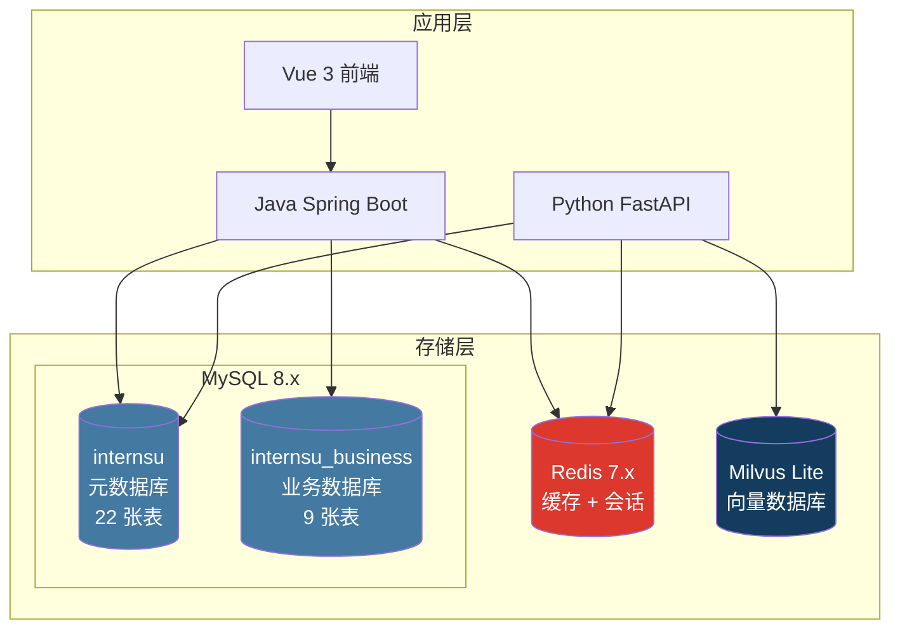

### 数据分布

| 数据类别 | 存储位置 | 表/结构 |
|---------|---------|--------|
| 用户认证 | MySQL (meta) | t_user, t_role, t_permission |
| 会话消息 | MySQL (meta) | t_conversation, t_message |
| AI 追踪 | MySQL (meta) | t_message_trace |
| 工具管理 | MySQL (meta) | t_tool_definition, t_tool_call_log |
| 工作流 | MySQL (meta) | t_workflow, t_workflow_node |
| 知识库 | MySQL (meta) + Milvus | t_knowledge_space, t_document |
| 文档分块 | MySQL (meta) + Milvus | t_document_chunk |
| Prompt | MySQL (meta) | t_prompt_template |
| 审计日志 | MySQL (meta) | t_audit_log, t_login_log, t_sql_execute_log |
| 部门组织 | MySQL (meta) | t_department |
| 系统配置 | MySQL (meta) | t_system_config |
| OA 业务 | MySQL (business) | oa_* 表 (5 张) |
| HR 业务 | MySQL (business) | hr_* 表 (4 张) |
| 会话缓存 | Redis | session:{user}:{conv} |
| Token 黑名单 | Redis | jwt:blacklist:{token} |
| 飞书 Token | Redis | feishu:token:* |
| 向量数据 | Milvus | knowledge_chunks collection |

---

## 3. 数据库 ER 图

### 3.1 认证与权限模块

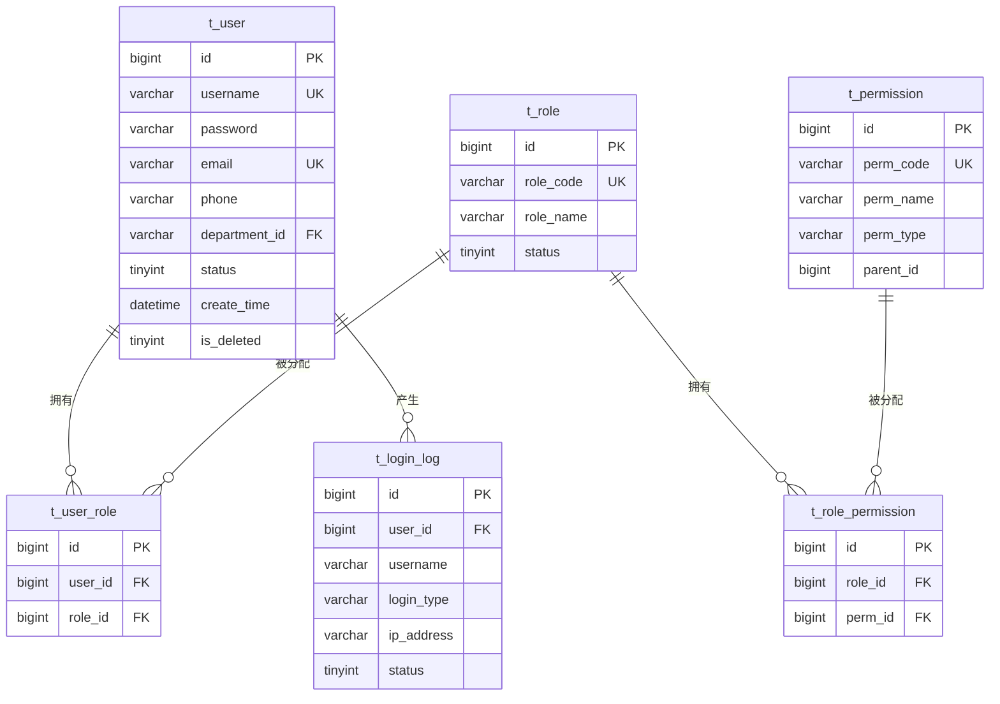

### 3.2 AI 对话与追踪模块

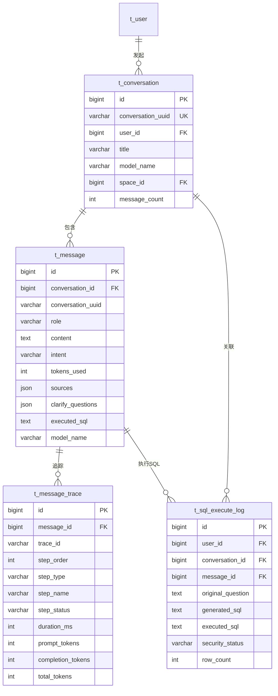

### 3.3 知识库与文档模块

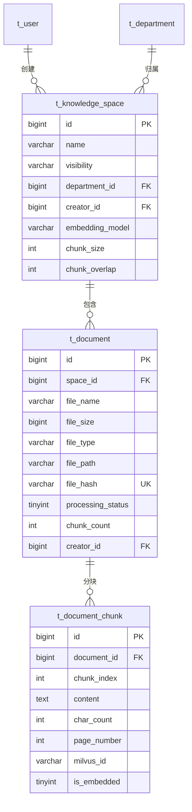

### 3.4 工具与工作流模块

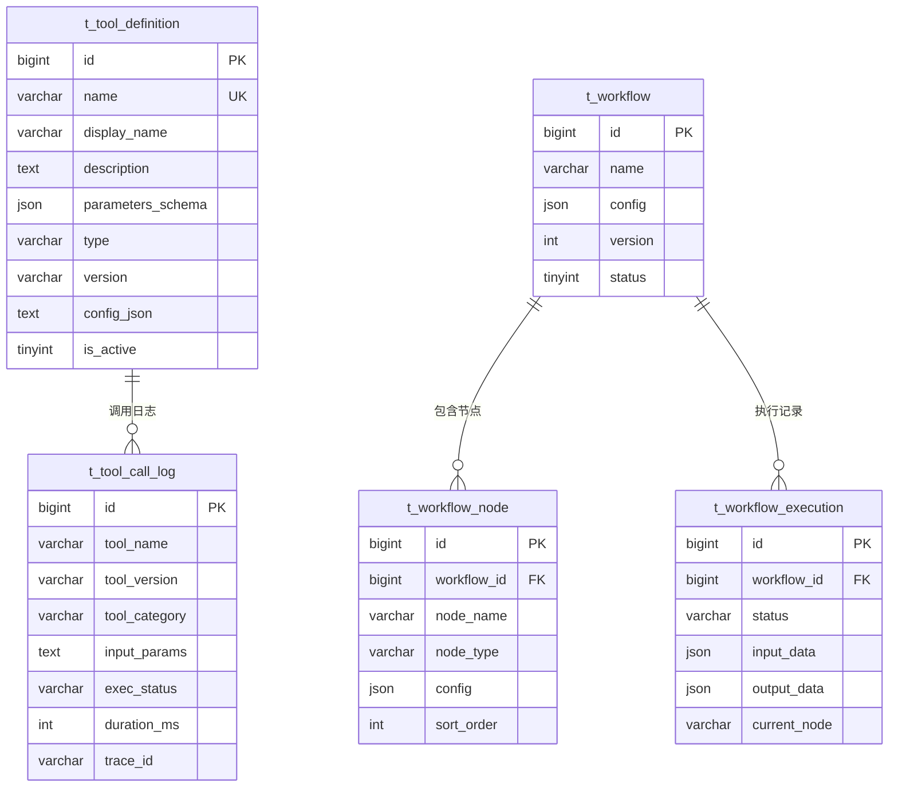

### 3.5 部门与组织模块

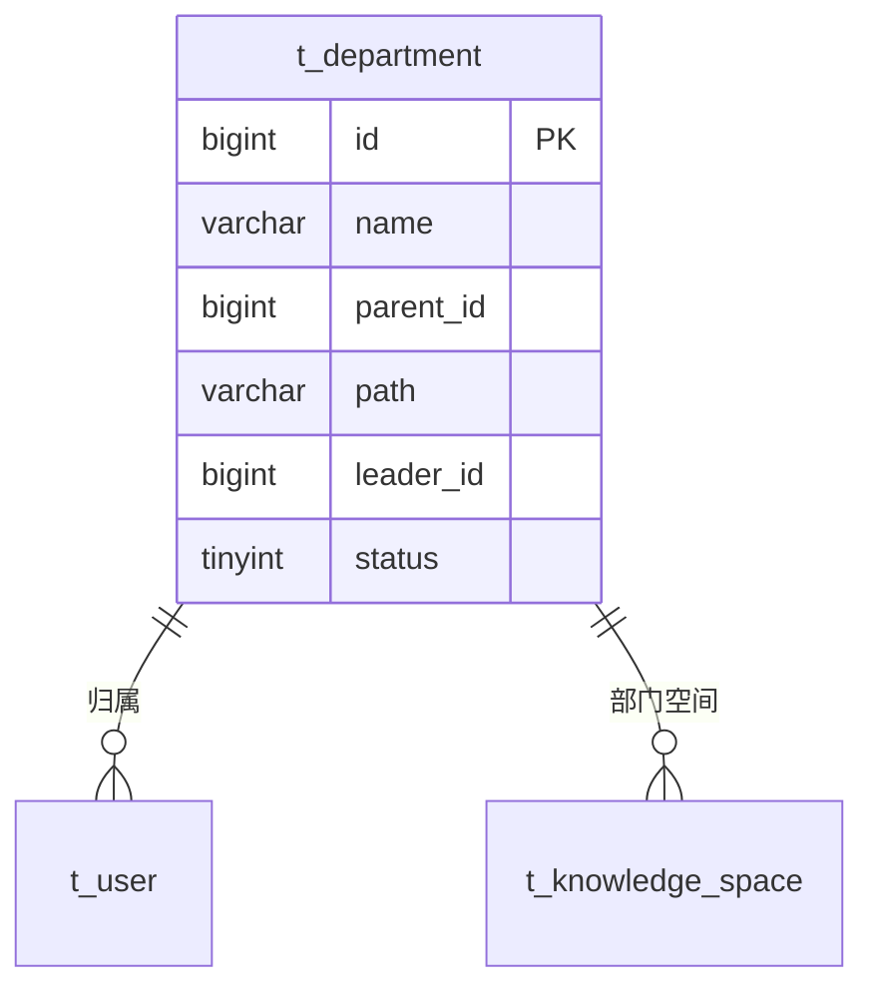

### 3.6 Prompt 与配置模块

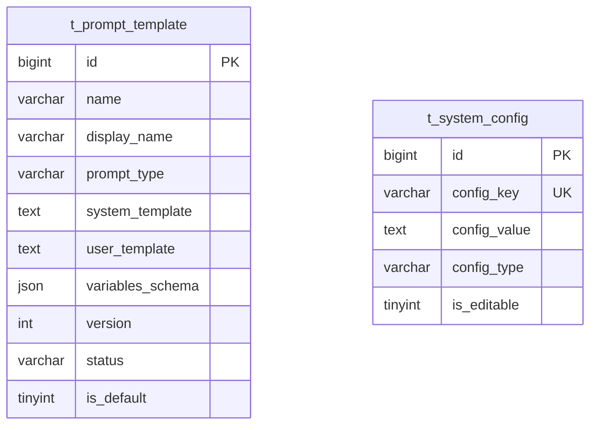

### 3.7 OA 业务模块

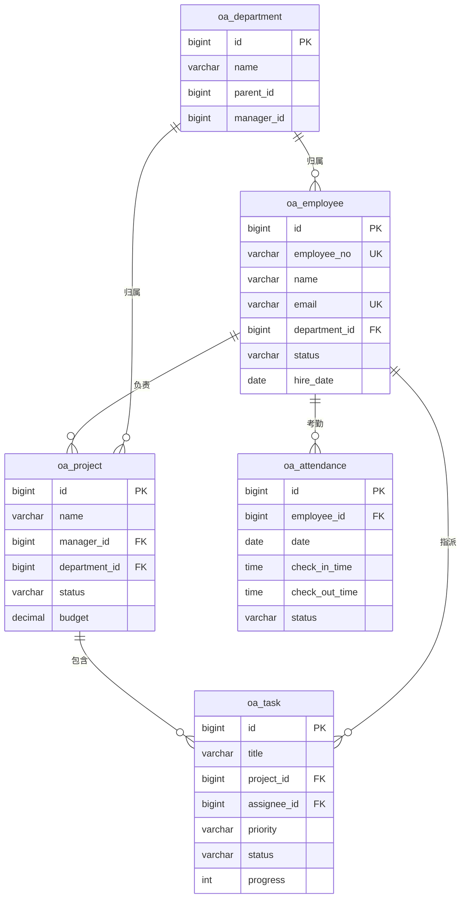

### 3.8 HR 业务模块

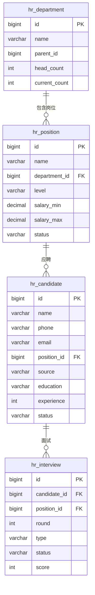

---

## 4. 核心业务模型

### 4.1 用户模型

**职责**: 管理系统用户的基本信息、认证凭证和组织归属。

**核心字段**:

| 字段 | 类型 | 说明 | 设计原因 |
|------|------|------|---------|
| id | BIGINT | 用户 ID | 自增主键，高性能索引 |
| username | VARCHAR(64) | 用户名 | 登录凭证，UK 约束 |
| password | VARCHAR(256) | BCrypt 密文 | BCrypt 产生 60 字符，预留空间 |
| email | VARCHAR(128) | 邮箱 | UK 约束，支持邮箱登录 |
| department_id | BIGINT | 部门 ID | 组织架构隔离 |
| status | TINYINT | 状态 | 1=正常 0=禁用 |
| is_deleted | TINYINT | 逻辑删除 | 0=正常 1=已删除 |

**设计特点**:
- 密码使用 BCrypt 加密（cost >= 10），VARCHAR(256) 预留足够空间
- email 唯一索引支持邮箱登录
- department_id 支持部门级数据隔离
- 逻辑删除避免物理删除导致数据丢失

### 4.2 会话模型

**职责**: 管理用户与 AI 的对话会话，支持多会话并行。

**生命周期**:
```
创建会话 → 发送消息 → 接收回复 → ... → 删除会话
    │                                        │
    └── Redis 缓存 (30min TTL) ──────────────┘
    └── MySQL 持久化 (永久) ─────────────────┘
```

**核心字段**:

| 字段 | 类型 | 说明 | 设计原因 |
|------|------|------|---------|
| conversation_uuid | VARCHAR(64) | Python 侧 UUID | 桥接 Python Redis 和 MySQL 标识 |
| user_id | BIGINT | 用户 ID | 会话归属 |
| space_id | BIGINT | 知识空间 ID | 限定检索范围 |
| message_count | INT | 消息数量 | 冗余计数，避免 COUNT 查询 |
| last_message_at | DATETIME | 最后消息时间 | 排序和过期判断 |

**设计特点**:
- 双标识设计: `id` (MySQL BIGINT) + `conversation_uuid` (Python UUID)
- `space_id` 支持会话级知识空间限定
- `message_count` 冗余计数优化列表查询

### 4.3 消息模型

**职责**: 存储对话中的每条消息，支持多种消息类型和元数据。

**核心字段**:

| 字段 | 类型 | 说明 | 设计原因 |
|------|------|------|---------|
| conversation_id | BIGINT | 会话 ID | 外键关联 |
| conversation_uuid | VARCHAR(64) | 冗余 UUID | 加速按 UUID 查询 |
| role | VARCHAR(16) | 角色 | user/assistant/system |
| content | TEXT | 消息内容 | 长文本，不限长度 |
| intent | VARCHAR(32) | 意图类型 | 记录 AI 路由决策 |
| sources | JSON | RAG 引用来源 | JSON 存储引用列表 |
| clarify_questions | JSON | 反问问题 | AI 澄清时存储问题列表 |
| executed_sql | TEXT | 执行的 SQL | SQL Agent 执行记录 |
| model_name | VARCHAR(64) | 使用的模型 | 追踪每条消息的模型 |

**存储策略**:
- Redis: 热数据（最近 20 轮），30 分钟 TTL
- MySQL: 冷数据（永久存储），用于历史查询
- TEXT 类型存储消息内容，无长度限制

### 4.4 Knowledge 模型

**职责**: 管理企业知识空间、文档元数据和分块信息。

**核心字段**:

| 字段 | 类型 | 说明 | 设计原因 |
|------|------|------|---------|
| visibility | VARCHAR(16) | 可见范围 | private/department/public |
| department_id | BIGINT | 部门 ID | 部门级隔离 |
| embedding_model | VARCHAR(64) | 嵌入模型 | 支持模型切换 |
| chunk_size | INT | 分块大小 | 可配置的分块参数 |
| document_count | INT | 文档数量 | 冗余计数 |
| chunk_count | INT | 分块数量 | 冗余计数 |

**三级可见性**:
```
public    → 全公司可见
department → 本部门可见 (基于 department_id)
private   → 仅创建者可见 (基于 creator_id)
```

### 4.5 Tool 模型

**职责**: 管理 AI 工具的定义、配置和调用日志。

**核心字段**:

| 字段 | 类型 | 说明 | 设计原因 |
|------|------|------|---------|
| name | VARCHAR(128) | 工具名称 | UK 约束，Python 侧注册名 |
| parameters_schema | JSON | 参数 Schema | OpenAI function-calling 格式 |
| type | VARCHAR(32) | 类型 | builtin/custom |
| executor_path | VARCHAR(512) | 执行器路径 | 自定义工具模块路径 |
| version | VARCHAR(20) | 语义版本 | 工具版本管理 |
| config_json | TEXT | 配置 | 运行时可修改的配置 |
| is_active | TINYINT | 是否启用 | 运行时启用/禁用 |

**设计特点**:
- `parameters_schema` 使用 JSON 存储 OpenAI function-calling 格式的参数定义
- `config_json` 支持运行时修改工具配置而无需重启
- `version` 使用语义版本号管理工具变更

### 4.6 Workflow 模型

**职责**: 定义和执行 AI 工作流，支持 LangGraph 状态图配置。

**核心字段**:

| 字段 | 类型 | 说明 | 设计原因 |
|------|------|------|---------|
| config | JSON | StateGraph 配置 | LangGraph 图定义 |
| version | INT | 版本号 | 工作流版本管理 |
| status | TINYINT | 状态 | 1=启用 0=停用 |

**节点类型**: llm / tool / condition / start / end

### 4.7 Trace 模型

**职责**: 追踪每条消息的 AI 执行过程，支持全链路追踪。

**核心字段**:

| 字段 | 类型 | 说明 | 设计原因 |
|------|------|------|---------|
| message_id | BIGINT | 消息 ID | 关联 assistant 消息 |
| trace_id | VARCHAR(64) | 全链路 ID | 跨 Java→Python 追踪 |
| step_order | INT | 步骤序号 | 执行顺序 |
| step_type | VARCHAR(32) | 步骤类型 | 意图识别/检索/生成等 |
| step_name | VARCHAR(64) | 展示名称 | 前端展示用 |
| duration_ms | INT | 耗时 | 性能分析 |
| prompt_tokens | INT | 输入 Token | LLM 成本统计 |
| completion_tokens | INT | 输出 Token | LLM 成本统计 |

---

## 5. 数据表设计

### 5.1 internsu 元数据库 (22 张表)

#### 5.1.1 t_user — 用户表

| 字段 | 类型 | 允许为空 | 默认值 | 说明 |
|------|------|---------|--------|------|
| id | BIGINT | NOT NULL | AUTO_INCREMENT | 用户 ID |
| username | VARCHAR(64) | NOT NULL | - | 用户名（登录账号） |
| password | VARCHAR(256) | NOT NULL | - | BCrypt 加密密文 |
| email | VARCHAR(128) | DEFAULT NULL | NULL | 邮箱 |
| phone | VARCHAR(20) | DEFAULT NULL | NULL | 手机号 |
| department_id | BIGINT | DEFAULT NULL | NULL | 所属部门 ID |
| nickname | VARCHAR(64) | DEFAULT NULL | NULL | 显示昵称 |
| avatar_url | VARCHAR(512) | DEFAULT NULL | NULL | 头像 URL |
| status | TINYINT | NOT NULL | 1 | 状态: 1=正常 0=禁用 |
| last_login_time | DATETIME | DEFAULT NULL | NULL | 最后登录时间 |
| last_login_ip | VARCHAR(64) | DEFAULT NULL | NULL | 最后登录 IP |
| create_time | DATETIME | NOT NULL | NOW() | 创建时间 |
| update_time | DATETIME | DEFAULT NULL | ON UPDATE NOW() | 更新时间 |
| is_deleted | TINYINT | NOT NULL | 0 | 逻辑删除 |
| creator_id | BIGINT | DEFAULT NULL | NULL | 创建者 ID |

**主键**: `id`
**唯一约束**: `uk_username (username)`, `uk_email (email)`
**索引**: `idx_status (status)`, `idx_create_time (create_time)`, `idx_department_id (department_id)`

---

#### 5.1.2 t_role — 角色表

| 字段 | 类型 | 允许为空 | 默认值 | 说明 |
|------|------|---------|--------|------|
| id | BIGINT | NOT NULL | AUTO_INCREMENT | 角色 ID |
| role_code | VARCHAR(64) | NOT NULL | - | 角色编码 |
| role_name | VARCHAR(128) | NOT NULL | - | 角色名称 |
| description | VARCHAR(512) | DEFAULT NULL | NULL | 角色描述 |
| status | TINYINT | NOT NULL | 1 | 状态: 1=启用 0=禁用 |
| sort_order | INT | DEFAULT | 0 | 排序号 |
| create_time | DATETIME | NOT NULL | NOW() | 创建时间 |
| update_time | DATETIME | DEFAULT NULL | ON UPDATE NOW() | 更新时间 |
| is_deleted | TINYINT | NOT NULL | 0 | 逻辑删除 |
| creator_id | BIGINT | DEFAULT NULL | NULL | 创建者 ID |

**主键**: `id`
**唯一约束**: `uk_role_code (role_code)`
**预设角色**: admin, knowledge_admin, developer, employee

---

#### 5.1.3 t_permission — 权限表

| 字段 | 类型 | 允许为空 | 默认值 | 说明 |
|------|------|---------|--------|------|
| id | BIGINT | NOT NULL | AUTO_INCREMENT | 权限 ID |
| perm_code | VARCHAR(128) | NOT NULL | - | 权限标识 |
| perm_name | VARCHAR(128) | NOT NULL | - | 权限名称 |
| perm_type | VARCHAR(32) | NOT NULL | 'api' | 类型: menu/button/api |
| parent_id | BIGINT | DEFAULT | 0 | 父权限 ID |
| path | VARCHAR(256) | DEFAULT NULL | NULL | 资源路径 |
| create_time | DATETIME | NOT NULL | NOW() | 创建时间 |
| update_time | DATETIME | DEFAULT NULL | ON UPDATE NOW() | 更新时间 |
| is_deleted | TINYINT | NOT NULL | 0 | 逻辑删除 |
| creator_id | BIGINT | DEFAULT NULL | NULL | 创建者 ID |

**主键**: `id`
**唯一约束**: `uk_perm_code (perm_code)`
**索引**: `idx_parent_id (parent_id)` — 支持树形权限查询

---

#### 5.1.4 t_user_role — 用户角色关联表

| 字段 | 类型 | 允许为空 | 默认值 | 说明 |
|------|------|---------|--------|------|
| id | BIGINT | NOT NULL | AUTO_INCREMENT | 主键 |
| user_id | BIGINT | NOT NULL | - | 用户 ID |
| role_id | BIGINT | NOT NULL | - | 角色 ID |
| create_time | DATETIME | NOT NULL | NOW() | 创建时间 |

**主键**: `id`
**唯一约束**: `uk_user_role (user_id, role_id)`
**索引**: `idx_user_id (user_id)`, `idx_role_id (role_id)`

---

#### 5.1.5 t_role_permission — 角色权限关联表

| 字段 | 类型 | 允许为空 | 默认值 | 说明 |
|------|------|---------|--------|------|
| id | BIGINT | NOT NULL | AUTO_INCREMENT | 主键 |
| role_id | BIGINT | NOT NULL | - | 角色 ID |
| perm_id | BIGINT | NOT NULL | - | 权限 ID |
| create_time | DATETIME | NOT NULL | NOW() | 创建时间 |

**主键**: `id`
**唯一约束**: `uk_role_perm (role_id, perm_id)`

---

#### 5.1.6 t_login_log — 登录日志表

| 字段 | 类型 | 允许为空 | 默认值 | 说明 |
|------|------|---------|--------|------|
| id | BIGINT | NOT NULL | AUTO_INCREMENT | 日志 ID |
| user_id | BIGINT | DEFAULT NULL | NULL | 用户 ID |
| username | VARCHAR(64) | NOT NULL | - | 登录用户名 |
| login_type | VARCHAR(32) | NOT NULL | 'LOGIN' | 操作类型 |
| ip_address | VARCHAR(64) | DEFAULT NULL | NULL | 客户端 IP |
| user_agent | VARCHAR(512) | DEFAULT NULL | NULL | 浏览器 UA |
| status | TINYINT | NOT NULL | 1 | 1=成功 0=失败 |
| fail_reason | VARCHAR(256) | DEFAULT NULL | NULL | 失败原因 |
| create_time | DATETIME | NOT NULL | NOW() | 操作时间 |

**主键**: `id`
**索引**: `idx_user_id`, `idx_username`, `idx_create_time`

---

#### 5.1.7 t_department — 部门表

| 字段 | 类型 | 允许为空 | 默认值 | 说明 |
|------|------|---------|--------|------|
| id | BIGINT | NOT NULL | AUTO_INCREMENT | 部门 ID |
| name | VARCHAR(128) | NOT NULL | - | 部门名称 |
| parent_id | BIGINT | DEFAULT NULL | NULL | 父部门 ID |
| path | VARCHAR(512) | DEFAULT NULL | NULL | 层级路径 |
| sort_order | INT | DEFAULT | 0 | 排序号 |
| leader_id | BIGINT | DEFAULT NULL | NULL | 部门负责人 |
| status | TINYINT | NOT NULL | 1 | 状态 |
| create_time | DATETIME | NOT NULL | NOW() | 创建时间 |
| update_time | DATETIME | DEFAULT NULL | ON UPDATE NOW() | 更新时间 |
| is_deleted | TINYINT | NOT NULL | 0 | 逻辑删除 |

**主键**: `id`
**索引**: `idx_parent_id`, `idx_path` — 支持子树查询

**path 字段设计**: 使用物化路径模式 (`/1/3/15`)，支持高效子树查询:
```sql
-- 查询某部门的所有子部门
SELECT * FROM t_department WHERE path LIKE '/1/2/%';
```

---

#### 5.1.8 t_tool_definition — 工具定义表

| 字段 | 类型 | 允许为空 | 默认值 | 说明 |
|------|------|---------|--------|------|
| id | BIGINT | NOT NULL | AUTO_INCREMENT | 工具 ID |
| name | VARCHAR(128) | NOT NULL | - | 工具名称 |
| display_name | VARCHAR(256) | NOT NULL | - | 显示名称 |
| description | TEXT | NOT NULL | - | 功能描述 |
| parameters_schema | JSON | NOT NULL | - | 参数 JSON Schema |
| type | VARCHAR(32) | NOT NULL | 'builtin' | 类型 |
| executor_path | VARCHAR(512) | DEFAULT NULL | NULL | 执行器路径 |
| is_require_confirm | TINYINT | DEFAULT | 0 | 是否需确认 |
| timeout_seconds | INT | DEFAULT | 30 | 超时时间 |
| version | VARCHAR(20) | DEFAULT | '1.0.0' | 语义版本 |
| config_json | TEXT | DEFAULT NULL | NULL | JSON 配置 |
| is_active | TINYINT | NOT NULL | 1 | 是否启用 |
| create_time | DATETIME | NOT NULL | NOW() | 创建时间 |
| update_time | DATETIME | DEFAULT NULL | ON UPDATE NOW() | 更新时间 |
| is_deleted | TINYINT | NOT NULL | 0 | 逻辑删除 |
| creator_id | BIGINT | DEFAULT NULL | NULL | 创建者 ID |

**主键**: `id`
**唯一约束**: `uk_name (name)`
**索引**: `idx_type_active (type, is_active)` — 查询启用的工具

---

#### 5.1.9 t_tool_call_log — 工具调用日志表

| 字段 | 类型 | 允许为空 | 默认值 | 说明 |
|------|------|---------|--------|------|
| id | BIGINT | NOT NULL | AUTO_INCREMENT | 日志 ID |
| tool_name | VARCHAR(128) | NOT NULL | - | 工具名称 |
| tool_version | VARCHAR(20) | DEFAULT | '' | 工具版本 |
| tool_category | VARCHAR(50) | DEFAULT | '' | 工具分类 |
| input_params | TEXT | DEFAULT NULL | NULL | 输入参数 |
| output_summary | TEXT | DEFAULT NULL | NULL | 输出摘要 |
| exec_status | VARCHAR(20) | NOT NULL | 'success' | 执行状态 |
| error_message | VARCHAR(2000) | DEFAULT | '' | 错误信息 |
| duration_ms | INT | DEFAULT | 0 | 执行耗时 |
| prompt_tokens | INT | DEFAULT | 0 | LLM 输入 Token |
| completion_tokens | INT | DEFAULT | 0 | LLM 输出 Token |
| total_tokens | INT | DEFAULT | 0 | 总 Token |
| trace_id | VARCHAR(64) | DEFAULT | '' | 全链路追踪 ID |
| user_id | BIGINT | DEFAULT NULL | NULL | 调用用户 |
| conversation_id | BIGINT | DEFAULT NULL | NULL | 关联会话 |
| create_time | DATETIME | NOT NULL | NOW() | 调用时间 |

**主键**: `id`
**索引**: `idx_tool_name`, `idx_exec_status`, `idx_trace_id`, `idx_user_id`, `idx_create_time`

---

#### 5.1.10 t_workflow — 工作流定义表

| 字段 | 类型 | 允许为空 | 默认值 | 说明 |
|------|------|---------|--------|------|
| id | BIGINT | NOT NULL | AUTO_INCREMENT | 工作流 ID |
| name | VARCHAR(256) | NOT NULL | - | 工作流名称 |
| description | TEXT | DEFAULT NULL | NULL | 描述 |
| config | JSON | DEFAULT NULL | NULL | StateGraph 配置 |
| status | TINYINT | NOT NULL | 1 | 状态 |
| version | INT | DEFAULT | 1 | 版本号 |
| create_time | DATETIME | NOT NULL | NOW() | 创建时间 |
| update_time | DATETIME | DEFAULT NULL | ON UPDATE NOW() | 更新时间 |
| is_deleted | TINYINT | NOT NULL | 0 | 逻辑删除 |
| creator_id | BIGINT | DEFAULT NULL | NULL | 创建者 ID |

---

#### 5.1.11 t_workflow_node — 工作流节点表

| 字段 | 类型 | 允许为空 | 默认值 | 说明 |
|------|------|---------|--------|------|
| id | BIGINT | NOT NULL | AUTO_INCREMENT | 节点 ID |
| workflow_id | BIGINT | NOT NULL | - | 所属工作流 |
| node_name | VARCHAR(128) | NOT NULL | - | 节点名称 |
| node_type | VARCHAR(32) | NOT NULL | - | 节点类型 |
| config | JSON | DEFAULT NULL | NULL | 节点配置 |
| position_x | INT | DEFAULT | 0 | 画布 X 坐标 |
| position_y | INT | DEFAULT | 0 | 画布 Y 坐标 |
| sort_order | INT | DEFAULT | 0 | 执行排序 |
| create_time | DATETIME | NOT NULL | NOW() | 创建时间 |

---

#### 5.1.12 t_workflow_execution — 工作流执行记录表

| 字段 | 类型 | 允许为空 | 默认值 | 说明 |
|------|------|---------|--------|------|
| id | BIGINT | NOT NULL | AUTO_INCREMENT | 执行 ID |
| workflow_id | BIGINT | NOT NULL | - | 工作流 ID |
| status | VARCHAR(32) | NOT NULL | 'pending' | 状态 |
| input_data | JSON | DEFAULT NULL | NULL | 输入参数 |
| output_data | JSON | DEFAULT NULL | NULL | 输出结果 |
| current_node | VARCHAR(128) | DEFAULT NULL | NULL | 当前节点 |
| error_msg | TEXT | DEFAULT NULL | NULL | 错误信息 |
| started_at | DATETIME | DEFAULT NULL | NULL | 开始时间 |
| completed_at | DATETIME | DEFAULT NULL | NULL | 完成时间 |
| user_id | BIGINT | DEFAULT NULL | NULL | 触发用户 |
| create_time | DATETIME | NOT NULL | NOW() | 创建时间 |

---

#### 5.1.13 t_prompt_template — Prompt 模板表

| 字段 | 类型 | 允许为空 | 默认值 | 说明 |
|------|------|---------|--------|------|
| id | BIGINT | NOT NULL | AUTO_INCREMENT | 主键 |
| name | VARCHAR(128) | NOT NULL | - | 模板名称 |
| display_name | VARCHAR(128) | DEFAULT NULL | NULL | 前端展示名 |
| prompt_type | VARCHAR(32) | NOT NULL | 'system' | 类型 |
| description | VARCHAR(512) | DEFAULT NULL | NULL | 描述 |
| system_template | TEXT | NOT NULL | - | System Prompt |
| user_template | TEXT | NOT NULL | - | User Message |
| variables_schema | JSON | DEFAULT NULL | NULL | 变量 Schema |
| version | INT | NOT NULL | 1 | 版本号 |
| status | VARCHAR(16) | NOT NULL | 'draft' | 状态 |
| is_default | TINYINT | DEFAULT | 0 | 是否默认 |
| provider_type | VARCHAR(32) | DEFAULT NULL | NULL | 限定 provider |
| model_name | VARCHAR(64) | DEFAULT NULL | NULL | 限定模型 |
| max_tokens | INT | DEFAULT | 4096 | 最大输出 |
| temperature | INT | DEFAULT | 70 | 温度 (*100) |
| tags | JSON | DEFAULT NULL | NULL | 标签 |
| create_time | DATETIME | NOT NULL | NOW() | 创建时间 |
| update_time | DATETIME | DEFAULT NULL | ON UPDATE NOW() | 更新时间 |
| is_deleted | TINYINT | NOT NULL | 0 | 逻辑删除 |
| creator_id | BIGINT | DEFAULT NULL | NULL | 创建者 ID |

**主键**: `id`
**唯一约束**: `uk_name_version (name, version)`
**索引**: `idx_type_status (prompt_type, status)`

---

#### 5.1.14 t_knowledge_space — 知识空间表

| 字段 | 类型 | 允许为空 | 默认值 | 说明 |
|------|------|---------|--------|------|
| id | BIGINT | NOT NULL | AUTO_INCREMENT | 空间 ID |
| name | VARCHAR(128) | NOT NULL | - | 空间名称 |
| description | VARCHAR(512) | DEFAULT NULL | NULL | 描述 |
| visibility | VARCHAR(16) | NOT NULL | 'private' | 可见范围 |
| department_id | BIGINT | DEFAULT NULL | NULL | 部门 ID |
| creator_id | BIGINT | NOT NULL | - | 创建者 ID |
| document_count | INT | DEFAULT | 0 | 文档数量 |
| chunk_count | INT | DEFAULT | 0 | 分块数量 |
| embedding_model | VARCHAR(64) | DEFAULT | 'BGE-M3' | 嵌入模型 |
| chunk_size | INT | DEFAULT | 512 | 分块大小 |
| chunk_overlap | INT | DEFAULT | 64 | 分块重叠 |
| status | TINYINT | NOT NULL | 1 | 状态 |
| create_time | DATETIME | NOT NULL | NOW() | 创建时间 |
| update_time | DATETIME | DEFAULT NULL | ON UPDATE NOW() | 更新时间 |
| is_deleted | TINYINT | NOT NULL | 0 | 逻辑删除 |

**主键**: `id`
**索引**: `idx_visibility_dept (visibility, department_id)`, `idx_creator_id`, `idx_create_time`

---

#### 5.1.15 t_document — 文档表

| 字段 | 类型 | 允许为空 | 默认值 | 说明 |
|------|------|---------|--------|------|
| id | BIGINT | NOT NULL | AUTO_INCREMENT | 文档 ID |
| space_id | BIGINT | NOT NULL | - | 知识空间 ID |
| file_name | VARCHAR(256) | NOT NULL | - | 文件名 |
| file_size | BIGINT | NOT NULL | 0 | 文件大小 |
| file_type | VARCHAR(16) | NOT NULL | - | 文件类型 |
| file_path | VARCHAR(512) | NOT NULL | - | 存储路径 |
| file_hash | VARCHAR(64) | DEFAULT NULL | NULL | SHA-256 哈希 |
| processing_status | TINYINT | NOT NULL | 0 | 处理状态 |
| chunk_count | INT | DEFAULT | 0 | 分块数量 |
| error_msg | VARCHAR(1024) | DEFAULT NULL | NULL | 错误信息 |
| creator_id | BIGINT | NOT NULL | - | 上传者 ID |
| create_time | DATETIME | NOT NULL | NOW() | 创建时间 |
| update_time | DATETIME | DEFAULT NULL | ON UPDATE NOW() | 更新时间 |
| is_deleted | TINYINT | NOT NULL | 0 | 逻辑删除 |

**主键**: `id`
**索引**: `idx_space_id`, `idx_processing_status`, `idx_file_hash`

**processing_status 状态机**:
```
0=uploaded → 1=parsing → 2=chunking → 3=embedding → 4=ready
                                                         ↓
                                                      -1=failed
```

---

#### 5.1.16 t_document_chunk — 文档分块表

| 字段 | 类型 | 允许为空 | 默认值 | 说明 |
|------|------|---------|--------|------|
| id | BIGINT | NOT NULL | AUTO_INCREMENT | 分块 ID |
| document_id | BIGINT | NOT NULL | - | 文档 ID |
| chunk_index | INT | NOT NULL | - | 块序号 |
| content | TEXT | NOT NULL | - | 文本内容 |
| char_count | INT | NOT NULL | 0 | 字符数 |
| page_number | INT | DEFAULT NULL | NULL | 页码 |
| milvus_id | VARCHAR(128) | DEFAULT NULL | NULL | Milvus 记录 ID |
| is_embedded | TINYINT | NOT NULL | 0 | 是否已向量化 |
| create_time | DATETIME | NOT NULL | NOW() | 创建时间 |

**主键**: `id`
**索引**: `idx_document_id`, `idx_milvus_id`, `idx_is_embedded`

---

#### 5.1.17 t_conversation — 对话表

| 字段 | 类型 | 允许为空 | 默认值 | 说明 |
|------|------|---------|--------|------|
| id | BIGINT | NOT NULL | AUTO_INCREMENT | 对话 ID |
| conversation_uuid | VARCHAR(64) | DEFAULT NULL | NULL | Python UUID |
| user_id | BIGINT | NOT NULL | - | 用户 ID |
| title | VARCHAR(256) | DEFAULT NULL | NULL | 对话标题 |
| model_name | VARCHAR(64) | DEFAULT NULL | NULL | 使用的模型 |
| space_id | BIGINT | DEFAULT NULL | NULL | 知识空间 ID |
| message_count | INT | DEFAULT | 0 | 消息数量 |
| last_message_at | DATETIME | DEFAULT NULL | NULL | 最后消息时间 |
| create_time | DATETIME | NOT NULL | NOW() | 创建时间 |
| update_time | DATETIME | DEFAULT NULL | ON UPDATE NOW() | 更新时间 |
| is_deleted | TINYINT | NOT NULL | 0 | 逻辑删除 |

**主键**: `id`
**唯一约束**: `uk_conv_uuid (conversation_uuid)`
**索引**: `idx_user_id`, `idx_user_id_create (user_id, create_time)`, `idx_create_time`

---

#### 5.1.18 t_message — 消息表

| 字段 | 类型 | 允许为空 | 默认值 | 说明 |
|------|------|---------|--------|------|
| id | BIGINT | NOT NULL | AUTO_INCREMENT | 消息 ID |
| conversation_id | BIGINT | NOT NULL | - | 对话 ID |
| conversation_uuid | VARCHAR(64) | DEFAULT NULL | NULL | 冗余 UUID |
| role | VARCHAR(16) | NOT NULL | - | 角色 |
| content | TEXT | NOT NULL | - | 消息内容 |
| intent | VARCHAR(32) | DEFAULT NULL | NULL | 意图类型 |
| tokens_used | INT | DEFAULT NULL | NULL | Token 消耗 |
| sources | JSON | DEFAULT NULL | NULL | RAG 引用 |
| clarify_questions | JSON | DEFAULT NULL | NULL | 反问问题 |
| executed_sql | TEXT | DEFAULT NULL | NULL | 执行的 SQL |
| model_name | VARCHAR(64) | DEFAULT NULL | NULL | 使用的模型 |
| create_time | DATETIME | NOT NULL | NOW() | 创建时间 |

**主键**: `id`
**索引**: `idx_conversation_id`, `idx_conv_uuid`, `idx_create_time`

---

#### 5.1.19 t_message_trace — 消息追踪表

| 字段 | 类型 | 允许为空 | 默认值 | 说明 |
|------|------|---------|--------|------|
| id | BIGINT | NOT NULL | AUTO_INCREMENT | 追踪 ID |
| message_id | BIGINT | NOT NULL | - | 消息 ID |
| trace_id | VARCHAR(64) | DEFAULT NULL | NULL | 全链路 ID |
| step_order | INT | NOT NULL | 1 | 步骤序号 |
| step_type | VARCHAR(32) | NOT NULL | - | 步骤类型 |
| step_name | VARCHAR(64) | DEFAULT NULL | NULL | 展示名称 |
| input_summary | VARCHAR(512) | DEFAULT NULL | NULL | 输入摘要 |
| output_summary | VARCHAR(512) | DEFAULT NULL | NULL | 输出摘要 |
| step_status | VARCHAR(16) | NOT NULL | 'running' | 状态 |
| duration_ms | INT | DEFAULT NULL | NULL | 耗时 |
| prompt_tokens | INT | DEFAULT NULL | NULL | 输入 Token |
| completion_tokens | INT | DEFAULT NULL | NULL | 输出 Token |
| total_tokens | INT | DEFAULT NULL | NULL | 总 Token |

**主键**: `id`
**索引**: `idx_message_id`, `idx_message_step (message_id, step_order)`, `idx_trace_id`

---

#### 5.1.20 t_audit_log — 审计日志表

| 字段 | 类型 | 允许为空 | 默认值 | 说明 |
|------|------|---------|--------|------|
| id | BIGINT | NOT NULL | AUTO_INCREMENT | 日志 ID |
| user_id | BIGINT | DEFAULT NULL | NULL | 用户 ID |
| action | VARCHAR(64) | NOT NULL | - | 操作类型 |
| resource_type | VARCHAR(64) | NOT NULL | - | 资源类型 |
| resource_id | VARCHAR(128) | DEFAULT NULL | NULL | 资源 ID |
| detail | JSON | DEFAULT NULL | NULL | 操作详情 |
| ip_address | VARCHAR(64) | DEFAULT NULL | NULL | 客户端 IP |
| user_agent | VARCHAR(512) | DEFAULT NULL | NULL | UA |
| status | TINYINT | NOT NULL | 1 | 1=成功 0=失败 |
| error_msg | VARCHAR(1024) | DEFAULT NULL | NULL | 错误信息 |
| create_time | DATETIME | NOT NULL | NOW() | 操作时间 |

---

#### 5.1.21 t_sql_execute_log — SQL 执行审计表

| 字段 | 类型 | 允许为空 | 默认值 | 说明 |
|------|------|---------|--------|------|
| id | BIGINT | NOT NULL | AUTO_INCREMENT | 日志 ID |
| user_id | BIGINT | NOT NULL | - | 执行用户 |
| conversation_id | BIGINT | DEFAULT NULL | NULL | 关联会话 |
| message_id | BIGINT | DEFAULT NULL | NULL | 关联消息 |
| original_question | TEXT | NOT NULL | - | 原始问题 |
| generated_sql | TEXT | NOT NULL | - | LLM 生成 SQL |
| executed_sql | TEXT | DEFAULT NULL | NULL | 实际执行 SQL |
| security_status | VARCHAR(16) | NOT NULL | 'pass' | 安全状态 |
| security_detail | JSON | DEFAULT NULL | NULL | 校验详情 |
| execution_status | VARCHAR(16) | DEFAULT NULL | NULL | 执行结果 |
| result_summary | VARCHAR(512) | DEFAULT NULL | NULL | 结果摘要 |
| row_count | INT | DEFAULT NULL | NULL | 返回行数 |
| execution_ms | INT | DEFAULT NULL | NULL | 执行耗时 |
| error_msg | VARCHAR(1024) | DEFAULT NULL | NULL | 错误信息 |
| ip_address | VARCHAR(64) | DEFAULT NULL | NULL | 客户端 IP |
| create_time | DATETIME | NOT NULL | NOW() | 创建时间 |

---

#### 5.1.22 t_system_config — 系统配置表

| 字段 | 类型 | 允许为空 | 默认值 | 说明 |
|------|------|---------|--------|------|
| id | BIGINT | NOT NULL | AUTO_INCREMENT | 配置 ID |
| config_key | VARCHAR(128) | NOT NULL | - | 配置键 |
| config_value | TEXT | NOT NULL | - | 配置值 |
| config_type | VARCHAR(16) | NOT NULL | 'string' | 值类型 |
| description | VARCHAR(512) | DEFAULT NULL | NULL | 配置说明 |
| is_editable | TINYINT | NOT NULL | 1 | 是否可编辑 |
| create_time | DATETIME | NOT NULL | NOW() | 创建时间 |
| update_time | DATETIME | DEFAULT NULL | ON UPDATE NOW() | 更新时间 |

**主键**: `id`
**唯一约束**: `uk_config_key (config_key)`

---

### 5.2 internsu_business 业务数据库 (9 张表)

#### 5.2.1 oa_department — OA 部门表

| 字段 | 类型 | 允许为空 | 默认值 | 说明 |
|------|------|---------|--------|------|
| id | BIGINT | NOT NULL | AUTO_INCREMENT | 部门 ID |
| name | VARCHAR(100) | NOT NULL | - | 部门名称 |
| parent_id | BIGINT | DEFAULT NULL | NULL | 上级部门 ID |
| manager_id | BIGINT | DEFAULT NULL | NULL | 负责人 ID |
| description | VARCHAR(500) | DEFAULT NULL | NULL | 部门描述 |
| status | TINYINT | DEFAULT | 1 | 状态 |
| create_time | DATETIME | DEFAULT | CURRENT_TIMESTAMP | 创建时间 |
| update_time | DATETIME | DEFAULT | ON UPDATE CURRENT_TIMESTAMP | 更新时间 |

---

#### 5.2.2 oa_employee — 员工表

| 字段 | 类型 | 允许为空 | 默认值 | 说明 |
|------|------|---------|--------|------|
| id | BIGINT | NOT NULL | AUTO_INCREMENT | 员工 ID |
| employee_no | VARCHAR(50) | NOT NULL UK | - | 员工编号 |
| name | VARCHAR(50) | NOT NULL | - | 员工姓名 |
| email | VARCHAR(100) | NOT NULL UK | - | 邮箱 |
| phone | VARCHAR(20) | DEFAULT NULL | NULL | 手机号 |
| department_id | BIGINT | NOT NULL FK | - | 所属部门 |
| position | VARCHAR(50) | DEFAULT NULL | NULL | 职位 |
| status | VARCHAR(20) | NOT NULL | '在职' | 状态 |
| hire_date | DATE | NOT NULL | - | 入职日期 |
| leave_date | DATE | DEFAULT NULL | NULL | 离职日期 |
| create_time | DATETIME | DEFAULT | CURRENT_TIMESTAMP | 创建时间 |
| update_time | DATETIME | DEFAULT | ON UPDATE CURRENT_TIMESTAMP | 更新时间 |

**外键**: `fk_oa_employee_department (department_id) → oa_department(id)`

---

#### 5.2.3 oa_project — 项目表

| 字段 | 类型 | 允许为空 | 默认值 | 说明 |
|------|------|---------|--------|------|
| id | BIGINT | NOT NULL | AUTO_INCREMENT | 项目 ID |
| name | VARCHAR(200) | NOT NULL | - | 项目名称 |
| description | TEXT | DEFAULT NULL | NULL | 项目描述 |
| manager_id | BIGINT | NOT NULL FK | - | 负责人 |
| department_id | BIGINT | NOT NULL FK | - | 所属部门 |
| status | VARCHAR(20) | NOT NULL | '进行中' | 状态 |
| start_date | DATE | NOT NULL | - | 开始日期 |
| end_date | DATE | DEFAULT NULL | NULL | 结束日期 |
| budget | DECIMAL(15,2) | DEFAULT NULL | NULL | 预算金额 |
| create_time | DATETIME | DEFAULT | CURRENT_TIMESTAMP | 创建时间 |
| update_time | DATETIME | DEFAULT | ON UPDATE CURRENT_TIMESTAMP | 更新时间 |

**外键**: `fk_oa_project_manager → oa_employee(id)`, `fk_oa_project_department → oa_department(id)`

---

#### 5.2.4 oa_task — 任务表

| 字段 | 类型 | 允许为空 | 默认值 | 说明 |
|------|------|---------|--------|------|
| id | BIGINT | NOT NULL | AUTO_INCREMENT | 任务 ID |
| title | VARCHAR(200) | NOT NULL | - | 任务标题 |
| description | TEXT | DEFAULT NULL | NULL | 任务描述 |
| project_id | BIGINT | NOT NULL FK | - | 所属项目 |
| assignee_id | BIGINT | NOT NULL FK | - | 指派员工 |
| priority | VARCHAR(20) | NOT NULL | '中' | 优先级 |
| status | VARCHAR(20) | NOT NULL | '待处理' | 状态 |
| due_date | DATE | DEFAULT NULL | NULL | 截止日期 |
| progress | INT | DEFAULT | 0 | 进度 0-100 |
| create_time | DATETIME | DEFAULT | CURRENT_TIMESTAMP | 创建时间 |
| update_time | DATETIME | DEFAULT | ON UPDATE CURRENT_TIMESTAMP | 更新时间 |

**外键**: `fk_oa_task_project → oa_project(id) ON DELETE CASCADE`, `fk_oa_task_assignee → oa_employee(id)`

---

#### 5.2.5 oa_attendance — 考勤表

| 字段 | 类型 | 允许为空 | 默认值 | 说明 |
|------|------|---------|--------|------|
| id | BIGINT | NOT NULL | AUTO_INCREMENT | 考勤 ID |
| employee_id | BIGINT | NOT NULL FK | - | 员工 ID |
| date | DATE | NOT NULL | - | 考勤日期 |
| check_in_time | TIME | DEFAULT NULL | NULL | 上班打卡 |
| check_out_time | TIME | DEFAULT NULL | NULL | 下班打卡 |
| status | VARCHAR(20) | NOT NULL | '正常' | 状态 |
| leave_type | VARCHAR(20) | DEFAULT NULL | NULL | 请假类型 |
| hours | DECIMAL(5,2) | DEFAULT NULL | NULL | 请假时长 |
| remark | VARCHAR(200) | DEFAULT NULL | NULL | 备注 |
| create_time | DATETIME | DEFAULT | CURRENT_TIMESTAMP | 创建时间 |
| update_time | DATETIME | DEFAULT | ON UPDATE CURRENT_TIMESTAMP | 更新时间 |

**唯一约束**: `uk_employee_date (employee_id, date)`
**外键**: `fk_oa_attendance_employee → oa_employee(id) ON DELETE CASCADE`

---

#### 5.2.6 hr_department — HR 部门表

| 字段 | 类型 | 允许为空 | 默认值 | 说明 |
|------|------|---------|--------|------|
| id | BIGINT | NOT NULL | AUTO_INCREMENT | 部门 ID |
| name | VARCHAR(100) | NOT NULL | - | 部门名称 |
| parent_id | BIGINT | DEFAULT NULL | NULL | 上级部门 |
| head_count | INT | DEFAULT | 0 | 编制人数 |
| current_count | INT | DEFAULT | 0 | 现有人数 |
| description | VARCHAR(500) | DEFAULT NULL | NULL | 描述 |
| status | TINYINT | DEFAULT | 1 | 状态 |
| create_time | DATETIME | DEFAULT | CURRENT_TIMESTAMP | 创建时间 |
| update_time | DATETIME | DEFAULT | ON UPDATE CURRENT_TIMESTAMP | 更新时间 |

---

#### 5.2.7 hr_position — 岗位表

| 字段 | 类型 | 允许为空 | 默认值 | 说明 |
|------|------|---------|--------|------|
| id | BIGINT | NOT NULL | AUTO_INCREMENT | 岗位 ID |
| name | VARCHAR(100) | NOT NULL | - | 岗位名称 |
| department_id | BIGINT | NOT NULL FK | - | 所属部门 |
| level | VARCHAR(20) | DEFAULT NULL | NULL | 职级 |
| salary_min | DECIMAL(10,2) | DEFAULT NULL | NULL | 最低薪资 |
| salary_max | DECIMAL(10,2) | DEFAULT NULL | NULL | 最高薪资 |
| requirements | TEXT | DEFAULT NULL | NULL | 任职要求 |
| responsibilities | TEXT | DEFAULT NULL | NULL | 岗位职责 |
| status | VARCHAR(20) | NOT NULL | '招聘中' | 状态 |
| open_date | DATE | NOT NULL | - | 发布日期 |
| close_date | DATE | DEFAULT NULL | NULL | 关闭日期 |
| create_time | DATETIME | DEFAULT | CURRENT_TIMESTAMP | 创建时间 |
| update_time | DATETIME | DEFAULT | ON UPDATE CURRENT_TIMESTAMP | 更新时间 |

**外键**: `fk_hr_position_department → hr_department(id)`

---

#### 5.2.8 hr_candidate — 候选人表

| 字段 | 类型 | 允许为空 | 默认值 | 说明 |
|------|------|---------|--------|------|
| id | BIGINT | NOT NULL | AUTO_INCREMENT | 候选人 ID |
| name | VARCHAR(50) | NOT NULL | - | 姓名 |
| phone | VARCHAR(20) | NOT NULL | - | 手机号 |
| email | VARCHAR(100) | NOT NULL | - | 邮箱 |
| position_id | BIGINT | NOT NULL FK | - | 应聘岗位 |
| source | VARCHAR(50) | DEFAULT NULL | NULL | 招聘渠道 |
| resume_url | VARCHAR(255) | DEFAULT NULL | NULL | 简历链接 |
| skills | VARCHAR(500) | DEFAULT NULL | NULL | 技能标签 |
| education | VARCHAR(50) | DEFAULT NULL | NULL | 学历 |
| experience | INT | DEFAULT | 0 | 工作经验(年) |
| status | VARCHAR(20) | NOT NULL | '待筛选' | 状态 |
| create_time | DATETIME | DEFAULT | CURRENT_TIMESTAMP | 创建时间 |
| update_time | DATETIME | DEFAULT | ON UPDATE CURRENT_TIMESTAMP | 更新时间 |

**外键**: `fk_hr_candidate_position → hr_position(id)`

---

#### 5.2.9 hr_interview — 面试表

| 字段 | 类型 | 允许为空 | 默认值 | 说明 |
|------|------|---------|--------|------|
| id | BIGINT | NOT NULL | AUTO_INCREMENT | 面试 ID |
| candidate_id | BIGINT | NOT NULL FK | - | 候选人 ID |
| position_id | BIGINT | NOT NULL FK | - | 岗位 ID |
| interviewer_id | BIGINT | DEFAULT NULL | NULL | 面试官 ID |
| round | INT | NOT NULL | 1 | 面试轮次 |
| type | VARCHAR(20) | DEFAULT NULL | NULL | 面试类型 |
| status | VARCHAR(20) | NOT NULL | '待面试' | 状态 |
| interview_date | DATETIME | DEFAULT NULL | NULL | 面试时间 |
| result | TEXT | DEFAULT NULL | NULL | 面试结果 |
| score | INT | DEFAULT NULL | NULL | 评分 0-100 |
| feedback | TEXT | DEFAULT NULL | NULL | 面试反馈 |
| create_time | DATETIME | DEFAULT | CURRENT_TIMESTAMP | 创建时间 |
| update_time | DATETIME | DEFAULT | ON UPDATE CURRENT_TIMESTAMP | 更新时间 |

**外键**: `fk_hr_interview_candidate → hr_candidate(id) ON DELETE CASCADE`, `fk_hr_interview_position → hr_position(id)`

---

## 6. 表关系分析

### 6.1 User → Conversation

| 关系 | 说明 |
|------|------|
| 类型 | 1:N |
| 外键 | `t_conversation.user_id → t_user.id` |
| 设计原因 | 一个用户可发起多个对话，对话归属用户 |

### 6.2 Conversation → Message

| 关系 | 说明 |
|------|------|
| 类型 | 1:N |
| 外键 | `t_message.conversation_id → t_conversation.id` |
| 设计原因 | 一个对话包含多条消息 |

### 6.3 Message → MessageTrace

| 关系 | 说明 |
|------|------|
| 类型 | 1:N |
| 外键 | `t_message_trace.message_id → t_message.id` |
| 设计原因 | 一条 assistant 消息对应多个执行步骤 |

### 6.4 KnowledgeSpace → Document

| 关系 | 说明 |
|------|------|
| 类型 | 1:N |
| 外键 | `t_document.space_id → t_knowledge_space.id` |
| 设计原因 | 一个知识空间包含多个文档 |

### 6.5 Document → DocumentChunk

| 关系 | 说明 |
|------|------|
| 类型 | 1:N |
| 外键 | `t_document_chunk.document_id → t_document.id` |
| 设计原因 | 一个文档被分割为多个分块 |

### 6.6 User ↔ Role (N:N)

| 关系 | 说明 |
|------|------|
| 类型 | N:N |
| 中间表 | `t_user_role` |
| 设计原因 | 一个用户可拥有多个角色，一个角色可分配给多个用户 |

### 6.7 Role ↔ Permission (N:N)

| 关系 | 说明 |
|------|------|
| 类型 | N:N |
| 中间表 | `t_role_permission` |
| 设计原因 | 一个角色可拥有多个权限，一个权限可分配给多个角色 |

### 6.8 Department → User

| 关系 | 说明 |
|------|------|
| 类型 | 1:N |
| 外键 | `t_user.department_id → t_department.id` |
| 设计原因 | 一个部门包含多个用户 |

### 6.9 Tool → ToolCallLog

| 关系 | 说明 |
|------|------|
| 类型 | 1:N |
| 外键 | `t_tool_call_log.tool_name → t_tool_definition.name` (逻辑) |
| 设计原因 | 一个工具可被多次调用，记录调用日志 |

### 6.10 完整关系链

```
t_user ──1:N──→ t_conversation ──1:N──→ t_message ──1:N──→ t_message_trace
   │                    │
   │                    └──1:N──→ t_sql_execute_log
   │
   ├──N:N──→ t_role ──N:N──→ t_permission
   │
   ├──1:N──→ t_login_log
   │
   └──1:N──→ t_department ──1:N──→ t_knowledge_space ──1:N──→ t_document ──1:N──→ t_document_chunk
```

---

## 7. 索引设计分析

### 7.1 已存在索引汇总

| 表 | 索引名 | 类型 | 字段 | 用途 |
|----|--------|------|------|------|
| t_user | PRIMARY | 主键 | id | 主键查询 |
| t_user | uk_username | 唯一 | username | 登录查询 |
| t_user | uk_email | 唯一 | email | 邮箱登录 |
| t_user | idx_status | 普通 | status | 状态筛选 |
| t_user | idx_create_time | 普通 | create_time | 时间排序 |
| t_user | idx_department_id | 普通 | department_id | 部门查询 |
| t_role | uk_role_code | 唯一 | role_code | 角色编码查询 |
| t_user_role | uk_user_role | 唯一 | (user_id, role_id) | 防重复分配 |
| t_login_log | idx_user_id | 普通 | user_id | 用户登录历史 |
| t_login_log | idx_create_time | 普通 | create_time | 时间排序 |
| t_conversation | idx_user_id | 普通 | user_id | 用户会话列表 |
| t_conversation | uk_conv_uuid | 唯一 | conversation_uuid | Python UUID 查询 |
| t_conversation | idx_user_id_create | 复合 | (user_id, create_time) | 用户会话分页 |
| t_message | idx_conversation_id | 普通 | conversation_id | 会话消息查询 |
| t_message | idx_conv_uuid | 普通 | conversation_uuid | UUID 查询 |
| t_message_trace | idx_message_id | 普通 | message_id | 消息追踪查询 |
| t_message_trace | idx_message_step | 复合 | (message_id, step_order) | 步骤排序 |
| t_message_trace | idx_trace_id | 普通 | trace_id | 全链路追踪 |
| t_tool_definition | uk_name | 唯一 | name | 工具名查询 |
| t_tool_definition | idx_type_active | 复合 | (type, is_active) | 启用工具查询 |
| t_tool_call_log | idx_tool_name | 普通 | tool_name | 工具调用统计 |
| t_tool_call_log | idx_trace_id | 普通 | trace_id | 追踪查询 |
| t_document | idx_space_id | 普通 | space_id | 空间文档查询 |
| t_document | idx_file_hash | 普通 | file_hash | 去重查询 |
| t_document_chunk | idx_document_id | 普通 | document_id | 文档分块查询 |
| t_document_chunk | idx_milvus_id | 普通 | milvus_id | Milvus 关联查询 |
| t_knowledge_space | idx_visibility_dept | 复合 | (visibility, department_id) | 可见性查询 |
| t_prompt_template | uk_name_version | 唯一 | (name, version) | 模板版本查询 |
| t_system_config | uk_config_key | 唯一 | config_key | 配置键查询 |
| t_department | idx_parent_id | 普通 | parent_id | 父部门查询 |
| t_department | idx_path | 普通 | path | 子树查询 |

### 7.2 索引优化建议

| 建议 | 说明 |
|------|------|
| t_message 增加 (conversation_id, create_time) 复合索引 | 支持会话消息分页+时间排序 |
| t_tool_call_log 增加 (user_id, create_time) 复合索引 | 支持用户调用历史分页 |
| t_audit_log 增加 (user_id, action, create_time) 复合索引 | 支持用户操作审计查询 |
| t_sql_execute_log 增加 (user_id, create_time) 复合索引 | 支持用户 SQL 审计分页 |

---

## 8. 查询性能分析

### 8.1 高频查询场景

| 场景 | SQL 模式 | 索引命中 | 风险 |
|------|---------|---------|------|
| 用户登录 | `WHERE username = ? AND is_deleted = 0` | uk_username ✓ | 低 |
| 会话列表 | `WHERE user_id = ? AND is_deleted = 0 ORDER BY create_time DESC` | idx_user_id_create ✓ | 低 |
| 消息分页 | `WHERE conversation_id = ? ORDER BY id LIMIT ?,?` | idx_conversation_id ✓ | 中(大数据量) |
| 工具查询 | `WHERE is_active = 1 AND is_deleted = 0` | idx_type_active ✓ | 低 |
| 文档查询 | `WHERE space_id = ? AND is_deleted = 0` | idx_space_id ✓ | 低 |
| 追踪查询 | `WHERE message_id = ? ORDER BY step_order` | idx_message_step ✓ | 低 |

### 8.2 潜在慢查询风险

| 风险 | 场景 | 原因 |
|------|------|------|
| 消息表全量 COUNT | 统计会话消息数 | 已通过 message_count 冗余解决 |
| 文档分块全文搜索 | 搜索分块内容 | 已通过 Milvus 向量检索替代 |
| 审计日志时间范围查询 | 按时间范围查日志 | 数据量增长后需分区 |

---

## 9. Redis 设计分析

### 9.1 Key 设计

| Key 模式 | 用途 | TTL | 数据类型 |
|---------|------|-----|---------|
| `jwt:blacklist:{token_id}` | JWT 黑名单 | Token 剩余有效期 | STRING |
| `session:{user_id}:{conv_id}` | 会话上下文 | 30min (滑动) | HASH |
| `memory:state:{user_id}:{conv_id}` | 图状态快照 | 30min | STRING (JSON) |
| `ratelimit:{user_id}:{api}` | 用户限流 | 窗口期 | STRING (计数器) |
| `feishu:token:*` | 飞书 Token 缓存 | 110min | STRING |
| `cache:tool:definitions` | 工具定义缓存 | 启动加载 | STRING (JSON) |

### 9.2 Redis 与 MySQL 关系

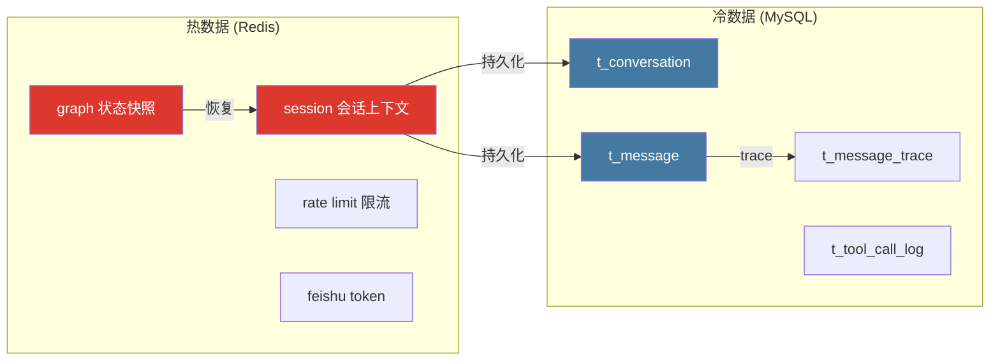

### 9.3 缓存策略

| 策略 | 应用场景 | 说明 |
|------|---------|------|
| Write-Through | 会话消息 | 写入时同时更新 Redis 和 MySQL |
| Cache-Aside | 工具定义 | 启动时加载，变更时刷新 |
| TTL 过期 | 会话上下文 | 30 分钟滑动过期 |
| 黑名单 | JWT Token | 退出时加入，过期自动删除 |

---

## 10. Milvus 设计分析

### 10.1 Collection 设计

| Collection | 用途 | 分片数 |
|-----------|------|--------|
| `knowledge_chunks` | 知识库文档分块 | 1 |

### 10.2 字段设计

| 字段名 | 类型 | 说明 |
|--------|------|------|
| chunk_id | VARCHAR(128) PK | 分块唯一标识 |
| file_id | VARCHAR(64) | 文档 ID |
| content | VARCHAR(8192) | 分块文本内容 |
| embedding | FLOAT_VECTOR(1024) | BGE-M3 嵌入向量 |
| metadata | JSON | 元数据 (页码、文件名等) |

### 10.3 索引配置

| 参数 | 值 | 说明 |
|------|-----|------|
| 索引类型 | IVF_FLAT | 倒排文件索引 |
| nlist | 128 | 聚类中心数 |
| 度量类型 | COSINE | 余弦相似度 |

### 10.4 Embedding 模型

| 参数 | 值 |
|------|-----|
| 模型 | BGE-M3 (FlagEmbedding) |
| 维度 | 1024 |
| 最大长度 | 8192 tokens |
| 语言 | 多语言 (中英文) |

### 10.5 Milvus 与 MySQL 关系

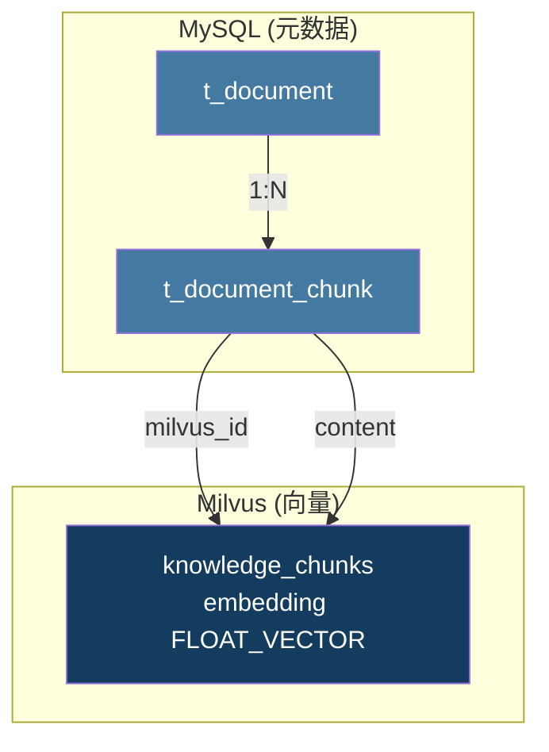

**关联方式**: `t_document_chunk.milvus_id` ↔ `knowledge_chunks.chunk_id`

---

## 11. 数据生命周期设计

### 11.1 用户创建

```
注册 → t_user (status=1) → t_user_role (默认 employee 角色)
```

### 11.2 会话创建

```
前端发起 → Java 创建 t_conversation → Python 创建 Redis session
                                        → 返回 conversation_uuid
```

### 11.3 消息生成

```
用户发送 → Redis 缓存 → LLM 处理 → 写入 t_message
                                    → 写入 t_message_trace
                                    → Java 持久化到 MySQL
```

### 11.4 文档上传

```
上传文件 → t_document (status=0) → 解析 (status=1)
             → 分块 (status=2) → 向量化 (status=3)
             → 写入 t_document_chunk → 写入 Milvus
             → 完成 (status=4)
```

### 11.5 删除流程

| 操作 | 方式 | 说明 |
|------|------|------|
| 逻辑删除 | `is_deleted = 1` | 所有业务表 |
| 物理删除 | `DELETE FROM` | 仅 t_message_trace (V8 清理) |
| Redis 过期 | TTL 自动 | 会话上下文 30min |
| Milvus 删除 | `delete()` | 按 file_id 批量删除 |

### 11.6 归档策略

未在代码中发现归档相关实现。

---

## 12. 安全设计

### 12.1 密码存储

- **算法**: BCrypt (Spring Security 默认)
- **盐值**: 自动生成
- **强度**: cost >= 10
- **存储**: VARCHAR(256)

### 12.2 敏感字段

| 字段 | 处理方式 |
|------|---------|
| password | BCrypt 加密存储，API 不返回 |
| phone | 显示时脱敏 (未在代码中发现) |
| email | API 返回完整值 |

### 12.3 逻辑删除

所有业务表使用 `is_deleted TINYINT DEFAULT 0`:
- `0` = 正常
- `1` = 已删除

查询时必须添加 `WHERE is_deleted = 0` 条件。

### 12.4 权限隔离

| 层级 | 机制 | 实现 |
|------|------|------|
| 接口级 | `@PreAuthorize` | Spring Security |
| 数据级 | `visibility` + `department_id` | 知识空间权限 |
| 行级 | `creator_id` + `user_id` | 文档/会话归属 |

### 12.5 审计字段

每张表包含:
- `create_time`: 记录创建时间
- `update_time`: 最后更新时间
- `creator_id`: 创建者 ID

---

## 13. 数据库设计亮点

### 13.1 双标识桥接设计

**问题**: Python 侧使用 UUID 管理会话，MySQL 使用 BIGINT 自增 ID。

**方案**: `conversation_uuid` 字段桥接两套标识:
- Python 侧: `conversation_uuid` 作为 Redis key
- MySQL 侧: `id` 作为主键，`conversation_uuid` 作为唯一索引
- 冗余字段: `t_message.conversation_uuid` 加速查询

**价值**: 无需修改任一侧的标识体系，通过冗余字段实现高效关联。

### 13.2 物化路径部门树

**问题**: 部门是树形结构，查询子树需要递归。

**方案**: `path` 字段存储物化路径 (`/1/3/15`):
```sql
-- 查询某部门的所有子部门 (无需递归)
SELECT * FROM t_department WHERE path LIKE '/1/2/%';
```

**价值**: 单次查询获取完整子树，O(1) 复杂度。

### 13.3 三层可见性知识空间

**问题**: 企业知识需要按公司/部门/个人三级隔离。

**方案**: `visibility` + `department_id` + `creator_id` 三字段组合:
```sql
-- 查询用户可访问的知识空间
WHERE (visibility = 'public')
   OR (visibility = 'department' AND department_id = ?)
   OR (visibility = 'private' AND creator_id = ?)
```

**价值**: 单表实现三级权限隔离，无需额外权限表。

### 13.4 文档处理状态机

**问题**: 文档上传后需要异步处理 (解析→分块→向量化)，需要追踪状态。

**方案**: `processing_status` 状态机 + `error_msg` 错误记录:
```
0=uploaded → 1=parsing → 2=chunking → 3=embedding → 4=ready
                                                         ↓
                                                      -1=failed
```

**价值**: 支持断点续传、失败重试、进度追踪。

### 13.5 Prompt 模板版本化

**问题**: Prompt 需要迭代优化，不能影响线上版本。

**方案**: `name + version` 唯一约束 + `status` 状态管理:
- `draft`: 草稿
- `active`: 生效中
- `archived`: 已归档

**价值**: 支持 Prompt 灰度发布、A/B 测试、版本回滚。

### 13.6 SQL 执行三重审计

**问题**: NL2SQL 可能生成危险 SQL，需要安全防护和审计。

**方案**: `t_sql_execute_log` 记录完整链路:
- `original_question`: 用户原始问题
- `generated_sql`: LLM 生成的 SQL
- `executed_sql`: 安全修正后实际执行的 SQL
- `security_status`: 安全校验结果 (pass/blocked/modified)

**价值**: 支持事后追溯、安全分析、SQL 优化。

### 13.7 全链路 Trace 追踪

**问题**: AI 执行过程是黑盒，用户不知道 AI 做了什么。

**方案**: `t_message_trace` + `trace_id` 全链路追踪:
- 每个执行步骤记录: 类型、状态、耗时、Token 消耗
- `trace_id` 贯穿 Java → Python → LLM
- 前端实时展示执行过程

**价值**: 可视化 AI 执行过程，增强用户信任，便于调试。

### 13.8 冗余计数优化

**问题**: 频繁 COUNT 查询影响性能。

**方案**: 冗余计数字段:
- `t_conversation.message_count`: 消息数量
- `t_knowledge_space.document_count`: 文档数量
- `t_knowledge_space.chunk_count`: 分块数量

**价值**: 列表查询无需 JOIN COUNT，提升查询性能。

---

## 14. 数据库改进建议

### 14.1 当前设计优点

- 统一命名规范 (`t_` 前缀 + 蛇形命名)
- 5 个企业级必须字段
- 逻辑删除避免数据丢失
- JSON 字段支持灵活配置
- 冗余计数优化查询性能

### 14.2 当前设计风险

| 风险 | 说明 | 影响 |
|------|------|------|
| 无读写分离 | 单 MySQL 实例 | 高并发读场景性能瓶颈 |
| 无分库分表 | 单库 31 张表 | 数据量增长后性能下降 |
| 无归档策略 | 消息/日志永久保留 | 存储空间持续增长 |
| 外键未启用 | MySQL InnoDB 支持但未强制 | 数据一致性依赖应用层 |

### 14.3 未来扩展方案

| 方案 | 适用场景 | 实施难度 |
|------|---------|---------|
| 读写分离 | 读多写少 | 中 |
| 消息表分区 | 消息量大 | 中 |
| 日志表归档 | 日志量大 | 低 |
| 分库分表 | 超大数据量 | 高 |
| TiDB 替换 | 需要分布式 | 高 |
