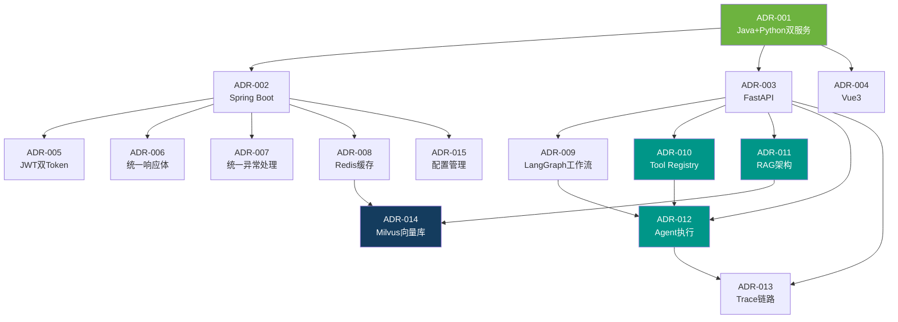

# InternSU ADR 技术决策记录

> 文档编号: INT-ADR-001
> 版本: v1.0.0
> 编写日期: 2026-06-13
> 状态: 已完成

---

## 架构决策关联图

---

## ADR-001: 采用 Java + Python 双服务架构

### 状态

Accepted

### 背景

InternSU 需要同时处理企业级业务逻辑 (认证、权限、CRUD) 和 AI 推理 (LLM 调用、RAG 检索、工作流编排)。单一技术栈难以同时满足两方面需求。

### 决策

采用 Java (Spring Boot) 作为业务网关服务，Python (FastAPI) 作为 AI 推理服务，通过 REST + SSE 通信。

### 备选方案

| 方案 | 说明 | 优点 | 缺点 |
|------|------|------|------|
| A: 单体 Java | Spring Boot + LangChain4j | 统一部署 | AI 生态弱，LangChain4j 不成熟 |
| B: 单体 Python | FastAPI 全栈 | AI 生态强 | 业务 CRUD 弱，ORM 不成熟 |
| C: Java + Python | 双服务分离 | 各自最优解 | 跨服务通信开销 |

### 选择理由

Java 擅长: Spring Security 认证、MyBatis-Plus ORM、WebClient 响应式代理
Python 擅长: LangGraph 工作流、LangChain LLM 编排、pymilvus 向量检索

### 优点

- 各自技术栈最优解
- 独立部署和扩展
- Python AI 服务可独立重启不影响 Java

### 缺点

- 跨服务通信增加延迟
- 双语言维护成本
- 分布式事务不支持

### 后果

- Java 端通过 WebClient 响应式代理 SSE 流
- Python 通过 X-Api-Key 调用 Java SQL 执行接口
- 前端仅与 Java 通信

### 演进方向

- Python 服务可水平扩展 (多实例)
- Java 可按模块进一步拆分
- 引入 gRPC 替代 REST 内部通信

---

## ADR-002: Spring Boot 作为业务服务框架

### 状态

Accepted

### 背景

需要一个成熟的 Java Web 框架来构建 API 网关，处理认证鉴权、数据持久化、SSE 代理等业务逻辑。

### 决策

采用 Spring Boot 3.3 + Spring Security + MyBatis-Plus 作为 Java 服务框架。

### 备选方案

| 方案 | 说明 | 优点 | 缺点 |
|------|------|------|------|
| A: Spring Boot | 成熟生态 | 完整生态 | 略重 |
| B: Vert.x | 高性能 | 异步非阻塞 | 生态较小 |
| C: Quarkus | 云原生 | 启动快 | 社区较小 |

### 选择理由

Spring Boot 生态最完整: Spring Security (认证)、MyBatis-Plus (ORM)、WebClient (响应式 HTTP)、Knife4j (API 文档)。团队熟悉度高。

### 优点

- Spring Security 生态完整
- MyBatis-Plus ORM 成熟
- Knife4j 自动 API 文档
- 社区活跃，问题易解决

### 缺点

- 启动速度较慢
- 内存占用较高
- 对 AI 推理场景支持弱

### 后果

- 使用 Spring Security 实现 JWT 认证
- 使用 MyBatis-Plus 实现数据库操作
- 使用 WebClient 代理 Python SSE 流

### 演进方向

- 引入 GraalVM 原生编译优化启动速度
- 引入 Spring Cloud 微服务治理

---

## ADR-003: Vue 3 作为前端框架

### 状态

Accepted

### 背景

需要一个现代前端框架构建企业级 SPA，支持 TypeScript、组件化、响应式 UI。

### 决策

采用 Vue 3 + Vite + Element Plus + Vben Admin Monorepo 架构。

### 备选方案

| 方案 | 说明 | 优点 | 缺点 |
|------|------|------|------|
| A: Vue 3 | 渐进式框架 | 学习曲线低 | 大型项目需额外规范 |
| B: React | 社区最大 | 生态丰富 | JSX 学习成本 |
| C: Angular | 全家桶 | 企业级 | 学习曲线陡 |

### 选择理由

Vben Admin 模板成熟，Element Plus 组件丰富，Vue 3 组合式 API 灵活，TypeScript 支持好。

### 优点

- Vben Admin 模板开箱即用
- Element Plus 企业级组件库
- Pinia 状态管理轻量
- Vite HMR 秒级热更新

### 缺点

- 大型项目需额外状态管理规范
- 组件库样式定制成本

### 后果

- 使用 Pinia 管理状态 (auth/chat/knowledge)
- 使用 Vue Router 管理路由
- 使用 Vben Admin 的 JWT 拦截器

### 演进方向

- 引入 Vue 3.4+ Vapor Mode 优化渲染性能
- 引入 Nuxt 3 支持 SSR

---

## ADR-004: JWT 认证机制

### 状态

Accepted

### 背景

系统需要无状态认证机制，支持前后端分离架构，避免 Session 共享问题。

### 决策

采用 JWT (JSON Web Token) 作为认证令牌，Spring Security 过滤器链实现认证。

### 备选方案

| 方案 | 说明 | 优点 | 缺点 |
|------|------|------|------|
| A: Session | 服务端会话 | 简单 | 需要 Session 共享 |
| B: JWT | 无状态令牌 | 无状态 | Token 无法主动失效 |
| C: OAuth2 | 标准协议 | 功能完整 | 复杂度高 |

### 选择理由

JWT 无状态、易于分布式部署，Spring Security 原生支持，适合前后端分离架构。

### 优点

- 无状态，无需 Session 存储
- 适用于分布式部署
- Spring Security 原生支持

### 缺点

- Token 无法主动失效 (需配合黑名单)
- Token 体积较大

### 后果

- 使用 Redis 存储 Token 黑名单
- 使用 JwtAuthenticationFilter 校验 Token
- Access Token 有效期 30 分钟

### 演进方向

- 引入 Token 自动续期机制
- 引入 Token 轮换策略

---

## ADR-005: 双 Token 认证机制

### 状态

Accepted

### 背景

单一 Access Token 有效期短 (30 分钟)，用户频繁重新登录体验差；Refresh Token 有效期长但安全性要求高。

### 决策

采用双 Token 机制: Access Token (30 分钟) + Refresh Token (7 天)，Refresh Token 存储在 Redis 中。

### 备选方案

| 方案 | 说明 | 优点 | 缺点 |
|------|------|------|------|
| A: 单 Token | 仅 Access Token | 简单 | 频繁登录 |
| B: 双 Token | AT + RT | 体验好 | 复杂度增加 |
| C: Token 轮换 | 每次请求轮换 | 安全 | 性能开销 |

### 选择理由

双 Token 平衡了安全性和用户体验。Access Token 短期有效降低泄露风险，Refresh Token 长期有效减少登录频率。

### 优点

- Access Token 短期有效降低泄露风险
- Refresh Token 长期有效减少登录频率
- Refresh Token 一次性使用防重放

### 缺点

- Redis 依赖增加
- Refresh Token 管理复杂

### 后果

- Refresh Token 存储在 Redis 中 (7 天 TTL)
- 刷新时旧 Refresh Token 立即失效
- 退出时 Access Token 加入黑名单

### 演进方向

- 引入 Refresh Token 轮换 (每次刷新返回新 RT)
- 引入设备绑定

---

## ADR-006: Redis 缓存设计

### 状态

Accepted

### 背景

系统需要高性能缓存存储会话数据、Token 黑名单、限流计数器等临时数据。

### 决策

采用 Redis 7.x 作为缓存层，存储会话上下文、Token 黑名单、限流计数器、飞书 Token。

### 备选方案

| 方案 | 说明 | 优点 | 缺点 |
|------|------|------|------|
| A: Redis | 高性能 KV | 数据结构丰富 | 内存消耗 |
| B: Memcached | 轻量缓存 | 简单 | 功能单一 |
| C: Hazelcast | 分布式缓存 | Java 原生 | 复杂度高 |

### 选择理由

Redis 数据结构丰富 (HASH/STRING/LIST)，支持 TTL 过期，Python 和 Java 都有成熟客户端。

### 优点

- 高性能 (微秒级响应)
- 数据结构丰富
- TTL 自动过期
- 持久化支持

### 缺点

- 内存消耗较大
- 单点故障风险
- 数据一致性需应用层保证

### 后果

- 会话上下文: `session:{user_id}:{conv_id}` (30min TTL)
- Token 黑名单: `jwt:blacklist:{token_id}`
- 限流计数: `ratelimit:{user_id}:{api}`
- 飞书 Token: `feishu:token:*` (110min TTL)

### 演进方向

- 引入 Redis Sentinel 高可用
- 引入 Redis Cluster 分片

---

## ADR-007: Milvus 向量数据库

### 状态

Accepted

### 背景

RAG 知识库需要存储和检索高维向量数据 (BGE-M3, 1024 维)，支持相似性搜索。

### 决策

采用 Milvus Lite (内嵌式) 作为向量数据库，pymilvus 客户端访问。

### 备选方案

| 方案 | 说明 | 优点 | 缺点 |
|------|------|------|------|
| A: pgvector | PostgreSQL 扩展 | 无需额外组件 | 性能一般 |
| B: Milvus Lite | 内嵌式 | 部署简单 | 不支持分布式 |
| C: Milvus 完整版 | 独立部署 | 高性能 | 部署复杂 |
| D: Pinecone | 云服务 | 零运维 | 依赖外部 |

### 选择理由

Milvus Lite 内嵌部署简化开发环境，pymilvus 客户端兼容完整版 Milvus，生产可平滑切换。

### 优点

- 内嵌部署，无需独立容器
- IVF_FLAT 索引适合百万级数据
- pymilvus 兼容完整版 Milvus
- 支持 COSINE 相似度

### 缺点

- 不支持分布式
- 数据量受限于内存
- 生产环境需切换完整版

### 后果

- Collection: `knowledge_chunks`
- 索引: IVF_FLAT, nlist=128, COSINE
- 与 MySQL 通过 `milvus_id` 关联

### 演进方向

- 生产环境切换 Milvus 完整版
- 引入分布式部署
- 优化索引参数

---

## ADR-008: RAG 知识库架构

### 状态

Accepted

### 背景

企业需要将文档知识结构化存储，支持自然语言检索和回答生成。

### 决策

采用混合检索 (向量 + BM25) + 交叉编码器重排序的 RAG 架构。

### 备选方案

| 方案 | 说明 | 优点 | 缺点 |
|------|------|------|------|
| A: 纯向量检索 | BGE-M3 + Milvus | 语义理解强 | 关键词匹配弱 |
| B: 纯关键词检索 | BM25 | 精确匹配 | 语义理解弱 |
| C: 混合检索 + 重排序 | 向量 + BM25 + Cross-Encoder | 准确率高 | 复杂度高 |

### 选择理由

混合检索结合了向量语义和关键词精确匹配的优势，交叉编码器重排序显著提升准确率。

### 优点

- 语义 + 关键词互补
- 交叉编码器精排提升准确率
- 引用溯源增强可信度

### 缺点

- 检索延迟增加 (向量 + BM25 + 重排序)
- 模型部署成本 (BGE-M3)
- 分块策略需调优

### 后果

- 分块: 512 字符, 64 重叠
- 嵌入: BGE-M3, 1024 维
- 检索: 向量 COSINE + BM25 + 交叉编码器
- 引用: 文档名 + 页码

### 演进方向

- 引入 Query Rewrite 优化查询
- 引入 HyDE (假设文档嵌入)
- 引入多模态检索

---

## ADR-009: Tool Registry 插件化架构

### 状态

Accepted

### 背景

系统需要支持多种 AI 工具 (SQL、RAG、飞书等)，且工具需要动态管理和扩展。

### 决策

采用 BaseTool 抽象类 + ToolRegistry 单例 + ToolManager 编排的三层架构。

### 备选方案

| 方案 | 说明 | 优点 | 缺点 |
|------|------|------|------|
| A: 硬编码路由 | if/else 分发 | 简单 | 耦合度高 |
| B: 配置文件驱动 | JSON/YAML 配置 | 灵活 | 运行时不可变 |
| C: Tool Registry | 插件化注册 | 解耦、可扩展 | 架构复杂度 |

### 选择理由

Tool Registry 实现了工具的动态注册、发现和调用，新增工具只需实现接口 + 注册，无需修改 Agent 逻辑。

### 优点

- 工具与 Agent 逻辑完全解耦
- 运行时启用/禁用
- OpenAI function-calling schema 自动生成
- 统一超时/校验/Trace/审计

### 缺点

- 架构复杂度增加
- 需要维护注册表一致性
- 调试链路变长

### 后果

- `bootstrap.py` 启动时注册所有工具
- `ToolManager.execute()` 统一执行入口
- `ToolRegistry.get()` 按名称查找
- 新增工具: 实现 BaseTool + 注册 + TOOLS_PROMPT

### 演进方向

- 引入工具版本管理
- 引入工具依赖关系
- 引入工具市场

---

## ADR-010: LangGraph 工作流架构

### 状态

Accepted

### 背景

AI 推理过程需要支持条件路由、多轮澄清、任务恢复等复杂流程，线性链路无法满足。

### 决策

采用 LangGraph StateGraph 构建 14 节点有向图工作流。

### 备选方案

| 方案 | 说明 | 优点 | 缺点 |
|------|------|------|------|
| A: 线性链路 | if/else 分支 | 简单 | 无法处理复杂流程 |
| B: LangChain Agent | 内置 Agent | 简单 | 灵活性差 |
| C: LangGraph | 有向图状态机 | 灵活、可视化 | 学习曲线 |

### 选择理由

LangGraph 支持有向图状态机，节点独立可测试，条件路由灵活，多轮澄清支持好。

### 优点

- 14 节点有向图，可视化调试
- 节点独立异步函数，可测试
- 条件边支持复杂分支路由
- 30+ 类型化状态字段

### 缺点

- 学习曲线陡
- 调试复杂度高
- 状态管理开销

### 后果

- `intern_graph.py` 定义 StateGraph
- 每个节点是独立异步函数
- `add_conditional_edges` 实现条件路由
- `clarify_node` → `slot_collect` → `task_resume` 多轮澄清

### 演进方向

- 引入工作流可视化编辑器
- 引入工作流版本管理
- 引入工作流 A/B 测试

---

## ADR-011: SSE 流式输出架构

### 状态

Accepted

### 背景

AI 回答需要实时推送到前端，传统请求-响应模式无法满足流式输出需求。

### 决策

采用 SSE (Server-Sent Events) 实现真流式输出，Python 后台 Task + asyncio.Queue + SSE yield。

### 备选方案

| 方案 | 说明 | 优点 | 缺点 |
|------|------|------|------|
| A: WebSocket | 双向通信 | 功能强 | 复杂度高 |
| B: SSE | 单向推送 | 简单 | 单向 |
| C: 轮询 | 定时请求 | 兼容性好 | 延迟高 |

### 选择理由

AI 回答是单向流 (服务端 → 客户端)，SSE 实现简单 (FastAPI 原生支持)，Java WebClient 响应式透传。

### 优点

- 首 Token 延迟 < 2s
- 实现简单
- 取消传播链完整

### 缺点

- 不支持双向通信
- 连接数受限
- 断线重连需应用层处理

### 后果

- Python: `asyncio.Queue` + `asyncio.create_task` + `StreamingResponse`
- Java: `WebClient` 响应式代理 SSE 流
- 前端: `EventSource` 接收事件

### 演进方向

- 引入 WebSocket 支持双向通信
- 引入断线重连机制

---

## ADR-012: LLM 意图识别替代规则引擎

### 状态

Accepted

### 背景

系统需要识别用户意图 (闲聊/RAG/SQL/飞书)，传统关键词匹配无法处理复杂语义。

### 决策

采用 LLM Tool Selection 模式，将每个能力定义为"工具"，让 LLM 自主选择。

### 备选方案

| 方案 | 说明 | 优点 | 缺点 |
|------|------|------|------|
| A: 关键词匹配 | 规则引擎 | 快速、确定性 | 无法处理复杂语义 |
| B: 意图分类模型 | 训练模型 | 准确率高 | 需要训练数据 |
| C: LLM Tool Selection | LLM 自主选择 | 灵活、零改动 | 延迟、成本 |

### 选择理由

LLM 可以理解复杂语义，新增能力只需在 TOOLS_PROMPT 加一行描述，零代码改动。

### 优点

- 理解复杂语义
- 新增能力零代码改动
- 自然语言描述即可

### 缺点

- LLM 调用延迟 (1-2s)
- Token 消耗成本
- 输出不完全可控

### 后果

- `intent_node.py` 构建 TOOLS_PROMPT
- LLM 仅输出工具名 (max_tokens=20)
- 新增工具: TOOLS_PROMPT 添加描述

### 演进方向

- 引入意图缓存 (相同问题缓存意图)
- 引入意图分类模型 (替代 LLM)

---

## ADR-013: 全链路 Trace 追踪

### 状态

Accepted

### 背景

AI 黑盒问题——用户不知道 AI 做了什么，难以建立信任，也难以调试。

### 决策

采用 trace_steps 列表 + SSE trace 事件 + MySQL 持久化的全链路追踪方案。

### 备选方案

| 方案 | 说明 | 优点 | 缺点 |
|------|------|------|------|
| A: 仅日志 | log.info 记录 | 简单 | 不可视化 |
| B: 前端进度条 | 简单进度 | 用户友好 | 信息量少 |
| C: 全链路 Trace | 采集+存储+展示 | 完整 | 复杂度高 |

### 选择理由

全链路 Trace 提供完整的执行过程记录，支持前端实时展示和事后追溯。

### 优点

- 前端实时展示增强信任
- MySQL 持久化支持事后追溯
- trace_id 贯穿全链路
- Token 消耗统计

### 缺点

- 存储开销增加
- 性能影响 (每步记录)
- 查询复杂度增加

### 后果

- 每个节点执行时 `trace_steps.append()`
- SSE trace 事件实时推送
- Java 解析后写入 `t_message_trace`
- 前端右侧面板实时展示

### 演进方向

- 引入 Trace 采样 (低频记录)
- 引入 Trace 分析 (慢步骤统计)
- 引入分布式追踪 (Jaeger/Zipkin)

---

## ADR-014: 统一异常处理机制

### 状态

Accepted

### 背景

系统需要统一的异常处理机制，避免异常信息泄露，提供友好的错误提示。

### 决策

Java 侧采用 `GlobalExceptionHandler` + `Result` 统一返回体；Python 侧采用 FastAPI 内置异常处理 + SSE error 事件。

### 备选方案

| 方案 | 说明 | 优点 | 缺点 |
|------|------|------|------|
| A: 各自处理 | 无统一机制 | 简单 | 不一致 |
| B: 统一异常处理 | GlobalHandler | 一致 | 需要设计 |
| C: 错误码体系 | 标准化 | 规范 | 实现成本 |

### 选择理由

统一异常处理确保所有异常以一致格式返回，不暴露内部错误，提供友好提示。

### 优点

- 异常格式一致
- 不暴露内部错误
- 友好的用户提示
- trace_id 便于排查

### 缺点

- 需要设计异常分类
- 部分异常可能被吞掉

### 后果

- Java: `GlobalExceptionHandler` 捕获 `BusinessException`/`ValidationException`
- Python: SSE `error` 事件推送到前端
- 统一返回: `Result<T>` + 错误码

### 演进方向

- 引入错误码标准 (RFC 7807)
- 引入异常监控 (Sentry)

---

## ADR-015: 统一响应体设计

### 状态

Accepted

### 背景

系统需要统一的 API 响应格式，便于前端处理和错误识别。

### 决策

采用 `Result<T>` 泛型封装，包含 code/message/data/timestamp/traceId 字段。

### 备选方案

| 方案 | 说明 | 优点 | 缺点 |
|------|------|------|------|
| A: 无统一格式 | 各接口自由格式 | 灵活 | 不一致 |
| B: Result\<T\> 封装 | 统一格式 | 一致 | 需要设计 |
| C: JSON:API 标准 | 标准协议 | 规范 | 过于复杂 |

### 选择理由

`Result<T>` 简单实用，支持泛型，包含 trace_id 便于全链路追踪。

### 优点

- 响应格式一致
- 泛型支持类型安全
- trace_id 便于排查
- timestamp 支持前后端时间校准

### 缺点

- 需要统一编码规范
- 增加响应体积

### 后果

- 所有 Java API 返回 `Result<T>`
- Python API 返回 `ApiResponse` (兼容格式)
- 错误时返回 code + message

### 演进方向

- 引入 HATEOAS 链接
- 引入分页元数据

---

## ADR-016: 配置管理设计

### 状态

Accepted

### 背景

系统需要管理多环境配置 (开发/测试/生产)，支持运行时配置更新。

### 决策

采用 .env 文件 + application.yml + t_system_config 表的三层配置管理。

### 备选方案

| 方案 | 说明 | 优点 | 缺点 |
|------|------|------|------|
| A: 仅 .env | 环境变量 | 简单 | 不支持运行时更新 |
| B: 配置中心 | Nacos/Apollo | 功能强 | 复杂度高 |
| C: 三层配置 | .env + yml + DB | 平衡 | 需要设计 |

### 选择理由

三层配置平衡了简单性和灵活性：.env 管理敏感配置，yml 管理应用配置，DB 管理运行时配置。

### 优点

- 敏感配置不入代码库
- 应用配置版本化
- 运行时配置可动态更新

### 缺点

- 配置分散在三处
- 需要配置优先级规则

### 后果

- `.env`: API Key、数据库密码
- `application.yml`: 端口、连接池
- `t_system_config`: AI 参数、RAG 参数

### 演进方向

- 引入配置中心 (Nacos)
- 引入配置加密

---

## 决策影响分析

| ADR | 性能 | 扩展性 | 可维护性 | 复杂度 | 学习成本 |
|-----|------|--------|---------|--------|---------|
| ADR-001 Java+Python | ⬇️ 延迟增加 | ⬆️ 独立扩展 | ⬇️ 双语言维护 | ⬆️ 架构复杂 | ⬆️ 需掌握双栈 |
| ADR-005 双Token | ⬇️ 刷新开销 | ⬆️ 安全性 | ⬇️ 逻辑复杂 | ⬆️ Redis 依赖 | ⬆️ 需理解机制 |
| ADR-007 Milvus | ⬆️ 向量检索快 | ⬆️ 水平扩展 | ⬇️ 部署复杂 | ⬆️ 新组件 | ⬆️ 需掌握向量 |
| ADR-009 Tool Registry | ⬇️ 间接开销 | ⬆️ 插件化 | ⬆️ 解耦 | ⬆️ 架构层次 | ⬆️ 需理解模式 |
| ADR-010 LangGraph | ⬇️ 编排开销 | ⬆️ 节点扩展 | ⬆️ 可视化 | ⬆️ 状态机 | ⬆️ 需掌握图 |
| ADR-011 SSE | ⬆️ 实时推送 | ⬆️ 流式扩展 | ⬆️ 简单 | ⬆️ 异步 | ⬆️ 需掌握异步 |

---

## 技术债务分析

| 决策 | 技术债务 | 影响 | 缓解方案 |
|------|---------|------|---------|
| ADR-001 Java+Python | 双语言维护成本 | 开发效率 | 统一编码规范，共享类型定义 |
| ADR-006 Redis | 单点故障风险 | 可用性 | 引入 Redis Sentinel |
| ADR-007 Milvus Lite | 不支持分布式 | 数据量限制 | 生产切换完整版 |
| ADR-009 Tool Registry | 调试链路变长 | 开发效率 | 引入 Trace 可视化 |
| ADR-010 LangGraph | 状态管理开销 | 性能 | 引入状态压缩 |
| ADR-012 LLM 意图识别 | Token 消耗成本 | 运营成本 | 引入意图缓存 |

---

## ADR 成熟度评估

| ADR | 成熟度 | 说明 |
|-----|--------|------|
| ADR-001 Java+Python | ⭐⭐⭐⭐ | 架构稳定，需优化通信 |
| ADR-002 Spring Boot | ⭐⭐⭐⭐⭐ | 生态成熟，无需调整 |
| ADR-003 Vue3 | ⭐⭐⭐⭐⭐ | 生态成熟，无需调整 |
| ADR-004 JWT | ⭐⭐⭐⭐ | 机制成熟，需优化续期 |
| ADR-005 双Token | ⭐⭐⭐⭐ | 机制完善，需优化轮换 |
| ADR-006 Redis | ⭐⭐⭐⭐ | 功能完善，需高可用 |
| ADR-007 Milvus | ⭐⭐⭐ | Lite 限制，需升级 |
| ADR-008 RAG | ⭐⭐⭐⭐ | 架构完善，需优化检索 |
| ADR-009 Tool Registry | ⭐⭐⭐⭐⭐ | 设计优秀，扩展性好 |
| ADR-010 LangGraph | ⭐⭐⭐⭐ | 功能完整，需可视化 |
| ADR-011 SSE | ⭐⭐⭐⭐ | 实现完善，需断线重连 |
| ADR-012 LLM 意图识别 | ⭐⭐⭐⭐ | 效果好，需缓存优化 |
| ADR-013 Trace | ⭐⭐⭐⭐⭐ | 设计完整，扩展性好 |
| ADR-014 异常处理 | ⭐⭐⭐⭐ | 机制完善，需标准化 |
| ADR-015 统一响应体 | ⭐⭐⭐⭐⭐ | 设计简洁，无需调整 |
| ADR-016 配置管理 | ⭐⭐⭐ | 需引入配置中心 |

---

## 面试价值分析

### Q1: 为什么采用 Tool Registry 而非硬编码?

**面试官视角**: 考察插件化设计思想和开闭原则理解。

**基于代码的分析**: `BaseTool` 抽象类 + `ToolRegistry` 单例 + `ToolManager` 编排。`bootstrap.py` 启动时注册，`ToolManager.execute()` 通过名称动态查找。新增工具只需实现接口 + 注册，无需修改 Agent 逻辑。

**代码证据**:
- `python-ai-service/app/tools/base.py` — BaseTool 抽象类
- `python-ai-service/app/tools/registry.py` — ToolRegistry 单例
- `python-ai-service/app/tools/manager.py` — ToolManager 编排
- `python-ai-service/app/tools/bootstrap.py` — 启动注册

### Q2: 为什么采用 LangGraph 而非 LangChain Agent?

**面试官视角**: 考察 AI 工作流编排能力和技术选型深度。

**基于代码的分析**: `intern_graph.py` 定义 14 节点 StateGraph，30+ 类型化状态字段，`add_conditional_edges` 支持复杂分支路由。LangChain Agent 是黑盒，无法自定义节点和路由。

**代码证据**:
- `python-ai-service/app/graph/intern_graph.py` — StateGraph 定义
- `python-ai-service/app/graph/nodes/` — 14 个独立节点

### Q3: 为什么选择 Milvus 而非 Elasticsearch?

**面试官视角**: 考察向量数据库选型能力和 RAG 架构理解。

**基于代码的分析**: Milvus 是专业向量数据库，支持 IVF_FLAT 索引和 COSINE 相似度，适合高维向量检索。ES 虽然支持向量，但不是核心能力，性能和功能不如专业向量库。

**代码证据**:
- `python-ai-service/app/rag/` — pymilvus 客户端使用
- `python-ai-service/requirements.txt` — `pymilvus>=2.4.0`

### Q4: 为什么需要全链路 Trace?

**面试官视角**: 考察可观测性设计和 AI 黑盒问题解决能力。

**基于代码的分析**: AI 执行过程是黑盒，用户不知 AI 做了什么。Trace 通过 `trace_steps` 列表 + SSE 实时推送 + MySQL 持久化，实现全链路可观测。

**代码证据**:
- `python-ai-service/app/graph/nodes/` — 每个节点 append trace_step
- `java-service/.../chat/entity/MessageTrace.java` — Trace 实体
- `frontend/apps/web-ele/src/views/history/index.vue` — Trace 面板

### Q5: 为什么采用 SSE 而非 WebSocket?

**面试官视角**: 考察实时通信技术选型和异步编程能力。

**基于代码的分析**: AI 回答是单向流 (服务端 → 客户端)，SSE 实现简单 (FastAPI `StreamingResponse`)，Java `WebClient` 响应式透传。WebSocket 双向通信是过度设计。

**代码证据**:
- `python-ai-service/app/api/v1/chat_api.py` — SSE Generator
- `java-service/.../chat/controller/AIProxyController.java` — SSE 代理

### Q6: 为什么 Java 和 Python 拆分?

**面试官视角**: 考察服务拆分能力和技术栈选型依据。

**基于代码的分析**: Java 擅长 Spring Security 认证 + MyBatis-Plus ORM；Python 擅长 LangGraph 工作流 + LangChain LLM 编排。双服务各自技术栈最优解，独立部署和扩展。

**代码证据**:
- `java-service/` — Spring Boot 业务服务
- `python-ai-service/` — FastAPI AI 服务
- `java-service/.../chat/controller/AAIProxyController.java` — SSE 代理

### Q7: RAG 准确率如何保证?

**面试官视角**: 考察 RAG 工程深度和检索质量优化能力。

**基于代码的分析**: 混合检索 (BGE-M3 向量 COSINE + BM25 关键词 jieba 分词) → 合并去重 → 交叉编码器 (BGE-M3 cross-encoder) 精排 top-20 → 引用标注 (文档名 + 页码)。

**代码证据**:
- `python-ai-service/app/rag/rag_pipeline.py` — 完整 RAG 流程
- `python-ai-service/app/rag/retrieval.py` — 混合检索
- `python-ai-service/app/rag/reranker.py` — 交叉编码器重排序

### Q8: Tool 执行失败怎么处理?

**面试官视角**: 考察容错设计和异常处理能力。

**基于代码的分析**: `ToolManager.execute()` 包含超时控制 (30s/60s/90s)、参数校验 (JSON Schema)、异常捕获。失败时返回 `ToolResult(success=False, error=msg)`，Agent 优雅降级而非崩溃。

**代码证据**:
- `python-ai-service/app/tools/manager.py` — ToolManager 执行编排
- `python-ai-service/app/tools/base.py` — ToolResult 数据结构
