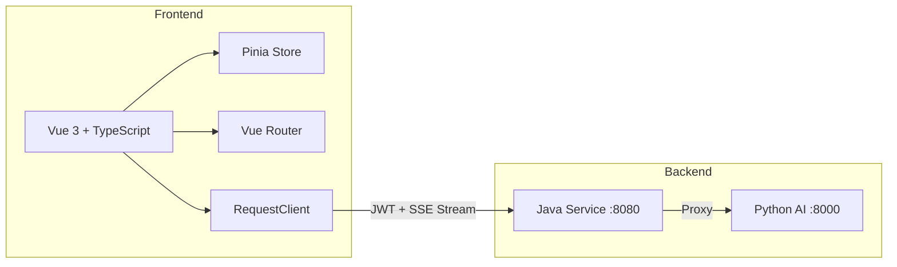
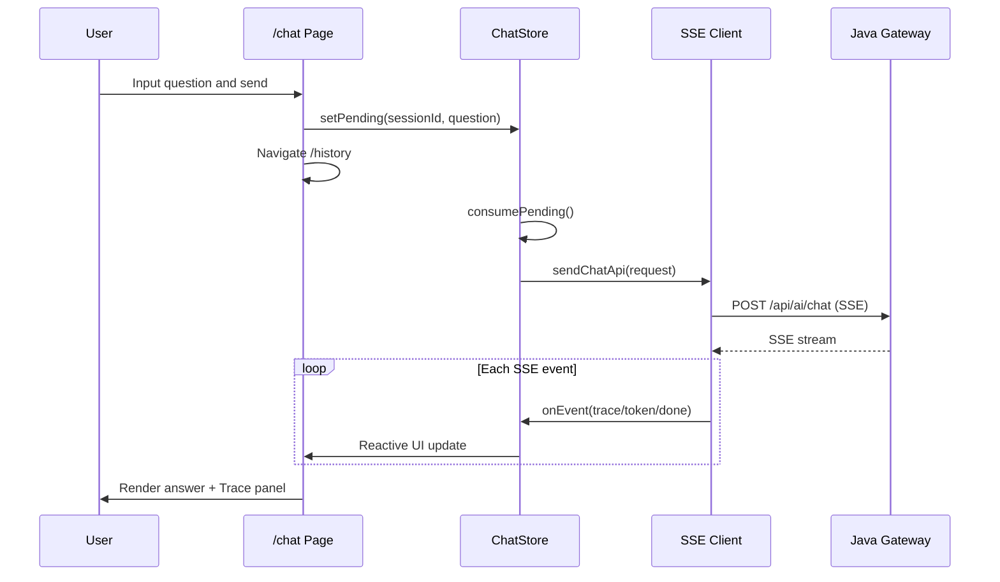

# InternSU — Frontend

> 企业AI实习生平台 · Vue 3 前端应用

## 1. 项目简介

InternSU Frontend 是企业AI实习生平台的用户界面，基于 Vue 3 + TypeScript + Vite 构建，采用 Vben Admin 5.7 作为基础框架。提供AI聊天、历史记录、知识库管理、用户认证等完整功能。

业务场景：企业内部员工通过浏览器访问，可以与AI助手进行对话，查看工作过程追踪(trace)，管理知识库文档，浏览历史会话记录。

核心价值：提供直观的流式聊天体验(SSE实时渲染)、工作过程可视化(Trace面板)、企业级双Token自动刷新、知识库联动聊天。

---

## 2. 技术架构





---

## 3. 技术栈

| 技术 | 版本 | 用途 |
|------|------|------|
| Vue | 3.x | 前端框架 |
| TypeScript | 5.x | 类型安全 |
| Vite | 5.x | 构建工具 |
| Pinia | - | 状态管理 |
| Vue Router | 4.x | 路由管理 |
| Element Plus | - | UI组件库 |
| Tailwind CSS | 3.x | 原子化CSS |
| pnpm | 11.2.2 | 包管理器 |
| Turborepo | - | Monorepo管理 |
| Vben Admin | 5.7.0 | 后台管理基础框架 |

---

## 4. 项目结构

```
frontend/
├── package.json                        # Monorepo root config
├── pnpm-workspace.yaml                 # pnpm workspace
├── apps/web-ele/                       # Main application
│   ├── package.json
│   ├── vite.config.ts
│   ├── .env.development
│   ├── .env.production
│   └── src/
│       ├── main.ts                     # App entry
│       ├── bootstrap.ts                # Bootstrap
│       ├── app.vue                     # Root component
│       ├── preferences.ts              # Global preferences
│       ├── api/                        # API layer
│       │   ├── request.ts              # Request client (dual-token refresh)
│       │   ├── token-refresh-manager.ts # Token refresh queue
│       │   └── core/
│       │       ├── auth.ts             # Auth API (login/register/refresh/logout)
│       │       ├── conversation.ts     # Conversation API (SSE stream parser)
│       │       ├── knowledge.ts        # Knowledge base API
│       │       ├── types.ts            # All type definitions
│       │       └── user.ts
│       ├── store/                      # State management
│       │   ├── auth.ts                 # Auth state
│       │   ├── chat.ts                 # Chat state (SSE + Trace)
│       │   └── knowledge.ts            # Knowledge selection state
│       ├── router/                     # Router
│       │   ├── index.ts                # Router instance
│       │   ├── guard.ts                # Route guards
│       │   └── routes/core.ts          # Route config (5 pages)
│       ├── views/                      # Pages
│       │   ├── home/index.vue          # Home page
│       │   ├── chat/index.vue          # AI Chat page (core)
│       │   ├── history/index.vue       # History page
│       │   ├── knowledge/index.vue     # Knowledge base page
│       │   └── _core/authentication/
│       │       ├── login.vue           # Login page
│       │       └── register.vue        # Register page
│       ├── components/                 # Business components
│       │   ├── NavBar.vue              # Navigation bar
│       │   ├── UserMenu.vue            # User menu
│       │   └── ...                     # Other UI components
│       └── utils/jwt.ts                # JWT decode + expiry check
├── packages/                           # Shared packages
│   ├── @core/                          # Core utilities
│   └── ...                             # Other shared packages
└── internal/                           # Internal config packages
    ├── lint-configs/                   # Lint rules
    ├── tailwind-config/                # Tailwind config
    ├── tsconfig/                       # TS config
    └── vite-config/                    # Vite config
```

---

## 5. 核心模块说明

### 5.1 统一请求封装 (api/request.ts)

职责：所有HTTP请求的统一入口，自动管理JWT双Token生命周期。

核心能力：
- 请求拦截器：注入Authorization header + 预刷新(距过期<5min主动刷新)
- 响应拦截器：401兜底刷新 + 并发请求排队 + 错误消息展示
- 双Token机制：accessToken(JWT) + refreshToken(Redis), 静默刷新

设计思想：全局isRefreshing标记 + refreshTokenQueue队列，确保多个同时401的请求只触发一次refresh调用，其他请求排队等结果。登出使用__skipRefresh标记跳过刷新逻辑。

### 5.2 聊天状态管理 (store/chat.ts)

职责：管理AI聊天的完整生命周期，包括会话列表、消息历史、SSE流接收、Trace步骤。

核心流程：
1. /chat页面输入问题 -> setPending()
2. 跳转/history -> consumePending()获取问题
3. prepareMessages()创建用户消息+AI占位消息
4. sendChatMessage()发起SSE请求
5. SSE回调: trace事件累加到currentTraces, done事件回填AI消息content
6. 自动读取KnowledgeStore.selectedSpaceIds作为doc_ids参数

设计思想：跨页面消息传递(sessionId + pendingQuestion)实现输入即跳转的流畅体验。AI消息使用占位ID，SSE完成时精确回填。

### 5.3 SSE流解析 (api/core/conversation.ts)

职责：手写ReadableStream解析器，处理text/event-stream格式。

核心逻辑：
1. POST请求获取Response.body
2. ReadableStream.getReader()逐块读取
3. TextDecoder解码 -> 按行分割 -> 解析"data: {...}"行
4. JSON.parse后按类型分发: isTraceStep() / isFinalAnswer()

设计思想：不依赖第三方SSE库，自行实现以精确控制解析行为和错误处理。支持增量buffer处理半行数据。

### 5.4 知识库选择状态 (store/knowledge.ts)

职责：管理知识库空间的选择状态，与聊天联动。

核心逻辑：
- fetchSpaces()从Java后端GET /api/v1/documents/spaces加载
- selectedSpaceIds管理多选状态
- ChatStore发送消息时自动读取selectedSpaceIds填入doc_ids参数

---

## 6. 核心流程

### 6.1 用户聊天流程

1. 用户在/chat页面输入问题 -> 生成sessionId -> setPending()
2. router.push(/history?sessionId=xxx) -> History页面onMounted
3. consumePending()获取问题 -> prepareMessages()创建占位消息
4. sendChatMessage() -> sendChatApi()发起POST /api/ai/chat (SSE)
5. SSE stream逐事件回调：
   - trace事件 -> currentTraces.push(实时累加)
   - done事件 -> 回填AI消息content + conversation_id
6. 渲染：消息气泡(用户+AI) + 右侧Trace面板(执行步骤)

### 6.2 Token刷新流程

1. 每次请求前检查accessToken是否距过期<5min
2. 未过期: 直接发送请求
3. 即将过期: 进入预刷新
   - 无刷新进行中: 当前请求负责调用refreshTokenApi()
   - 有刷新进行中: 入队等待
4. 请求返回401: 进入兜底刷新(同上逻辑)
5. 刷新成功: 唤醒队列中所有等待请求，重试原请求
6. 刷新失败: 清空队列 + doReAuthenticate() + 跳转登录页

---

## 7. 环境要求

| 组件 | 版本要求 |
|------|----------|
| Node.js | 18+ |
| pnpm | 11.2.2+ |
| Java Service | localhost:8080 |
| Python AI Service | localhost:8000 |

---

## 8. 本地启动指南

### 8.1 安装依赖

```bash
cd frontend
pnpm install
```

### 8.2 配置环境变量

```bash
# apps/web-ele/.env.development (已配置默认值)
VITE_GLOB_API_URL=http://localhost:8080/api
```

### 8.3 启动开发服务器

```bash
cd frontend
pnpm dev
# 访问 http://localhost:5173
```

### 8.4 构建生产版本

```bash
pnpm build
# 输出: apps/web-ele/dist/
```

### 8.5 验证

1. 浏览器打开 http://localhost:5173
2. 注册账号(或使用内置admin/admin123)
3. 登录后进入/chat页面开始对话
4. 在/knowledge页面可上传文档并选择知识库
5. 在/history页面查看历史会话记录

---

## 9. 配置说明

### .env.development

| 配置项 | 默认值 | 说明 |
|--------|--------|------|
| VITE_GLOB_API_URL | http://localhost:8080/api | Java后端地址 |

### preferences.ts (全局偏好)

| 配置项 | 说明 |
|--------|------|
| app.enableRefreshToken | 是否启用Token自动刷新 |
| app.locale | 默认语言(zh-CN) |

---

## 10. API封装说明

### 认证模块

| 函数 | 方法 | 端点 | 说明 |
|------|------|------|------|
| loginApi | POST | /v1/auth/login | 登录(设置双Token) |
| registerApi | POST | /v1/auth/register | 注册 |
| refreshTokenApi | POST | /v1/auth/refresh | 刷新Token(使用baseRequestClient) |
| logoutApi | POST | /v1/auth/logout | 登出(标记__skipRefresh) |

### 聊天模块

| 函数 | 方法 | 端点 | 说明 |
|------|------|------|------|
| sendChatApi | POST | /api/ai/chat | SSE流式聊天(核心) |
| fetchConversationsApi | GET | /api/ai/conversations | 会话列表 |
| fetchMessagesApi | GET | /api/ai/conversations/{id}/messages | 会话消息 |

### 知识库模块

| 函数 | 方法 | 端点 | 说明 |
|------|------|------|------|
| fetchKnowledgeSpacesApi | GET | /v1/documents/spaces | 知识空间列表 |
| getMyDocumentsApi | GET | /v1/documents/my | 我的文档 |
| getPublicDocumentsApi | GET | /v1/documents/public | 公开文档 |
| uploadDocumentApi | POST | /v1/documents/upload | 上传文档 |

---

## 11. 路由设计

| 路径 | 页面 | 说明 | 认证 |
|------|------|------|------|
| / | -> /home | 根路径重定向 | - |
| /home | views/home | 首页 | No |
| /chat | views/chat | AI聊天页(核心) | Yes |
| /history | views/history | 历史记录 | Yes |
| /knowledge | views/knowledge | 知识库管理 | Yes |
| /auth/login | login.vue | 登录 | No |
| /auth/register | register.vue | 注册 | No |
| /:path(.*)* | not-found.vue | 404 | - |

---

## 12. 安全设计

- 双Token自动刷新: 请求拦截器预刷新(距过期<5min) + 响应拦截器401兜底刷新
- 并发刷新锁: isRefreshing标记 + refreshTokenQueue队列，防多次重复刷新
- Token过期检测: utils/jwt.ts解码JWT payload.exp，本地判断是否即将过期
- 登出清理: 清除localStorage + 清除Token + 调用登出API(标记__skipRefresh)
- 路由守卫: router/guard.ts控制页面访问权限

---

## 13. 页面功能清单

| 页面 | 核心功能 |
|------|----------|
| /chat | AI对话输入、发送按钮、知识库选择 |
| /history | 左侧会话列表、中间消息气泡、右侧Trace面板 |
| /knowledge | 知识库选择器、我的文档、公开文档、文档上传 |
| /auth/login | 用户名/密码登录 |
| /auth/register | 注册(用户名/密码/邮箱/昵称) |

---

## 14. 部署说明

### 构建
```bash
cd frontend
pnpm build
# 产出: apps/web-ele/dist/
```

### 部署(静态文件)
将dist/目录部署到任意静态文件服务器(Nginx/CDN/OSS)，配置反向代理转发/api请求到Java后端。

### Nginx示例
```nginx
server {
    listen 80;
    root /var/www/internsu;
    location / { try_files $uri /index.html; }
    location /api/ { proxy_pass http://java-service:8080; }
}
```

---

## 15. 项目亮点

1. 企业级双Token刷新方案: 请求拦截器预刷新 + 响应拦截器401兜底 + 并发请求队列排队，静默刷新用户无感知
2. 手写SSE流解析器: 不依赖第三方SSE库，基于ReadableStream+TextDecoder自行实现，精确控制解析行为
3. Trace工作过程可视化: SSE trace事件实时累加到右侧面板，用户可看到AI的工作过程(意图识别/检索/SQL/回答)
4. 知识库联动聊天: ChatStore发送消息时自动读取KnowledgeStore.selectedSpaceIds，无需手动传递
5. 跨页面消息传递: 通过sessionId+pendingQuestion实现/chat输入->/history自动发送的流畅体验
6. JWT过期本地检测: 解码payload.exp，距过期<5分钟主动刷新，避免请求发出后才收到401
7. 统一类型定义: types.ts集中管理所有前后端接口类型(ChatSendRequest/ChatTraceStep/CitationSource等)
8. Monorepo架构: pnpm+Turborepo管理多包，共享Vite/TS/Tailwind/Lint配置

---

## 16. 后续规划

- 移动端适配(响应式布局优化)
- 多语言支持(en-US)
- 暗色模式
- 单元测试+E2E测试(Playwright已配置)
- 模型选择器UI增强
