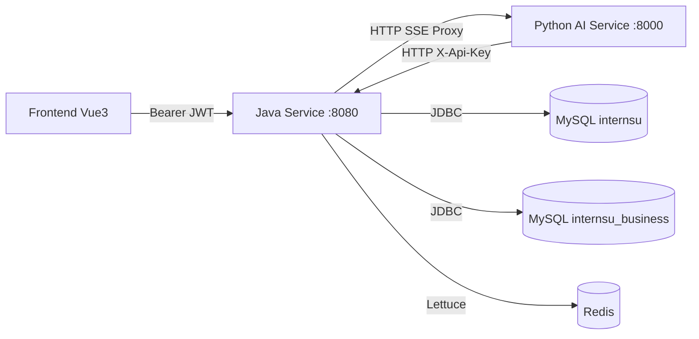
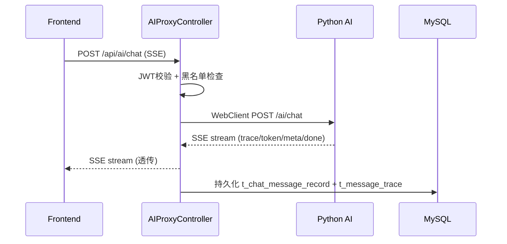

# InternSU — Java Core Service

> 企业AI实习生平台 · Java业务编排与持久化服务

## 1. 项目简介

InternSU Java Service 是企业AI实习生平台的核心业务后端，承担认证授权、请求路由、事务控制、数据持久化四大职责。通过 WebClient 代理模式将 AI 推理请求转发给 Python AI Service，同时独立完成用户管理、知识库文档管理、SQL Agent 数据查询等业务能力。

业务场景：企业内部员工通过前端与AI助手对话，Java服务负责身份验证、权限校验、SSE流代理、对话记录持久化。

核心价值：将认证授权、业务事务与AI推理分离；作为SSE流式代理网关统一对外接口；负责所有数据的持久化与事务一致性。

---

## 2. 技术架构

系统整体采用 Java + Python 双服务架构。Java 作为业务编排层，Python 作为 AI 推理层。





---

## 3. 技术栈

| 技术 | 版本 | 用途 |
|------|------|------|
| Spring Boot | 3.3.5 | 核心框架 |
| Java | 17 | 运行语言 |
| MyBatis Plus | 3.5.8 | ORM |
| MySQL Connector/J | 8.x | 数据库驱动 |
| Spring Data Redis (Lettuce) | - | Redis客户端 |
| Spring Security | 6.x | 安全框架 |
| jjwt | 0.12.6 | JWT实现 |
| Spring WebFlux (WebClient) | - | 响应式HTTP客户端 |
| Knife4j | 4.5.0 | API文档 |
| MapStruct | 1.6.2 | 对象映射 |
| Micrometer Brave | - | 分布式追踪 |

---

## 4. 项目结构

```
java-service/
├── pom.xml                              # Maven配置
├── Dockerfile                           # Docker构建
├── config/
│   └── application-secrets.yml          # 生产敏感配置模板
├── src/main/resources/
│   ├── application.yml                  # 公共配置
│   ├── application-dev.yml              # 开发环境
│   ├── application-prod.yml             # 生产环境
│   ├── logback-spring.xml               # 日志配置
│   └── mapper/                          # MyBatis XML
└── src/main/java/com/company/aiplatform/
    ├── auth/                            # 认证授权
    │   ├── controller/AuthController    # 注册/登录/刷新/登出
    │   ├── entity/                      # User, Role, Permission等
    │   └── security/JwtTokenProvider    # JWT工具
    ├── chat/                            # 聊天代理
    │   ├── controller/AIProxyController # SSE流式代理入口
    │   └── entity/                      # Conversation, MessageRecord, MessageTrace
    ├── common/                          # 公共组件
    │   ├── config/SecurityConfig        # Spring Security配置
    │   ├── filter/TraceIdFilter         # 全链路追踪
    │   └── filter/JwtAuthenticationFilter
    ├── rag/                             # 知识库文档管理
    │   ├── controller/RagController     # 文档CRUD
    │   └── entity/                      # Document, KnowledgeSpace
    ├── sql/                             # SQL Agent
    │   ├── controller/SqlAgentController # Schema + 只读SQL执行
    │   └── config/BusinessDataSourceConfig # 双数据源
    ├── thirdparty/                      # Python AI客户端
    │   └── client/AIServiceClient
    ├── tool/                            # 工具管理
    │   ├── controller/ToolController
    │   └── entity/ToolDefinition
    └── user/                            # 用户管理
```

---

## 5. 核心模块说明

### 5.1 认证授权模块 (auth)

- 职责：用户注册、登录、Token颁发/刷新/失效
- 输入：LoginReq / RegisterReq / RefreshTokenReq
- 输出：LoginVO (accessToken + refreshToken + userInfo)
- 设计思想：双Token机制——短生命周期无状态JWT(15min)做日常认证，长生命周期Redis存储的RefreshToken(7天)做服务端管控。登出时AccessToken加入黑名单(Redis基于jti)，RefreshToken从Redis删除

### 5.2 SSE代理模块 (chat/AIProxyController)

- 职责：统一AI聊天入口，SSE流式代理 + 对话持久化 + Trace持久化
- 输入：ChatProxyRequest (userId, conversationId, message, model, spaceIds, docIds)
- 输出：Flux<ServerSentEvent<String>>
- 设计思想：Java不参与AI推理，仅作为网关透传Python SSE流。同时解析trace/token/meta/done事件进行MySQL持久化。v4版本将执行链路写入t_message_trace表

### 5.3 知识库文档管理 (rag)

- 职责：文档上传(触发Python异步索引)、文档查询/删除、知识空间列表
- 输入：MultipartFile + spaceId
- 输出：Document实体(含处理状态: 上传/解析/分块/向量化/就绪/失败)
- 设计思想：三级权限隔离——公司公共(space_id=1)/部门(space_id=部门ID)/私人。userId从JWT Token提取，所有操作前置越权拦截

### 5.4 SQL Agent (sql)

- 职责：为Python AI Service提供业务数据库Schema查询和只读SQL执行
- 输入：GET /api/sql/schema, GET /api/sql/tables, POST /api/sql/execute
- 输出：SqlSchemaResponse / SqlExecuteResponse
- 设计思想：双数据源——主库internsu(元数据) + 业务库internsu_business(OA/HR)。通过X-Api-Key认证内部调用，仅允许SELECT/SHOW/DESCRIBE/EXPLAIN/WITH，非聚合查询自动LIMIT 1000

---

## 6. 核心流程

用户聊天请求的完整调用链：

1. TraceIdFilter — 生成/恢复 traceId，写入MDC
2. JwtAuthenticationFilter — 提取Bearer Token → 校验签名+过期 → 检查黑名单(jti) → 加载UserDetails
3. AIProxyController — 构建downstream payload → WebClient POST Python /ai/chat → Flux<SSE>逐条透传
4. 持久化 — SSE完成 → ChatPersistenceService.saveChatTurn() → t_chat_message_record + t_message_trace

---

## 7. 环境要求

| 组件 | 版本要求 |
|------|----------|
| JDK | 17+ |
| Maven | 3.8+ |
| MySQL | 8.0+ |
| Redis | 7.0+ |
| Python AI Service | localhost:8000 |

---

## 8. 本地启动指南

### 8.1 前置准备

```bash
# 启动 MySQL 和 Redis
# 初始化数据库
mysql -u root -p < docs/database/meta/V1__init_auth.sql
mysql -u root -p < docs/database/meta/V2__init_tool_workflow.sql
# 依次执行 V3~V8 迁移脚本

# 初始化业务库(可选，SQL Agent演示用)
mysql -u root -p -e "CREATE DATABASE IF NOT EXISTS internsu_business"
mysql -u root -p internsu_business < docs/database/business/oa_hr_schema.sql
```

### 8.2 启动

```bash
cd java-service
mvn spring-boot:run
```

### 8.3 验证

```bash
curl http://localhost:8080/actuator/health
```
API文档: http://localhost:8080/doc.html

---

## 9. 配置说明

### 9.1 application.yml (公共配置)

| 配置项 | 默认值 | 说明 |
|--------|--------|------|
| server.port | 8080 | 服务端口 |
| ai.backend.url | http://localhost:8000 | Python AI服务地址 |
| ai.backend.api-key | dev-api-key | 内部调用密钥 |
| ai.backend.timeout.connect | 5000ms | 连接超时 |
| ai.backend.timeout.read | 60000ms | 读取超时 |
| app.feature.async-agent-task | true | 异步Agent |
| app.feature.stream-response | true | 流式响应 |

### 9.2 application-dev.yml (开发环境关键配置)

| 配置项 | 默认值 | 说明 |
|--------|--------|------|
| spring.datasource.url | jdbc:mysql://localhost:3306/internsu | 数据库 |
| spring.data.redis.host | localhost:6379 | Redis |
| jwt.secret | dev-secret-key... | JWT密钥(生产须更换) |
| jwt.expiration | 900000 (15min) | Access Token有效期 |
| jwt.refresh-expiration | 604800000 (7天) | Refresh Token有效期 |

### 9.3 敏感配置

生产环境通过 spring.config.import: optional:file:./config/application-secrets.yml 从外部加载。敏感项包括: spring.datasource.password, spring.data.redis.password, jwt.secret, ai.backend.api-key

---

## 10. API说明

### 认证模块

| 端点 | 方法 | 说明 |
|------|------|------|
| /api/v1/auth/register | POST | 用户注册 |
| /api/v1/auth/login | POST | 登录(返回双Token) |
| /api/v1/auth/refresh | POST | 刷新Token |
| /api/v1/auth/logout | POST | 登出(黑名单) |

### 聊天模块

| 端点 | 方法 | 说明 |
|------|------|------|
| /api/ai/chat | POST | SSE流式聊天(核心入口) |

### 知识库模块

| 端点 | 方法 | 说明 |
|------|------|------|
| /api/v1/documents/spaces | GET | 知识空间列表 |
| /api/v1/documents/my | GET | 我的文档(分页) |
| /api/v1/documents/public | GET | 公开文档(分页) |
| /api/v1/documents/upload | POST | 上传文档 |
| /api/v1/documents/{id} | DELETE | 删除文档 |

### SQL Agent模块

| 端点 | 方法 | 说明 |
|------|------|------|
| /api/sql/schema | GET | 业务库Schema |
| /api/sql/tables | GET | 业务库表列表 |
| /api/sql/execute | POST | 执行SQL(内部, 需X-Api-Key) |

### 工具管理

| 端点 | 方法 | 说明 |
|------|------|------|
| /api/v1/tools/list | GET | 已启用工具列表 |
| /api/v1/tools/admin/list | GET | 全部工具(管理员) |
| /api/v1/tools/{name}/enabled | PUT | 启用/禁用 |
| /api/v1/tools/{name}/config | PUT | 更新配置 |

---

## 11. 数据流说明

1. **请求入口**: Frontend -> TraceIdFilter(生成traceId) -> JwtAuthenticationFilter(JWT校验+黑名单) -> Controller
2. **SSE代理**: AIProxyController构建downstream payload -> WebClient POST Python /ai/chat -> Flux<SSE>逐条透传
3. **持久化**: SSE完成 -> ChatPersistenceService.saveChatTurn() -> t_chat_message_record + t_message_trace
4. **缓存**: Redis存储RefreshToken(7天TTL) + Token黑名单(jti, TTL=剩余有效期)
5. **文档上传**: RagController接收文件 -> uploads目录 -> t_document元数据 -> 异步调用Python /ai/rag/index

---

## 12. 安全设计

- **JWT双Token**: Access Token(15min, 无状态JWT, 含jti) + Refresh Token(7天, Redis服务端可控)
- **Token黑名单**: 登出时jti入Redis, TTL=剩余有效期, JwtAuthFilter每次校验
- **BCrypt密码加密**: BCryptPasswordEncoder
- **权限控制**: @RequireRole注解 + SecurityContextUtil + 知识空间越权拦截
- **SQL注入防护**: 仅允许SELECT/SHOW/DESCRIBE/EXPLAIN/WITH + 自动LIMIT 1000 + X-Api-Key认证
- **请求校验**: @Valid + Jakarta Bean Validation

---

## 13. 日志与监控

- 日志框架: SLF4J + Logback, 日志含traceId ([%X{traceId:-N/A}])
- 开发环境: 控制台输出, DEBUG级别
- 生产环境: 滚动文件(按天+100MB分割), WARN级别, 30天保留, 3GB上限
- ERROR日志: 单独输出, 90天保留
- Prometheus指标: /actuator/prometheus

---

## 14. 部署说明

### Docker Compose (推荐)
```bash
cd deploy/docker
docker compose up -d
```

### 手动部署
```bash
mvn clean package -DskipTests
cp config/application-secrets.yml target/
java -jar target/InternSU-1.0.0-SNAPSHOT.jar --spring.profiles.active=prod
```

Docker镜像: eclipse-temurin:21-jre-alpine, 启用ZGC, MaxRAMPercentage=75%

---

## 15. 项目亮点

1. **双Token认证体系**: Access Token(15min JWT) + Refresh Token(7天 Redis), 黑名单即时失效, 登出即删RefreshToken
2. **SSE流式代理网关**: 透传Python SSE流同时完成MySQL持久化和MessageTrace记录
3. **全链路追踪**: TraceIdFilter -> MDC -> Logback -> X-Trace-Id响应头, 跨服务全程可追踪
4. **双数据源设计**: 主库internsu(元数据) + 业务库internsu_business(OA/HR), 职责清晰分离
5. **SQL多层安全防护**: 仅允许只读操作 + 自动LIMIT 1000 + X-Api-Key认证, 聚合查询智能识别
6. **知识空间三级权限**: 公司公共/部门/私人, userId从JWT提取, 前置越权拦截
7. **统一响应体设计**: Result<T>(code/message/data) + ResultCode枚举, 全项目统一
8. **配置分层管理**: application.yml + application-{profile}.yml + application-secrets.yml(敏感不入库)
9. **Docker分层构建**: layertools提取依赖层/应用层, 构建缓存加速
10. **操作日志AOP**: @OperationLog注解 + AOP切面自动记录操作人/时间/参数

---

## 16. 后续规划

- gRPC服务端实现(依赖已配置, 端口9090已分配)
- Kafka事件驱动实现(依赖/配置已就绪)
- 更细粒度的数据级权限控制
- 多租户支持
