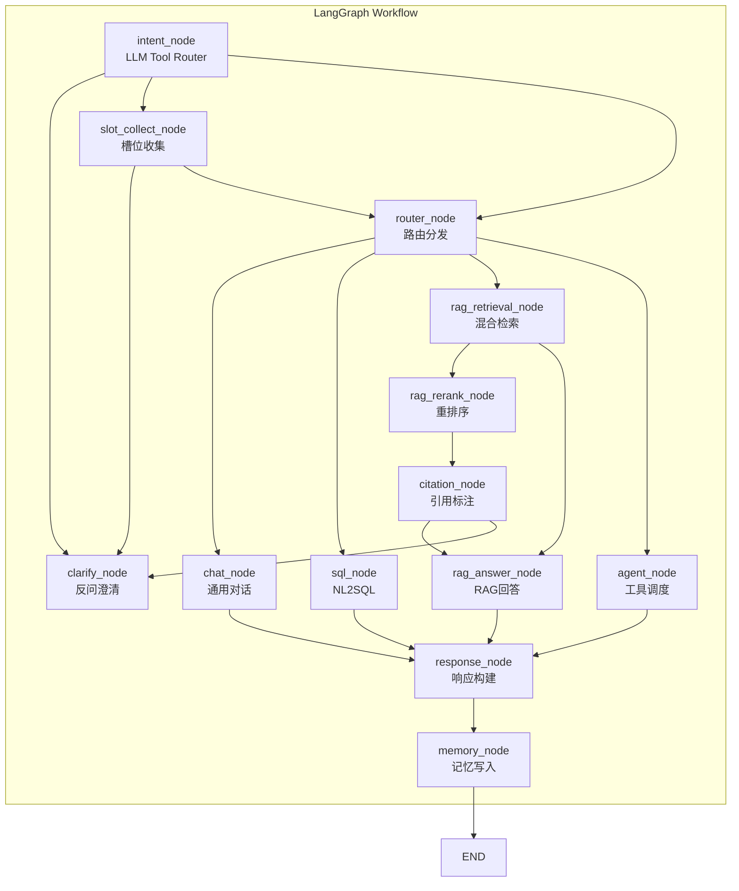
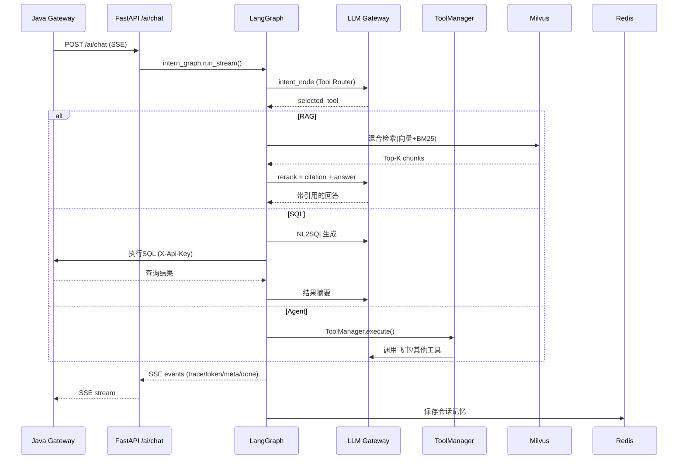
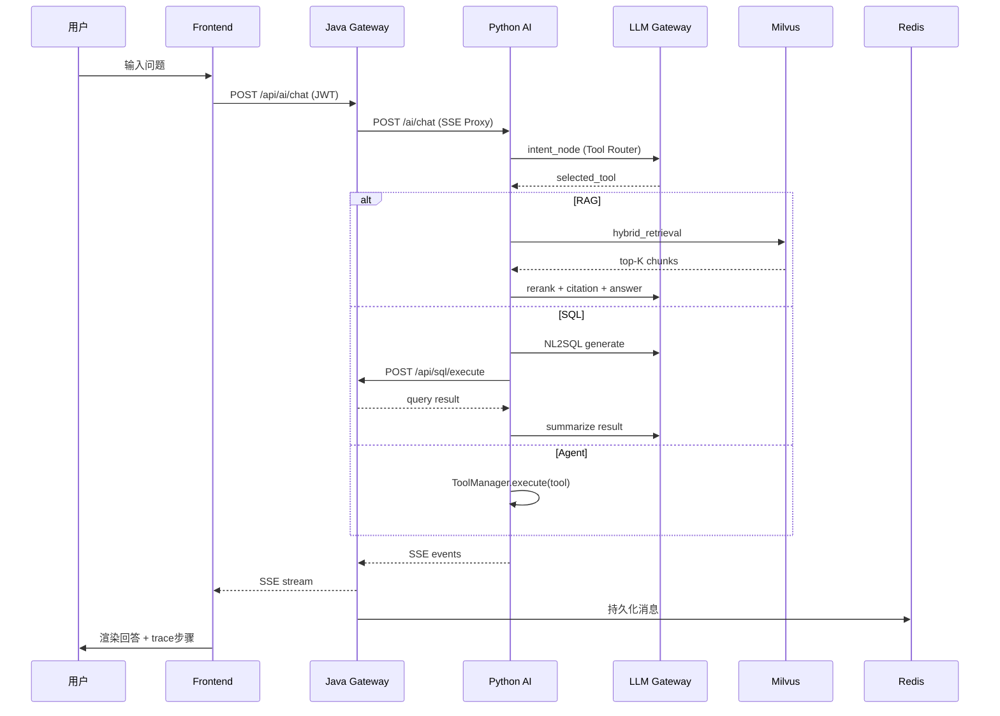

# InternSU — Python AI Service

> 企业AI实习生平台 · Python AI推理与Agent编排服务

## 1. 项目简介

InternSU Python AI Service 是平台的智能核心，负责AI推理、Agent编排、RAG检索、NL2SQL生成等所有AI相关能力。基于 LangGraph 构建了完整的 Agentic RAG 工作流，支持意图识别、槽位收集、多路路由分发、工具调用、流式响应等企业级AI能力。

业务场景：接收Java网关转发的用户问题，通过LangGraph工作流进行意图分析，自动路由到通用对话/RAG知识检索/NL2SQL数据查询/Agent工具调用等处理链路，以SSE流式返回结果。

核心价值：将AI推理与业务逻辑分离；提供可扩展的Tool Registry框架；LangGraph驱动的Agentic RAG管道；多Provider LLM网关实现高可用。

---

## 2. 技术架构





---

## 3. 技术栈

| 技术 | 版本 | 用途 |
|------|------|------|
| FastAPI | >=0.115.0 | Web框架 |
| Python | >=3.11 | 运行语言 |
| LangGraph | >=0.2.0 | Agent工作流编排(核心) |
| LangChain | >=0.3.0 | LLM抽象层 |
| langchain-openai | >=0.2.0 | OpenAI兼容Provider |
| BGE-M3 (FlagEmbedding) | >=1.2.0 | 本地向量化(1024维) |
| BGE-Reranker-v2-m3 | - | 重排序模型 |
| Milvus Lite | >=3.0 | 嵌入式向量数据库 |
| PyMilvus | >=2.4.0 | Milvus客户端 |
| rank_bm25 | >=0.2.2 | BM25关键词检索 |
| jieba | >=0.42.1 | 中文分词 |
| Redis | >=5.2.0 | 会话记忆存储 |
| sse-starlette | >=2.0.0 | SSE实时推送 |
| OpenTelemetry | >=1.28.0 | 分布式追踪 |
| Prometheus Instrumentator | >=7.0.0 | 指标暴露 |
| tiktoken | >=0.8.0 | Token计数 |
| tenacity | >=9.0.0 | 重试策略 |
| gRPC | >=1.67.0 | 跨语言通信(预留) |

---

## 4. 项目结构

```
python-ai-service/
├── pyproject.toml                      # Poetry配置
├── requirements.txt                    # pip依赖
├── Dockerfile                          # Docker构建
├── .env / .env.example                # 环境变量
├── pytest.ini                          # 测试配置
├── tests/                              # 测试文件(19个)│
└── app/
    ├── main.py                         # FastAPI入口 + lifespan
    ├── api/v1/
    │   ├── chat_api.py                 # ★ 核心聊天API(SSE流式+非流式)
    │   ├── rag_api.py                  # 文档索引/删除
    │   ├── sql_api.py                  # SQL查询(已废弃)
    │   └── health_api.py              # 健康检查
    ├── graph/                          # ★ LangGraph工作流引擎
    │   ├── intern_graph.py             # 图构建器(16节点+7条件边)
    │   ├── state.py                    # InternState(80+字段TypedDict)
    │   ├── clarify/                    # 槽位管理+反问澄清
    │   ├── edges/routes.py             # 7条条件路由函数
    │   └── nodes/                      # 16个图节点
    │       ├── intent_node.py          # Tool Router(LLM自主选工具)
    │       ├── clarify_node.py         # 反问澄清(hot-fill+LLM生成)
    │       ├── router_node.py          # 路由分发
    │       ├── agent_node.py           # ★ Agent节点(统一工具调度)
    │       ├── rag_retrieval_node.py   # RAG检索触发
    │       ├── rag_rerank_node.py      # 重排序
    │       ├── citation_node.py        # 引用标注
    │       ├── rag_answer_node.py      # RAG答案生成
    │       ├── sql_node.py             # NL2SQL节点
    │       ├── chat_node.py            # 通用对话
    │       ├── memory_node.py          # 记忆写入
    │       └── response_node.py        # 响应构建
    ├── llm/                            # ★ LLM网关
    │   ├── gateway.py                  # LLMGateway(多Provider+探活+故障转移)
    │   ├── base.py                     # BaseLLMProvider抽象
    │   ├── deepseek_provider.py        # DeepSeek Provider
    │   └── openai_provider.py          # OpenAI Provider
    ├── tools/                          # ★ 工具系统
    │   ├── base.py                     # BaseTool抽象类+ToolMetadata+ToolResult
    │   ├── registry.py                 # ToolRegistry单例(OpenAI function-calling)│
    │   ├── manager.py                  # ToolManager(统一执行+Trace+超时)
    │   ├── bootstrap.py                # 启动时自注册
    │   ├── adapters/                   # 工具适配器
    │   │   ├── sql_tool.py             # SQL工具
    │   │   ├── rag_tool.py             # RAG工具
    │   │   └── feishu_tool.py          # 飞书工具
    │   └── feishu/                     # 飞书集成(客户端/过滤/总结)
    ├── retrieval/                      # ★ 混合检索
    │   ├── hybrid_retriever.py         # 三路融合(向量+局部BM25+全局BM25)
    │   └── milvus_store.py             # Milvus向量存储
    ├── pipeline/embedder.py            # ★ BGE-M3嵌入引擎(1024维+校验)
    ├── sql_agent/                      # NL2SQL模块
    │   ├── generator.py                # LLM生成SQL
    │   ├── executor.py                 # SQL执行(调Java)
    │   ├── schema_loader.py            # Schema加载
    │   ├── sql_guard.py                # SQL安全守卫
    │   ├── sql_memory.py               # SQL对话记忆
    │   ├── sql_summarizer.py           # 结果摘要
    │   └── sql_trace.py                # SQL追踪
    ├── sse/chat_stream.py              # ★ SSE流发送器(6种事件)
    ├── memory/memory_manager.py        # Redis会话记忆
    ├── middleware/                      # 中间件(API Key/Tracing/异常)
    └── prompts/                        # Prompt模板
```

---

## 5. 核心模块说明

### 5.1 LangGraph工作流引擎 (graph/)

职责：编排AI对话的完整执行流程，从意图识别到最终回答的16步状态机。

工作流节点(16个): intent_node -> clarify_node/slot_collect -> router_node -> [chat/sql/rag/agent] -> response -> memory

设计思想：采用LangGraph的StateGraph模式，每个节点通过InternState TypedDict传递状态。条件边实现动态路由(如RAG检索为空时走回退逻辑)。支持stream和非stream两种执行模式。

### 5.2 LLM Gateway (llm/gateway.py)

职责：多Provider LLM调用的统一入口，支持故障转移和运行时监控。

输入：messages列表 + model名称 + temperature等参数
输出：LLMResponse (content + usage) 或 AsyncIterator (stream)

设计思想：两阶段初始化(静态校验+异步探活)。DeepSeek为主Provider，OpenAI为备用。401认证失败立即熔断不重试。占位符检测防止sk-your-key-here等模板Key上线。

### 5.3 工具系统 (tools/)

职责：统一的工具注册、发现、执行框架，支持OpenAI function-calling格式导出。

核心组件：
- BaseTool: 抽象基类，定义get_metadata() / _execute() / validate_params()
- ToolRegistry: 单例注册中心，支持按名称/分类/启用状态查询
- ToolManager: 统一执行入口，处理参数校验、超时控制、Trace记录
- ToolAdapter: sql_tool / rag_tool / feishu_tool 具体实现

设计思想：新增工具只需继承BaseTool并在bootstrap.py注册，无需修改路由逻辑。ToolMetadata包含完整的参数Schema，可自动生成OpenAI function-calling格式。

### 5.4 混合检索 (retrieval/hybrid_retriever.py)

职责：三路融合检索，最大化召回率和精确率。

三路策略：
1. BGE-M3向量检索(0.5权重): 语义相似性
2. 局部BM25检索(0.3权重): 在向量候选集内关键词匹配
3. 全局BM25检索(0.2权重): 在全部语料中关键词搜索(jieba分词)

设计思想：向量检索擅长语义但可能漏掉精确匹配，BM25擅长关键词但缺乏语义理解，三路融合互补。全局BM25索引懒加载，新文档入库后自动失效重建。

### 5.5 BGE-M3嵌入引擎 (pipeline/embedder.py)

职责：本地部署BAAI/bge-m3模型，提供1024维向量化。

设计思想：离线模式优先使用本地缓存模型。每次encode后硬断言维度==1024，防止Milvus冲突。GPU/CPU自适应检测(cuda > mps > cpu)，GPU加载失败自动降级CPU。

### 5.6 SSE流发送器 (sse/chat_stream.py)

职责：将LangGraph工作流的中间状态转为SSE事件流。

支持6种事件类型：
- trace: 工作过程步骤(右侧面板展示)
- token: 逐字输出(真流式)
- meta: 元数据(sources/tokens/trace_id)
- done: 完成标记(含完整answer)
- error: 错误信息
- heartbeat: 心跳保活

设计思想：asyncio.Queue解耦Graph执行和SSE发送。LLM每生成一个token立即put Queue，主协程读取Queue yield SSE，实现真正的流式体验。

### 5.7 SQL Agent (sql_agent/)

职责：将自然语言问题转为SQL并安全执行。

链路：user question -> sql_generator(LLM生成SQL) -> sql_guard(安全校验) -> executor(调Java执行) -> sql_summarizer(LLM摘要结果)

设计思想：Python负责NL2SQL智能生成，Java负责安全执行和数据访问。SQL结果通过LLM摘要为自然语言，让用户看到可读的回答而非原始表格数据。

---

## 6. 核心流程

### 6.1 用户提问完整链路



---

## 7. 环境要求

| 组件 | 版本要求 | 说明 |
|------|----------|------|
| Python | >=3.11, <3.13 | 推荐3.11 |
| Poetry | 2.x (或pip) | 包管理 |
| Redis | 7.0+ | 会话记忆 |
| MySQL | 8.0+ | 业务数据(Java管理) |
| BGE-M3模型 | 本地缓存 | HuggingFace下载 |
| Java Service | localhost:8080 | 业务后端 |
| DeepSeek API Key | 必填 | 主LLM Provider |

---

## 8. 本地启动指南

### 8.1 前置准备

```bash
# 1. 克隆项目并安装依赖
cd python-ai-service
pip install -r requirements.txt
# 或: poetry install --without dev

# 2. 配置环境变量
cp .env.example .env
# 编辑 .env: 填入 DEEPSEEK_API_KEY, 数据库/Redis连接信息

# 3. 下载 BGE-M3 模型(若使用HF镜像)
# HF_ENDPOINT=https://hf-mirror.com huggingface-cli download BAAI/bge-m3

# 4. 确保 Java Service + MySQL + Redis 已启动
```

### 8.2 启动服务

```bash
cd python-ai-service
python -m app.main
# 或: uvicorn app.main:app --host 0.0.0.0 --port 8000 --reload
```

### 8.3 验证

```bash
# 健康检查
curl http://localhost:8000/ai/health

# 发送聊天请求
curl -X POST http://localhost:8000/ai/chat \
  -H "Content-Type: application/json" \
  -H "X-Api-Key: dev-api-key" \
  -d '{"user_id":"1","conversation_id":"test","message":"你好"}'
```

---

## 9. 配置说明

### .env 关键配置项

| 配置项 | 必填 | 默认值 | 说明 |
|--------|------|--------|------|
| DEEPSEEK_API_KEY | 是 | - | DeepSeek API Key |
| OPENAI_API_KEY | 否 | - | OpenAI备用Key |
| default_provider | 否 | deepseek | 默认Provider |
| redis_url | 否 | redis://localhost:6379/0 | Redis连接 |
| milvus_db_path | 否 | ./data/milvus_lite.db | Milvus数据文件 |
| bge_model_name | 否 | BAAI/bge-m3 | Embedding模型 |
| chunk_size | 否 | 512 | 分块大小 |
| rag_top_k | 否 | 50 | 检索Top-K |
| rerank_top_n | 否 | 5 | 重排序Top-N |
| agent_max_iterations | 否 | 10 | Agent最大迭代次数 |
| debug | 否 | false | 调试模式(生产必须false) |

---

## 10. API说明

### 聊天模块

| 端点 | 方法 | 说明 |
|------|------|------|
| /ai/chat | POST | 统一聊天(stream=true返回SSE) |
| /ai/conversations | GET | 会话列表 |
| /ai/conversations/{id}/messages | GET | 会话消息 |

### RAG模块

| 端点 | 方法 | 说明 |
|------|------|------|
| /ai/rag/index | POST | 文档索引(Java调用) |
| /ai/rag/document/{docId} | DELETE | 删除文档向量 |

### 健康检查

| 端点 | 方法 | 说明 |
|------|------|------|
| /ai/health | GET | 服务健康状态 |

---

## 11. 数据流说明

1. **LLM调用**: chat_api -> InternGraph.run_stream() -> 各节点 -> llm_gateway.chat/chat_stream -> DeepSeek/OpenAI API
2. **RAG检索**: rag_retrieval_node -> hybrid_retriever.search() -> Milvus(向量) + BM25(关键词) -> 三路融合
3. **SQL执行**: sql_node -> sql_generator.generate() -> sql_guard校验 -> executor调Java /api/sql/execute
4. **Agent工具**: agent_node -> ToolManager.execute() -> 查找ToolRegistry -> BaseTool._execute()
5. **会话记忆**: memory_node -> Redis存储对话历史(conversation_window=20条)
6. **Trace追踪**: 每个节点记录trace_steps -> SSE发送 -> Java持久化到t_message_trace

---

## 12. 安全设计

- **API Key认证**: ApiKeyMiddleware验证X-Api-Key(Java调用Python)，所有chat/rag端点需认证
- **SQL安全**: sql_guard.py语义校验 + Java层只读限制 + LIMIT防护(双重防护)
- **404掩码**: 配置项缺失时统一返回503而非泄漏内部错误
- **占位符检测**: LLM Gateway启动时校验API Key格式，拒绝sk-your-key-here等模板
- **CORS控制**: settings.cors_origins控制跨域白名单

---

## 13. 日志与监控

- 日志框架: Python logging + 自定义ContextFilter(traceId注入)
- 日志格式: 含trace_id和模块名，支持控制台+文件双输出
- 生产环境: 日志写入 logs/internsu-ai.log(env=prod时)
- 全链路追踪: RequestTracingMiddleware从X-Trace-Id头提取traceId -> contextvars -> 所有日志自动携带
- Prometheus: /metrics端点(prometheus-fastapi-instrumentator)

---

## 14. 部署说明

### Docker Compose
```bash
cd deploy/docker
docker compose up -d python-ai-service
```

### Dockerfile
```bash
cd python-ai-service
docker build -t internsu-python-ai .
docker run -p 8000:8000 --env-file .env internsu-python-ai
```

Docker镜像: python:3.11-slim, 多阶段构建(poetry安装依赖 -> 复制到运行镜像), Healthcheck: /ai/health

---

## 15. 项目亮点

1. **LangGraph Agent工作流**: 16节点+7条件边的完整Agentic RAG状态机，支持意图识别->槽位收集->路由分发->多路并行->结果返回
2. **LLM Tool Router**: 用LLM自主选择工具(chart/rag/sql/agent/clarify)替代关键词匹配，新增能力只需加一行Tool定义无需改路由
3. **Tool Registry + ToolManager**: 抽象BaseTool基类，支持OpenAI function-calling格式导出，统一执行/超时/Trace/日志
4. **三路混合检索**: BGE-M3向量(0.5) + 局部BM25(0.3) + 全局BM25(0.2)，jieba中文分词，懒加载全局索引
5. **BGE-M3本地部署**: 1024维向量化，硬编码维度校验(每次encode后断言)，GPU/CPU自适应+失败降级
6. **LLM Gateway多Provider**: DeepSeek主+OpenAI备，占位符检测(拒绝模板Key)，401快速熔断，运行时故障转移
7. **真流式SSE架构**: asyncio.Queue解耦Graph执行和SSE发送，LLM每生成token即推送(非等待完整结果再伪流式)
8. **槽位管理+反问澄清**: 自动从用户消息提取参数(hot-fill)，不足时LLM生成反问，防死循环轮次限制
9. **SQL多层安全**: Python sql_guard语义校验 + Java层只读限制+自动LIMIT，双重安全防护
10. **全链路追踪**: trace_id从Java X-Trace-Id透传 -> Python contextvars -> LLM调用 -> SSE事件 -> 日志

---

## 16. 后续规划

- gRPC通信实现(依赖已配置，用于高性能内部调用)
- OpenTelemetry完整集成(依赖已配置，待添加Span/Tracer)
- 支持更多Tool Provider(邮件、日程、工单等)
- Milvus Cluster支持(当前使用Milvus Lite单机版)
- Prompt版本管理与A/B测试
- 模型评测框架集成
